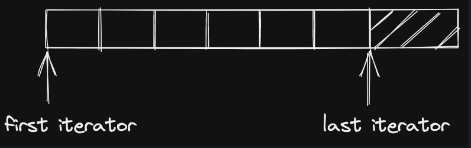

# 概述和版本介绍
## 一、stl_config.h
测试代码：

```cpp
#include <vector>
#include <iostream>

using namespace std;

int main()
{
# if defined(__sgi)
  cout << "__sgi" << endl;
#endif

# if defined(__GNUC__)
  cout << "__GNUC__" << endl;
  cout << __GNUC__ << ' ' << __GNUC_MINOR__ << endl;
# endif

#ifdef __STL_NO_DRAND48
  cout << "__STL_no_DRAND48 defined" << endl;
#else
  cout << "__STL_NO_DRAND48 undefined" << endl;
#endif

#ifdef __STL_STATIC_TEMPLATE_MEMBER_BUG
  cout << "__STL_STATIC_TEMPLATE_MEMBER_BUG defined" << endl;
#else
  cout << "__STL_STATIC_TEMPLATE_MEMBER_BUG undefined" << endl;
#endif

#ifdef __STL_CLASS_PARTIAL_SPECIALIZATION
  cout << "__STL_CLASS_PARTIAL_SPECIALIZATION defined" << endl;
#else
  cout << "__STL_CLASS_PARTIAL_SPECIALIZATION undefined" << endl;
#endif
  return 0;
}

```
输出：

```
__GNUC__
4 2
__STL_NO_DRAND48 undefined
__STL_STATIC_TEMPLATE_MEMBER_BUG undefined
__STL_CLASS_PARTIAL_SPECIALIZATION undefined
```

## 二、stl_config中的各种组态

```cpp
#include <iostream>

using namespace std;

template <typename T>
class testClass {

    public:
        static int _data;
};

// 为模板提供特例化
template<>
int testClass<int>::_data = 1;
// 为模板提供特例化
template<>
int testClass<char>::_data = 2;

int main()
{
  cout << testClass<int>::_data << endl;
  cout << testClass<char>::_data << endl;

  testClass<int> obji1, obji2;
  testClass<char> objc1, objc2;

  cout << obji1._data << endl;
  cout << obji2._data << endl;

  cout << objc1._data << endl;
  cout << objc2._data << endl;

  obji1._data = 3;
  objc2._data = 4;

  cout << obji1._data << endl;
  cout << obji2._data << endl;
  cout << objc1._data << endl;
  cout << objc2._data << endl;
  return 0;
}
```

如果上面代码中不加template<>，编译时会报错
`error: template specialization requires 'template<>'`

**函数特例化举例**

```cpp
template <typename T>  
void fun(T a)  
{  
	cout << "The main template fun(): " << a << endl;  
}  
  
template <>   // 对int型特例化  
void fun(int a)  
{  
	cout << "Specialized template for int type: " << a << endl;  
}  
  
int main()  
{  
	fun<char>('a');  
	fun<int>(10);  
	fun<float>(9.15);  
	return 0;  
}
```

output：

```C
The main template fun(): a  
Specialized template for int type: 10  
The main template fun(): 9.15
```


## 三、bound friend template friend
```cpp
#include <iostream>
#include <cstddef>

using std::cout;
using std::endl;

class alloc {};

template <class T, class Alloc = alloc, size_t BufSiz = 0>
class deque {
    public:
        deque() { cout << "deque" << "  " << endl; }
};

template <class T, class Sequence>
class stack;

template <class T, class Sequence>
bool operator==(const stack<T, Sequence>& x,
                const stack<T, Sequence>& y);

template <class T, class Sequence>
bool operator<(const stack<T, Sequence>& x,
               const stack<T, Sequence>& y);

template <class T, class Sequence = deque<T> >
class stack {

  friend bool operator== <> (const stack<T, Sequence>&, const stack<T, Sequence>&) {
    return cout << "operator == " << '\t';
    
  } // 如果定义在类中的话，operator== 后面加不加 <>或<T>都可以，若是定义在外面（如下面注释中的方式）则必须要增加<>和<T>，形参中有无<T, Sequence>都是可以的
  friend bool operator< <> (const stack<T, Sequence>&, const stack<T, Sequence>&) {
    return cout << "operator < " << '\t';
  }

    public:
      stack() { cout << "stack" << endl; }
    private:
       Sequence c;  // 这里实例化一个stack时，先调用Sequence的构造函数，再调用stack构造函数
};

/*
template <class T, class Sequence>
bool operator==(const stack<T, Sequence>& x,
                const stack<T, Sequence>& y) {
  return cout << "operator==" << '\t';
}

template <class T, class Sequence>
bool operator<(const stack<T, Sequence>& x,
               const stack<T, Sequence>& y) {
  return cout << "operator<" << '\t';
}
*/

int main()
{
  stack<int> x;
  stack<int> y;
  cout << (x == y) << endl;
  cout << (x < y) << endl;

  stack<char> y1;

  return 0;

}

```

## 四、显式指定模板（class template explicit specialization）

```cpp
#include <iostream>
using std::endl;
using std::cout;

#define __STL_TEMPLATE_NULL template<>  // 这里需要将某个参数指定为template<>

template <class Key> struct hash {
  void operator() () {
    cout << "hash<T>" << endl;
  }
};

__STL_TEMPLATE_NULL struct hash<char> {
  void operator() () {
    cout << "hash<char>" << endl;
  } 
};

__STL_TEMPLATE_NULL struct hash<unsigned char> {
  void operator() () {
    cout << "hash<unsigned char>" << endl;
  }
};

int main()
{
  hash<long> t1;
  hash<char> t2;
  hash<unsigned char> t3;
  t1();    // hash<T>
  t2();    // hash<char>
  t3();    // hash<unsigned char>
  return 0;
}

```

output:
```
hash<T>
hash<char>
hash<unsigned char>
```

## 五、increment/decrement/dereference操作符

`++`操作符重载时可以分为前置操作符重载和后置操作符重载
如何区分是哪一类重载呢？
前置操作符重载入参为空，如下面INT类中的`operator++()`和`operator--()`方法；
后置操作符重载需要有额外的参数，如下面INT类中的`operator++(int)`和`operator--(int)`方法；
同时还可以利用友元函数实现两元操作符重载，第一个参数位于操作符前面，第二个位于操作符后面，如下面INT类中的`friend ostream& operator<<(ostream& os, const INT& i);`方法

```cpp
#include <iostream>

using namespace std;

class INT {
  friend ostream& operator<<(ostream& os, const INT& i);
  public:
    INT(int i): m_i(i) {};

    INT& operator++() {
      ++(this->m_i);
      return *this;
    }

    const INT operator++(int) {
      INT temp = * this;
      ++(*this);
      return temp;
    }

    INT& operator--() {
      --(this->m_i);
      return *this;
    }

    const INT operator--(int) {
      INT temp = *this;
      --(*this);
      return temp;
    }

    int& operator*() const {
      return (int&) m_i;
    }

  private:
    int m_i;
};


ostream& operator<<(ostream& os, const INT& i)
{
  os << '[' << i.m_i << ']';    // 类的友元函数可以调用类的私有方法、属性
  return os;
}

int main()
{
  INT I(5);
  cout << I++ << endl;
  cout << ++I << endl;
  cout << I-- << endl;
  cout << --I << endl;
  cout << *I << endl;
  return 0;
}


```

output:
```
[5]
[7]
[7]
[5]
5
```

## 五、前闭后开区间表示法\[\)
任何一个STL算法，都需要获得由一对迭代器（泛型指针）所指示的区间，用以表示操作范围。这一对迭代器所示的是个所谓的前闭后开区间，以\[first, last\)表示。如下图所示，last iterator所指示的数据已经不属于该容器了。



