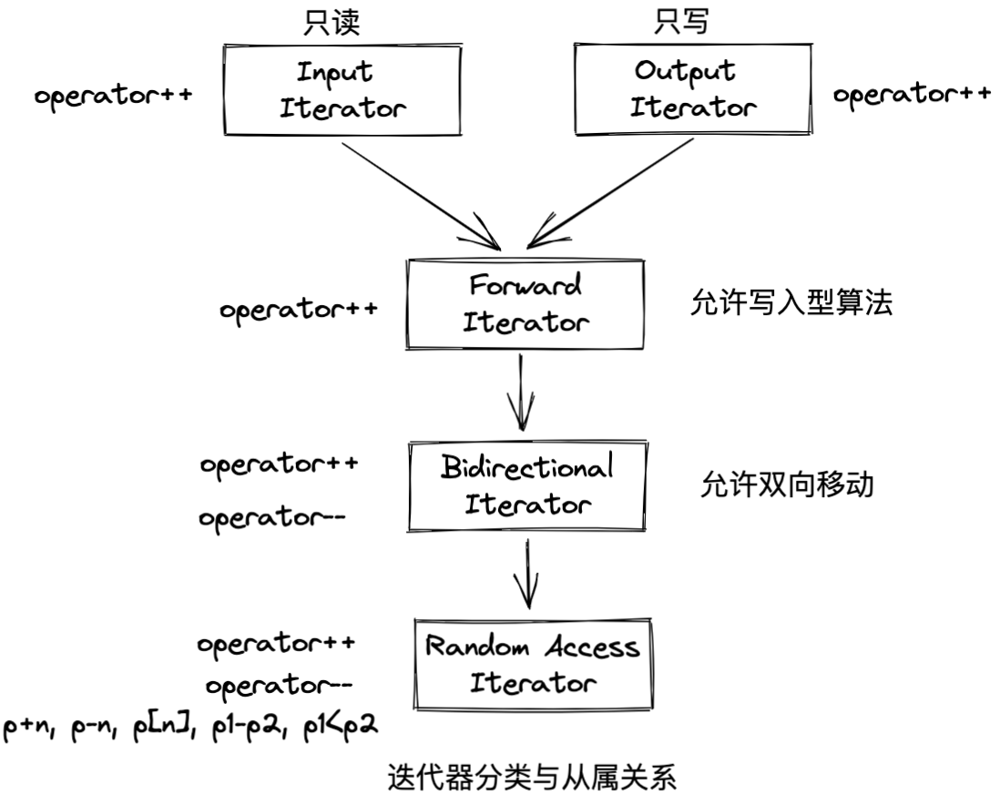

# 迭代器概念与编程技巧

## 一、迭代器设计思维——STL关键所在
STL中心思想：将数据容易(containers)和算法(algorithms)分开，彼此独立设计
迭代器(iterator)即两者之间的胶着剂

迭代器中最重要的编程工作是对operator* 和operator->进行重载
如auto_ptr类中对上述两个方法的重载
```cpp
template<class T>
class auto_ptr {
public:
  ...

  T& operator*() const { return *pointee; }
  T* operator->() const { return pointee; }
private:
  T* pointee;
};
```

### 提供中间层用于萃取返回值类型
```cpp
// 未提供中间层版本
template <class I>
typename I::value_type
func(I ite)
{ return *ite; }

// 对于智能指针
MyIter<int> ite(new int(8));
cout << func(ite);
// output: 8

// 这种方式对原生指针就会有问题
// 可以用中间层的方式进行改善

// 中间层如下：
template <class I>
struct iterator_traits {
  typedef typename I::value_type value_type;
};
// 重写func方法如下：
template <class I>
typename iterator_traits<I>::value_type
func(I ite) {
  return *ite;
}

// 对于原生指针，只需特偏化iterator_traits一次，如下：
template <class T>
struct iterator_traits<T*> {
  typedef T value_type;
};

// 若需要对const int*类型进行特偏化，也可以按如下方式：
template <class T>
struct iterator_traits<const T*> {
  typedef T value_type;
};
```


五种型别的特性萃取机
```cpp
template <class I>
struct iterator_traits {
  typedef typename I::iterator_category iterator_category;
  typedef typename I::value_type        value_type;
  typedef typename I::difference_type   difference_type;
  typedef typename I::pointer           pointer;
  typedef typename I::reference         reference
}
```
同时一定需要将传入型别为pointer和pointer_to_const设计特偏化

| 迭代器型别        | 解释                                                                              |
| ----------------- | --------------------------------------------------------------------------------- |
| value_type        | 迭代器所指对象的型别                                                              |
| difference_type   | 表示两个迭代器之间的距离                                                          |
| reference_type    | \*p的型别为T&时，即为reference_type，否则为value_type                             |
| pointer_type      | 若返回一个pointer，指向迭代器所指之物，则为pointer_type，如重载->操作符时的返回值 |
| iterator_category | 用于标识迭代器类型，根据不同的迭代器类型调用不同的方法                                                                                  |

关于reference_type和pointer_type两个相应型别的说明

```cpp
template <class I>
struct iterator_traits {
  typedef typename I::pointer    pointer;
  typedef typename I::reference  reference;
};

// 针对原生指针的特偏化版本
template <class T>
struct iterator_traits<T*> {
  typedef T*  pointer;
  typedef T&  reference;
};

// 针对原生const指针的特偏化版本
template <class T>
struct iterator_traits<const T*> {
  typedef const T*  pointer;
  typedef const T&  reference;
};
```

### 迭代器分类


效率优先，如果一个算法可接受Forward Iterator，此时喂给它Random Access Iterator也可以，但效率会降低

### 以advance为例说明iterator_category设计方法
```cpp
// 设计五种tag types作为标记，其中包含上图中的继承关系
struct input_iterator_tag {};
struct output_iterator_tag {};
struct forward_iterator_tag : public input_iterator_tag {};
struct bidirectional_iterator_tag : public forward_iterator_tag {};
struct random_access_iterator_tag : public bidirectional_iterator_tag {};

// 按照重载方式定义各种__advance方法
template <class InputIterator, class Distance>
inline void __advance(InputIterator& i, Distance n, input_iterator_tag) {
  while (n--) ++i;
}


// 考虑继承时可以省略，不定义该方法的话会自动推导至调用input_iterator_tag对应的方法
template <class ForwardIterator, class Distance>
inline void __advance(ForwardIterator& i, Distance n, forward_iterator_tag)
{
  __advance(i, n, input_iterator_tag());
}

template <class BidirectionalIterator, class Distance>
inline void __advance(BidirectionalIterator& i, Distance n, bidirectional_iterator_tag) {
  if (n >= 0) 
    while (n--) ++i;
  else
    while (n++) --i;
}


template <class RandomAccessIterator, class Distance>
inline void __advance(RandomAccessIterator& i, Distance n, random_access_iterator_tag) {
  i += n;
}


// 重载了__advance方法后，仍需要一个对外开放的上层控制接口
// 此处输入类型为什么命名为InputIterator？
// STL算法有一个命名规定：以算法所能接受之最低阶迭代器类型为其命名
template <class InputIterator, class Distance>
inline void advance(InputIterator& i, Distance n) {
  __advance(i, n, iterator_traits<InputIterator>::iterator_category());
}

// 为满足上述行为，traits必须再增加一个相应的型别
template <class I>
struct iterator_traits {
  typedef typename I::iterator_category iterator_category;
};

// 针对原生指针的特偏化版本
template <class I>
struct iterator_traits<T*> {
  typedef random_access_iterator_tag iterator_category;
};

// 针对原生const指针的特偏化版本
struct iterator_traits<const T*> {
  typedef random_access_iterator_tag iterator_category;
};

// 为什么用random_access_iterator_tag？因为继承关系，random_access_iterator_tag类型可以调用输入参数为其父类的方法，因此定义为random_access_iterator_tag会更加通用

```

### __type_straits
针对不同的型别，提升其默认构造函数、复制构造函数、赋值构造函数、析构函数的效率
定义一个泛型\_\_type_straits

```cpp

struct __ture_type {};
struct __false_type {};

template <class type>
struct __type_traits {
  typedef __true_type   this_dummy_member_must_be_first;
  
  // 默认都是false_type
  typedef __false_type  has_trivial_default_constructor;
  typedef __false_type  has_trivial_copy_constructor;
  typedef __false_type  has_trivial_assignment_operator;
  typedef __false_type  has_trivial_destructor;
  typedef __false_type  is_POD_type;
};

// 对自己定义类型进行特偏化声明
template<> struct __type_traits<Shape> {
  typedef __true_type  has_trivial_default_constructor;
  typedef __false_type has_trivial_copy_constructor;
  typedef __false_type has_trivial_assignment_operator;
  typedef __false_type has_trivial_destructor;
  // 能用 C 的 memcpy() 等函数进行操作的类、结构体就是 POD 类型的数据。
  typedef __false_type is_POD_type;
};


// 应用实例
template <class ForwardIterator, class Size, class T>
inline ForwardIterator uninitialized_fill_n(ForwardIterator first, 
											Size n, const T& x) {
  return __uninitialized_fill_n(first, n, x, value_type(first));
}


template <class ForwardIterator, class Size, class T, class T1>
inline ForwardIterator __uninitialized_fill_n(ForwardIterator first, Size n, 
										const T& x, T1*) {
  typedef typename __typetraits<T1>::is_POD_type is_POD;
  // 会根据不同的is_POD返回值调用不同的重载函数
  return __uninitialized_fill_n_aux(first, n, x, is_POD());
}

template <class ForwardIterator, class Size, class T>
ForwardIterator uninitialized_fill_n_aux(ForwardIterator first, Size n,
										const T& x, __false_type) {
  ForwardIterator cur = first;
  for (; n > 0; --n, ++cur)
    construct(&*cur, x);
  return cur;
}


template <class ForwardIterator, class Size, class T>
ForwardIterator uninitialized_fill_n_aux(ForwardIterator first, Size n,
										const T& x, __false_type) {
  // 如果copy construction等同于assignment，而且有trivial destructor,
  // 以下就有效：
  return fill_n(first, n, x);
}

// fill_n调用赋值构造函数填充对象
template <class OutputIterator, class Size, class T>
OutputIterator fill_n(OutputIterator first, Size n, const T& value) {
  for (; n > 0; --n, ++first)
    *first = value;
  return first;
}

```

Q：一个class什么时候该有自己的non-trivial default constructor, non-trivial copy constructor, non-trivial assignment operator, non-trivial destructor ?
A：1. 若class内涵指针成员，
      2. 并且对它进行内存动态配置
      那么这个class就需要实现出自己的non-trivial-xxx....

## 附录
### 拷贝构造函数和赋值构造函数
1、什么时候调用拷贝构造函数，什么时候调用赋值构造函数
- 对象不存在，且没用别的对象来初始化，就是调用了构造函数；

- 对象不存在，且用别的对象来初始化，就是拷贝构造函数（上面说了三种用它的情况！）

- 对象存在，用别的对象来给它赋值，就是赋值函数。

```cpp
class  A;  
A a;  
A b;     
b = a;   // b已经存在，调用赋值构造函数

// --------------------------------------------

class A;
A a;
A c(a);    // c不存在，调用拷贝构造函数

// --------------------------------------------

class A;
A a;
A d = a;   // d不存在，调用拷贝构造函数  
```

2、拷贝构造函数出现场景有哪些
- 一个对象以值传递的方式传入函数体

- 一个对象以值传递的方式从函数返回

- 一个对象需要通过另一个对象进行初始化

3、默认拷贝构造函数和默认赋值构造函数用的都是浅拷贝，那么浅拷贝和深拷贝有什么区别

**浅拷贝：**
如果复制的对象中引用了一个外部内容（例如分配在堆上的数据），那么在复制这个对象的时候，让新旧两个对象指向同一个外部内容，就是浅拷贝。（指针虽然复制了，但所指向的空间内容并没有复制，而是由两个对象共用）

**深拷贝：**
如果在复制这个对象的时候为新对象制作了外部对象的独立复制，就是深拷贝。

4、默认拷贝构造函数返回的是一个新的对象，默认拷贝构造函数返回的是对已有对象的引用


### 原生指针、泛型指针、智能指针
1、原生指针
就是最普通的指针，定义类似： 类型 变量名，如int*;

与之对比的是使用上有类似指针的功能 实际并不是指针。比如：迭代器

\[一个类重载 \*和->操作符 那么可以像指针一样使用  但是这种并不是原生的\]

2、泛型指针
第一种就是 void \*指针 可以指向任意的数据结构 因此可以称为"泛型"。

第二种就是指具有指针特性的泛型数据结构 如：泛型迭代器和接下来要说的智能指针。

3、智能指针
C++中没有自动回收内存的机制，因此出现了智能指针。
一般我们将一个指针封装到一个智能指针类中，该类中有一个引用计数器。
对指针的复制等操作会使引用计数+1，delete操作会使引用计数-1。计数=0时，指针=NULL。

### C++基本型别
- char
- signed char
- unsigned char
- short
- unsigned short
- int
- unsigned int
- long
- unsigned long
- float
- double
- long double
