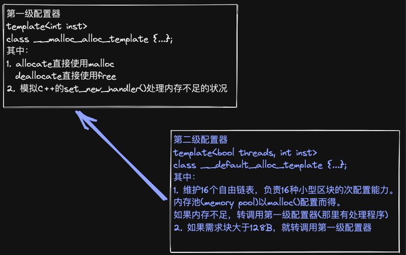
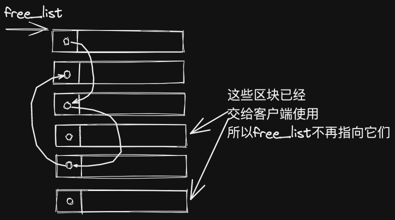
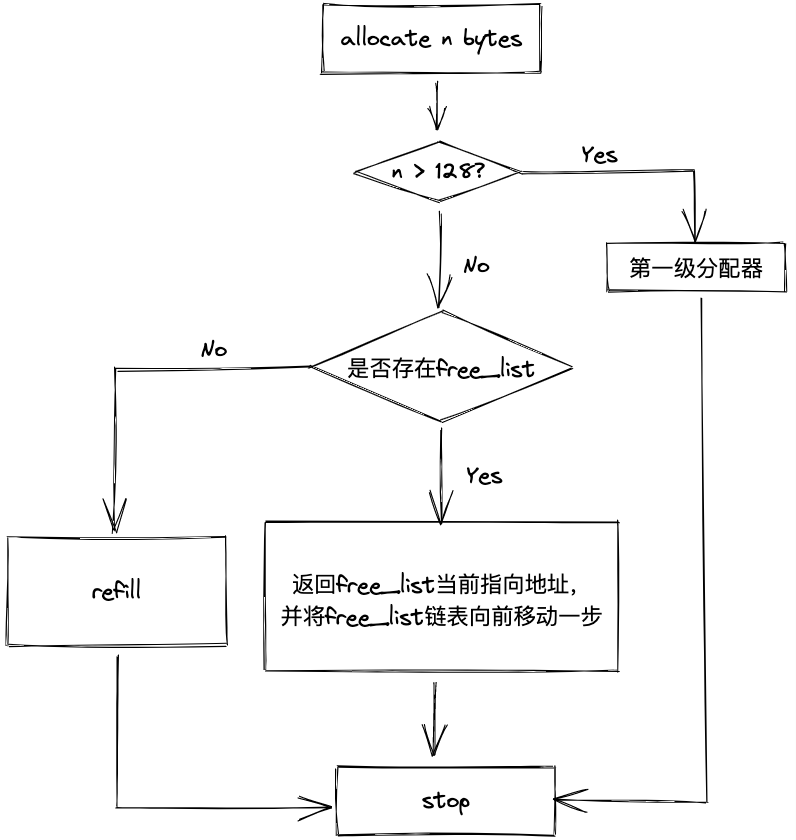
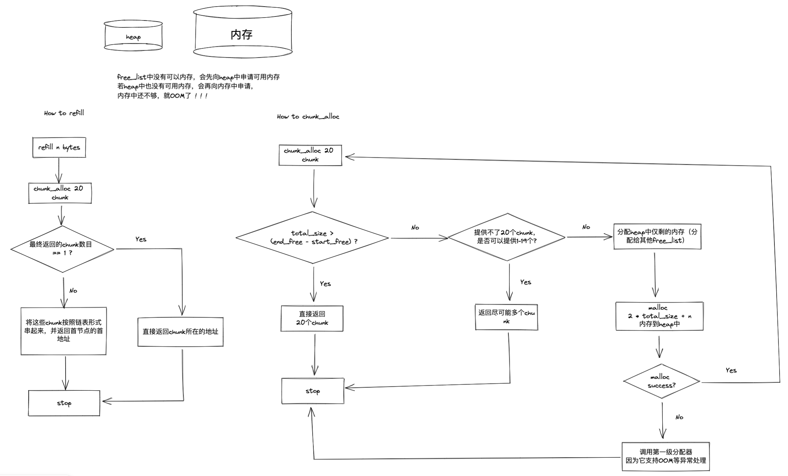

<!-- START doctoc generated TOC please keep comment here to allow auto update -->
<!-- DON'T EDIT THIS SECTION, INSTEAD RE-RUN doctoc TO UPDATE -->

- [空间配置器](#%E7%A9%BA%E9%97%B4%E9%85%8D%E7%BD%AE%E5%99%A8)
  - [一、SGI特殊的空间配置器 std::alloc](#%E4%B8%80sgi%E7%89%B9%E6%AE%8A%E7%9A%84%E7%A9%BA%E9%97%B4%E9%85%8D%E7%BD%AE%E5%99%A8-stdalloc)
    - [placement new](#placement-new)
  - [二、具备次配置力的SGI空间配置器](#%E4%BA%8C%E5%85%B7%E5%A4%87%E6%AC%A1%E9%85%8D%E7%BD%AE%E5%8A%9B%E7%9A%84sgi%E7%A9%BA%E9%97%B4%E9%85%8D%E7%BD%AE%E5%99%A8)
    - [构造和析构基本工具](#%E6%9E%84%E9%80%A0%E5%92%8C%E6%9E%90%E6%9E%84%E5%9F%BA%E6%9C%AC%E5%B7%A5%E5%85%B7)
    - [空间的配置与释放](#%E7%A9%BA%E9%97%B4%E7%9A%84%E9%85%8D%E7%BD%AE%E4%B8%8E%E9%87%8A%E6%94%BE)
  - [三、内存基本处理工具](#%E4%B8%89%E5%86%85%E5%AD%98%E5%9F%BA%E6%9C%AC%E5%A4%84%E7%90%86%E5%B7%A5%E5%85%B7)
    - [uninitialized_copy()](#uninitialized_copy)
    - [uninitialized_fill()](#uninitialized_fill)
    - [uninitialized_fill_n()](#uninitialized_fill_n)

<!-- END doctoc generated TOC please keep comment here to allow auto update -->

# 空间配置器
## 一、SGI特殊的空间配置器 std::alloc
### placement new
placement new就是在用户指定的内存位置上构建新的对象，这个构建过程不需要额外分配内存，只需要调用对象的构造函数即可。
placement new的好处：  
1）在已分配好的内存上进行对象的构建，构建速度快。  
2）已分配好的内存可以反复利用，有效的避免内存碎片问题。
下面这个例子就是将一个_T1对象分配到__p的内存中
```cpp
template <class _T1, class _T2>

inline void _Construct(_T1* __p, const _T2& __value) {

new ((void*) __p) _T1(__value);

}
```

## 二、具备次配置力的SGI空间配置器
### 构造和析构基本工具
stl_construnct.h代码部分：
trick：
1、 在析构时，若\[first, last\)范围极大，将所有对象析构时，需要遍历所有对象，但对于int、long等对象，析构时可能什么都不用做，因此首先利用value_type()方法获得迭代器所指对象的型别，再利用`__type_traits<T>`判断该型别的析构函数是否什么都没做来选择具体的destroy方法
2、template特偏化优先级为：普通函数 > 特偏化 > 全特化 > 一般template
**举个例子**
一般特化
```cpp
template<class T>
T& Max(T& left, T& right)
{
	return left > right? left : right;
}
```

全特化
```cpp
template<class T1,class T2>
T1& Max(T1& left, T2& right)  //返回类型自定T1或T2
{
	return left > right? left : right;
}
```

特偏化

```cpp
template<T,int>
template<T,int>
template<double,T>
template<T,double>
```

普通函数
```cpp
char* Max(char* left, char* right)
{
	if (strcmp(left, right) > 0)
		return left;

	return right;
}
```

stl_construnct.h源代码如下：
```cpp
/*

*

* Copyright (c) 1994

* Hewlett-Packard Company

*

* Permission to use, copy, modify, distribute and sell this software

* and its documentation for any purpose is hereby granted without fee,

* provided that the above copyright notice appear in all copies and

* that both that copyright notice and this permission notice appear

* in supporting documentation. Hewlett-Packard Company makes no

* representations about the suitability of this software for any

* purpose. It is provided "as is" without express or implied warranty.

*

*

* Copyright (c) 1996,1997

* Silicon Graphics Computer Systems, Inc.

*

* Permission to use, copy, modify, distribute and sell this software

* and its documentation for any purpose is hereby granted without fee,

* provided that the above copyright notice appear in all copies and

* that both that copyright notice and this permission notice appear

* in supporting documentation. Silicon Graphics makes no

* representations about the suitability of this software for any

* purpose. It is provided "as is" without express or implied warranty.

*/

  

/* NOTE: This is an internal header file, included by other STL headers.

* You should not attempt to use it directly.

*/

  

#ifndef __SGI_STL_INTERNAL_CONSTRUCT_H

#define __SGI_STL_INTERNAL_CONSTRUCT_H

  

#include <new.h>

  

__STL_BEGIN_NAMESPACE

  

// construct and destroy. These functions are not part of the C++ standard,

// and are provided for backward compatibility with the HP STL. We also

// provide internal names _Construct and _Destroy that can be used within

// the library, so that standard-conforming pieces don't have to rely on

// non-standard extensions.

  

// Internal names

  

template <class _T1, class _T2>

inline void _Construct(_T1* __p, const _T2& __value) {

new ((void*) __p) _T1(__value);

}

  

template <class _T1>

inline void _Construct(_T1* __p) {

new ((void*) __p) _T1();

}

  

template <class _Tp>

inline void _Destroy(_Tp* __pointer) {

__pointer->~_Tp();

}

  

template <class _ForwardIterator>

void

__destroy_aux(_ForwardIterator __first, _ForwardIterator __last, __false_type)

{

for ( ; __first != __last; ++__first)

destroy(&*__first);

}

  
// 在析构时，若[first, last)范围极大，将所有对象析构时，需要遍历所有对象，但对于int、long等对象，析构时可能什么都不用做，因此首先利用value_type()方法获得迭代器所指对象的型别，再利用__type_traits<T>判断该型别的析构函数是否什么都没做来选择具体的destroy方法
template <class _ForwardIterator>

inline void __destroy_aux(_ForwardIterator, _ForwardIterator, __true_type) {}

  

template <class _ForwardIterator, class _Tp>

inline void

__destroy(_ForwardIterator __first, _ForwardIterator __last, _Tp*)

{

typedef typename __type_traits<_Tp>::has_trivial_destructor

_Trivial_destructor;

__destroy_aux(__first, __last, _Trivial_destructor());

}

  

template <class _ForwardIterator>

inline void _Destroy(_ForwardIterator __first, _ForwardIterator __last) {

__destroy(__first, __last, __VALUE_TYPE(__first));

}

  
// 特化版本，这些版本对象在析构时什么也不做，
inline void _Destroy(char*, char*) {}

inline void _Destroy(int*, int*) {}

inline void _Destroy(long*, long*) {}

inline void _Destroy(float*, float*) {}

inline void _Destroy(double*, double*) {}

#ifdef __STL_HAS_WCHAR_T

inline void _Destroy(wchar_t*, wchar_t*) {}

#endif /* __STL_HAS_WCHAR_T */

  

// --------------------------------------------------

// Old names from the HP STL.

  

template <class _T1, class _T2>

inline void construct(_T1* __p, const _T2& __value) {

_Construct(__p, __value);

}

  

template <class _T1>

inline void construct(_T1* __p) {

_Construct(__p);

}

  

template <class _Tp>

inline void destroy(_Tp* __pointer) {

_Destroy(__pointer);

}

  

template <class _ForwardIterator>

inline void destroy(_ForwardIterator __first, _ForwardIterator __last) {

_Destroy(__first, __last);

}

  

__STL_END_NAMESPACE

  

#endif /* __SGI_STL_INTERNAL_CONSTRUCT_H */

  

// Local Variables:

// mode:C++

// End:
```

### 空间的配置与释放
位于std_alloc.h中
trick：
1、SGI也是通过C中的全局函数malloc()和free()完成内存的配置和释放的；
2、考虑到小型区块可能造成内存的破碎问题，SGI设计了双层级配置器，第一级配置器直接使用malloc()和free()，第二级配置器则视情况采用不同的策略：
- 当配置区块超过128B时，使用第一级配置器

- 反之，为了降低额外负担，采用负责的memory pool整理方式，不再求助于？第一级配置器

  

3、如何通过函数指针实现set_new_handler()方法

```cpp
// 函数名:   __set_malloc_handler
// 输入参数: void (*__f) ()
// 输出指针: void (*) ()
// 可以改写成:
// typedef void (*PF)(); 
// static PF set_malloc_handler(PF f) {
// PF old = __malloc_alloc_oom_handler;
// __malloc_alloc_oom_handler = f;
// return (old); 
// }
static void (* __set_malloc_handler(void (*__f)()))()

{

// __old是一个函数指针
// 调用时用__old()或(*__old)()都是可以的
void (* __old)() = __malloc_alloc_oom_handler;

__malloc_alloc_oom_handler = __f;

return(__old);

}
```

4、如何通过宏定义实现内存分配异常处理方法
```cpp
# define __THROW_BAD_ALLOC fprintf(stderr, "out of memory\n"); exit(1)

if (0 == __my_malloc_handler) { __THROW_BAD_ALLOC; }
```

5、将bytes上调至8的倍数的写法
```cpp
_S_round_up(size_t __bytes)

{ return (((__bytes) + (size_t) _ALIGN-1) & ~((size_t) _ALIGN - 1)); }
```

6、自由链表的实现技巧(union)



```cpp
union _Obj {

union _Obj* _M_free_list_link;

char _M_client_data[1]; /* The client sees this. */

};
```

7、堆往高地址生长，栈往低地址生长
```cpp
_S_start_free = (char*)malloc(__bytes_to_get); // malloc返回分配内存的首地址
_S_end_free = _S_start_free + __bytes_to_get;
```

8、内存分配逻辑



How to refill（重填内存）



**第一级配置器：**


**第二级配置器：**
STL各类容器中默认调用的是第二级配置器，第二级配置器会根据需求调用第一级配置器

## 三、内存基本处理工具

### uninitialized_copy()
全区间构造函数完成两个步骤：
- 配置内存区块，足以包含范围内的所有元素
- 使用uninitialized_copy方法，在该内存上构造元素，调用construct(T* p, const T2 value)方法，将value copy到p所在内存
写法如下
```cpp
template<class T1, class T2>
inline void construct(T1* p, const T2& value) {
  new (p) T1(value)
}
```

C++要求使用uninitialized_copy方法具有（commit or rollback）语意，即要么构造出全部元素，要么不构造任何东西

### uninitialized_fill()
没看出与uninitialized_copy之间的区别，看起来很像

### uninitialized_fill_n()
可以将内存配置和对象构造行为分离开，会为指定范围内的所有元素设定相同的初值


