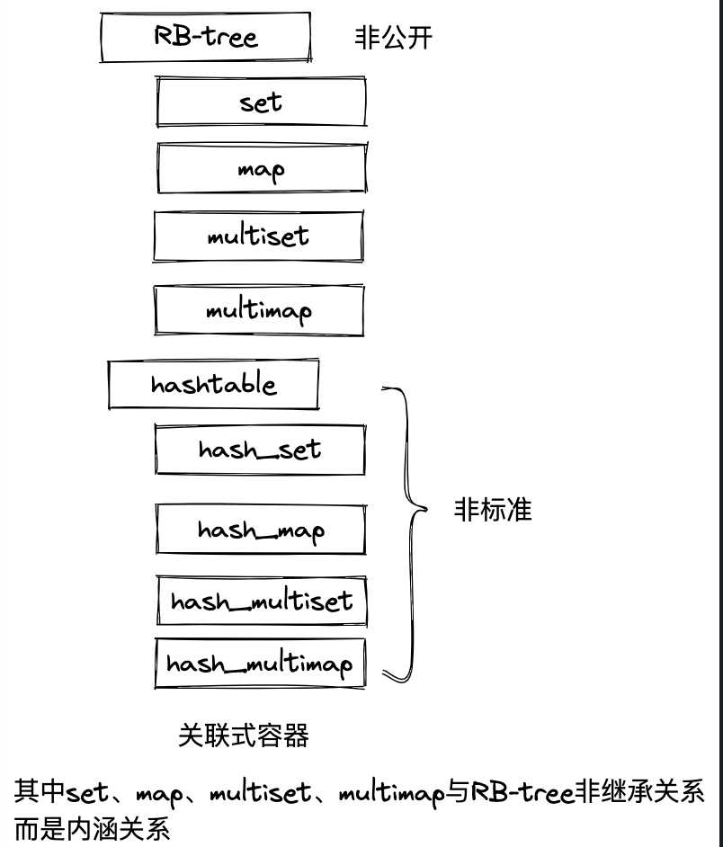
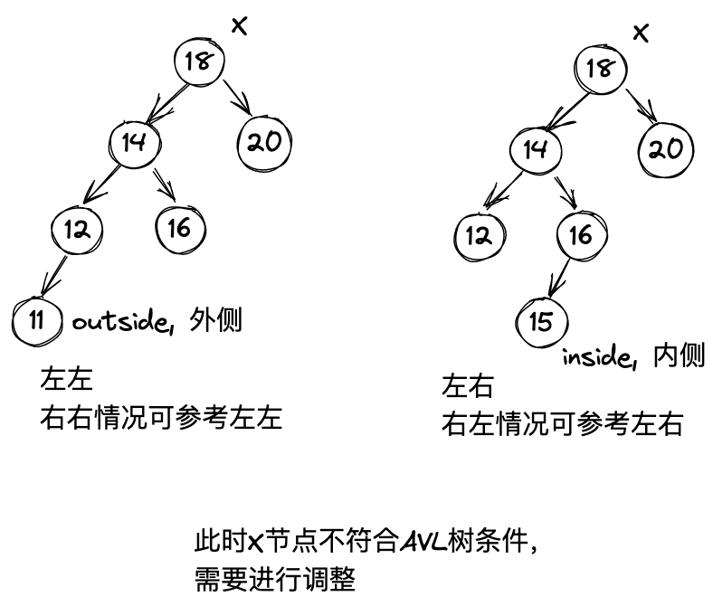
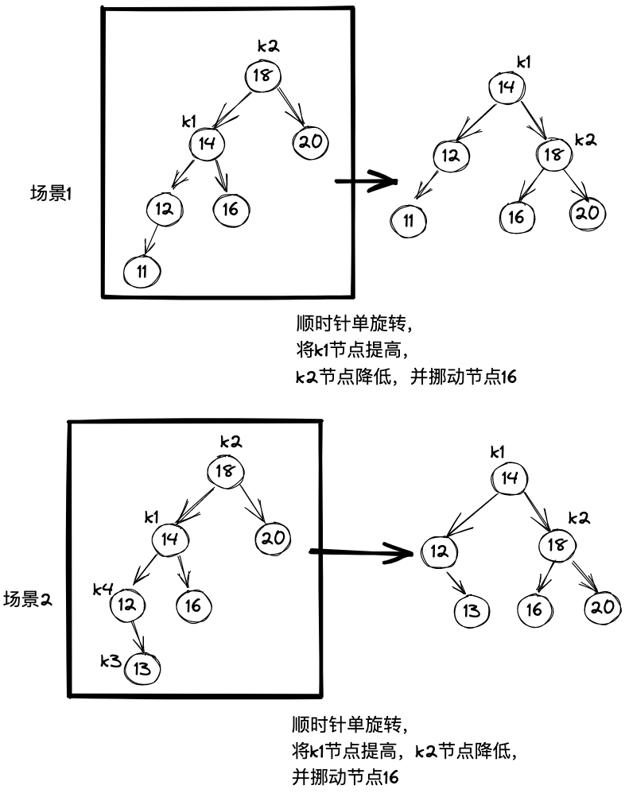
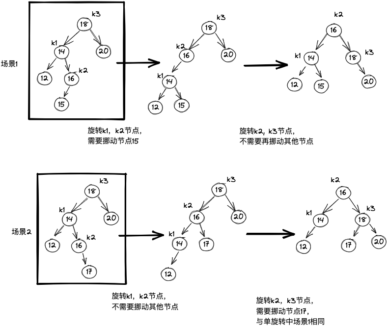
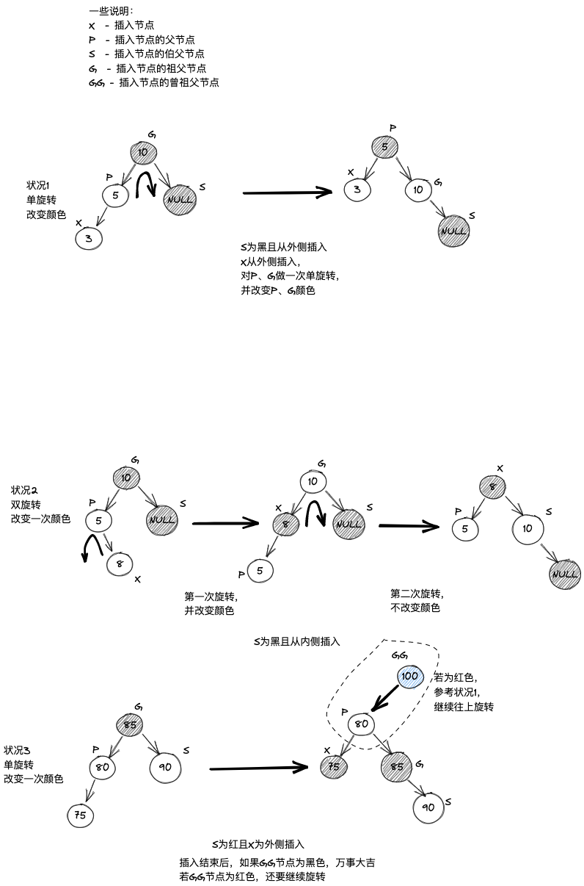
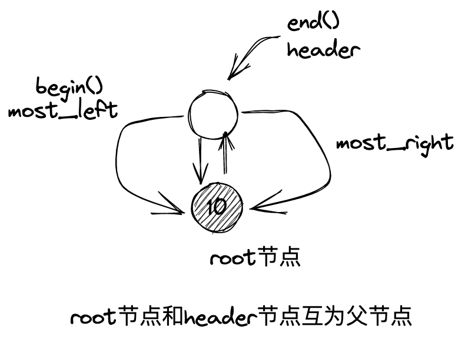
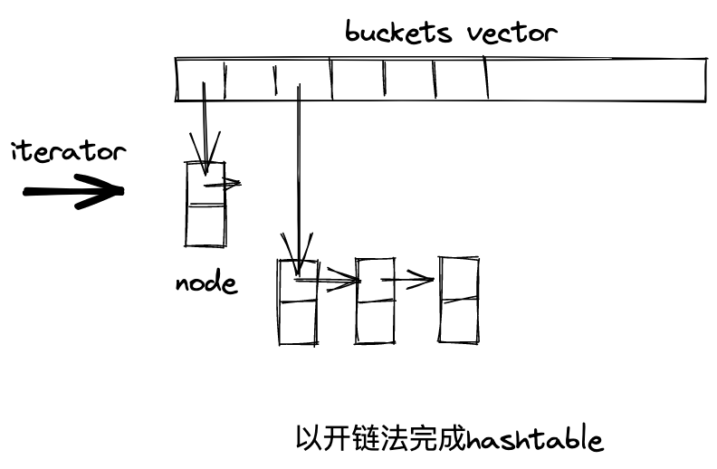

<!-- START doctoc generated TOC please keep comment here to allow auto update -->
<!-- DON'T EDIT THIS SECTION, INSTEAD RE-RUN doctoc TO UPDATE -->

- [一、AVL树](#%E4%B8%80avl%E6%A0%91)
  - [什么是AVL树](#%E4%BB%80%E4%B9%88%E6%98%AFavl%E6%A0%91)
  - [AVL树单旋转](#avl%E6%A0%91%E5%8D%95%E6%97%8B%E8%BD%AC)
  - [AVL树双旋转](#avl%E6%A0%91%E5%8F%8C%E6%97%8B%E8%BD%AC)
- [二、RB-tree](#%E4%BA%8Crb-tree)
  - [什么是RB-tree](#%E4%BB%80%E4%B9%88%E6%98%AFrb-tree)
  - [如何插入节点](#%E5%A6%82%E4%BD%95%E6%8F%92%E5%85%A5%E8%8A%82%E7%82%B9)
  - [RB-tree节点设计](#rb-tree%E8%8A%82%E7%82%B9%E8%AE%BE%E8%AE%A1)
  - [RB-tree迭代器](#rb-tree%E8%BF%AD%E4%BB%A3%E5%99%A8)
  - [RB-tree数据结构](#rb-tree%E6%95%B0%E6%8D%AE%E7%BB%93%E6%9E%84)
- [三、set](#%E4%B8%89set)
- [四、map](#%E5%9B%9Bmap)
- [五、multiset](#%E4%BA%94multiset)
- [六、 multimap](#%E5%85%AD-multimap)
- [七、hashtable](#%E4%B8%83hashtable)
  - [开链](#%E5%BC%80%E9%93%BE)
- [八、hash_set](#%E5%85%ABhash_set)
- [十、hash_multiset](#%E5%8D%81hash_multiset)
- [十一、hash_multimap](#%E5%8D%81%E4%B8%80hash_multimap)
- [附录](#%E9%99%84%E5%BD%95)
  - [仿函数](#%E4%BB%BF%E5%87%BD%E6%95%B0)

<!-- END doctoc generated TOC please keep comment here to allow auto update -->




## 一、AVL树
### 什么是AVL树
AVL tree(Adelson-Velskii-Landis tree)是一个“加上了额外平衡条件”的二叉搜索树，AVL tree要求任何节点的左右子树高度差最多1，即可保证O(log(N))的搜索速度。

AVL树插入节点时将遇到下列四种情形：
X为根节点
1. 插入点位于X的左子节点的左子树——左左
2. 插入点位于X的左子节点的右子树——左右
3. 插入点位于X的右子节点的左子树——右左
4. 插入点位于X的右子节点的右子树——右右
如下图所示


不管是哪种形式，都可以通过单旋转和旋转进行调整和解决

### AVL树单旋转
如下图所示，对于插入节点11的场景，只需要旋转一次即可，若插入节点13，则可先逆时针旋转为和插入节点11一样的场景，再顺时针旋转一次即可



### AVL树双旋转


## 二、RB-tree
### 什么是RB-tree
RB-tree是一种二叉搜索树，但还需要满足以下规则：
1. 每个节点不是红色就是黑色
2. 根节点为黑色
3. 如果节点为红色，其子节点必须为黑色
4. 任一节点至NULL(树尾端)的任何路径，所含之黑节点数必须相同（NULL节点视为黑节点）

根据规则4，新增节点必须为红色；根据规则3，新增节点之父节点必须为黑色。
因此插入红色节点时，其父节点恰好也是红色时，就需要对树结构进行调整，否则无需调整。

红黑树不能满足AVL树的要求，即任何节点的左右子树高度差最多1，因此平衡性比AVL树差。
但红黑树通常能保持平衡，搜寻平均效率与AVL树几乎相等。

### 如何插入节点


**何时只改变节点颜色**
若将插入节点的父节点、伯父节点、祖父节点修改颜色后即满足要求，那么仅改变颜色即可

**何时单旋转**
状况1

**何时双旋转**
状况2、3，状况3甚至需要更多次旋转

### RB-tree节点设计
有一个_Rb_tree_node_base类，
实现了minimum()和maximum()两个方法

```cpp
typedef bool _Rb_tree_Color_type;

const _Rb_tree_Color_type _S_rb_tree_red = false;

const _Rb_tree_Color_type _S_rb_tree_black = true;

struct _Rb_tree_node_base

{

typedef _Rb_tree_Color_type _Color_type;

typedef _Rb_tree_node_base* _Base_ptr;


_Color_type _M_color; // bool量，表示黑白颜色

_Base_ptr _M_parent;  // 父节点

_Base_ptr _M_left;    // 左节点

_Base_ptr _M_right;   // 右节点

  

static _Base_ptr _S_minimum(_Base_ptr __x)

{

// 找到最左边的节点，即key值最小的节点 

while (__x->_M_left != 0) __x = __x->_M_left;

return __x;

}

  
// 找到最右边的节点，即key值最大的节点
static _Base_ptr _S_maximum(_Base_ptr __x)

{

while (__x->_M_right != 0) __x = __x->_M_right;

return __x;

}

};
```

真正的节点类继承自_Rb_tree_node_base
```cpp
template <class _Value>

struct _Rb_tree_node : public _Rb_tree_node_base

{

typedef _Rb_tree_node<_Value>* _Link_type;

_Value _M_value_field;    // 存放节点值

};
```


### RB-tree迭代器
base iterator：
需要实现increment()和decrement()方法
```cpp
struct _Rb_tree_base_iterator

{

typedef _Rb_tree_node_base::_Base_ptr _Base_ptr;

typedef bidirectional_iterator_tag iterator_category;

typedef ptrdiff_t difference_type;

_Base_ptr _M_node;

  
// 分类讨论
void _M_increment()

{
// 状况1，有右子节点，先向右走一步，然后一直向左走到底
if (_M_node->_M_right != 0) { 

_M_node = _M_node->_M_right;

while (_M_node->_M_left != 0)

_M_node = _M_node->_M_left;

}
// 状况2，没有右节点，一边更新一边向上找，找到第一个父节点，当前节点不是该父节点的右子节点
else {

_Base_ptr __y = _M_node->_M_parent;

while (_M_node == __y->_M_right) {

_M_node = __y;

__y = __y->_M_parent;

}
// 状况3，即状况2的后手，需要将当前node设置为所找到的第一个父节点
if (_M_node->_M_right != __y)

_M_node = __y;

}
// 状况4，直接返回node，该情况主要应对只有一个根节点时还要++的场景，见下图

}

  

void _M_decrement()

{
// 状况1，node节点为header节点，即红黑树中一个节点都没有的场景
if (_M_node->_M_color == _S_rb_tree_red &&

_M_node->_M_parent->_M_parent == _M_node)

_M_node = _M_node->_M_right;

// 状况2，如果左节点不为空，先向左走一步，然后一直走到最右边

else if (_M_node->_M_left != 0) {

_Base_ptr __y = _M_node->_M_left;

while (__y->_M_right != 0)

__y = __y->_M_right;

_M_node = __y;

}

// 状况3，左节点为空，一边更新一边向上找第一个父节点，该节点不是父节点的左子节点
else {

_Base_ptr __y = _M_node->_M_parent;

while (_M_node == __y->_M_left) {

_M_node = __y;

__y = __y->_M_parent;

}

_M_node = __y;

}

}

};
```


正规迭代器继承自_Rb_tree_base_iterator
主要就是实现了以下几个操作符：
- operator*()
- operator->()
- operator++()        // 返回引用
- operator++(int)   // 返回临时对象
- operator--()
- operator--(int)
```cpp
template <class _Value, class _Ref, class _Ptr>

struct _Rb_tree_iterator : public _Rb_tree_base_iterator

{

typedef _Value value_type;

typedef _Ref reference;

typedef _Ptr pointer;

typedef _Rb_tree_iterator<_Value, _Value&, _Value*>

iterator;

typedef _Rb_tree_iterator<_Value, const _Value&, const _Value*>

const_iterator;

typedef _Rb_tree_iterator<_Value, _Ref, _Ptr>

_Self;

typedef _Rb_tree_node<_Value>* _Link_type;

  

_Rb_tree_iterator() {}

_Rb_tree_iterator(_Link_type __x) { _M_node = __x; }

_Rb_tree_iterator(const iterator& __it) { _M_node = __it._M_node; }

  

reference operator*() const { return _Link_type(_M_node)->_M_value_field; }

#ifndef __SGI_STL_NO_ARROW_OPERATOR

pointer operator->() const { return &(operator*()); }

#endif /* __SGI_STL_NO_ARROW_OPERATOR */

  

_Self& operator++() { _M_increment(); return *this; }

_Self operator++(int) {

_Self __tmp = *this;

_M_increment();

return __tmp;

}

_Self& operator--() { _M_decrement(); return *this; }

_Self operator--(int) {

_Self __tmp = *this;

_M_decrement();

return __tmp;

}

};
```

### RB-tree数据结构
有5个泛化参数，既有Key又有Value主要是为了适配后面的set和map
```cpp
template <class _Key, class _Value, class _KeyOfValue, class _Compare,

class _Alloc = __STL_DEFAULT_ALLOCATOR(_Value) >

class _Rb_tree : protected _Rb_tree_base<_Value, _Alloc>
```
RB-tree实现的接口如下：

| 接口                                  | 用途                              |
| ------------------------------------- | --------------------------------- |
| key_comp()                            | 返回比较键值大小的函数或仿函数    |
| begin()                               | 返回最左节点                      |
| end()                                 | 返回header所指处                  |
| empty()                               | 返回bool值，节点数是否为0         |
| size()                                | 返回节点数                        |
| pair<iterator, bool> insert_unique(x) | 将x插入树中，并保持节点值独一无二 |
| iterator insert_equal(x)              | 将x插入树中，允许节点重复                                  |

## 三、set
set中所有元素都会根据元素的键值自动排序，set元素的键值(key)即实值(value)，实值即键值。
底层实现都在RB-tree
```cpp
template <class _Key, class _Compare = less<_Key>,

class _Alloc = __STL_DEFAULT_ALLOCATOR(_Key) >

class set;
```


## 四、map
map中所有元素都会根据元素的键值自动排序，map的所有元素都是pair，pair的第一元素被视为键值、第二元素被视为实值。
```cpp
template <class _Key, class _Tp, // _Tp为value的类型

class _Compare less<_Key>,

class _Alloc = __STL_DEFAULT_ALLOCATOR(_Tp) >

class map;
```

## 五、multiset
multiset和set的区别在于insert时，set调用的是insert_unique()方法，multiset调用的是insert_equal()方法

## 六、 multimap
multimap和map的区别在于insert时，map调用的是insert_unique()方法，multimap调用的是insert_equal()方法

## 七、hashtable
二叉搜索树再插入、删除、搜寻等操作上具有对数平均时间表现
hashtable则有常数平均时间的表现
但hashtable存在一个难题：
当元素过多时必然会出现碰撞问题
下面介绍如何避免碰撞

### 开链
hashtable每个表格元素中维护一个list，然后我们在list身上执行元素的插入、搜寻和删除，虽然针对list进行的搜寻是线性时间复杂度的，但只要list够短，速度也很快。

**hashtable桶子与节点**



节点数据结构

```cpp
template <class _Val>

struct _Hashtable_node

{

_Hashtable_node* _M_next; // 指向下一个node

_Val _M_val;              // node值

};
```
**hashtable迭代器**
```cpp
template <class _Val, class _Key, class _HashFcn,

class _ExtractKey, class _EqualKey, class _Alloc>

struct _Hashtable_iterator {

typedef hashtable<_Val,_Key,_HashFcn,_ExtractKey,_EqualKey,_Alloc>

_Hashtable;

typedef _Hashtable_iterator<_Val, _Key, _HashFcn,

_ExtractKey, _EqualKey, _Alloc>

iterator;

typedef _Hashtable_const_iterator<_Val, _Key, _HashFcn,

_ExtractKey, _EqualKey, _Alloc>

const_iterator;

typedef _Hashtable_node<_Val> _Node;

  

typedef forward_iterator_tag iterator_category;

typedef _Val value_type;

typedef ptrdiff_t difference_type;

typedef size_t size_type;

typedef _Val& reference;

typedef _Val* pointer;

  

_Node* _M_cur;         // 迭代器目前所指节点

_Hashtable* _M_ht;     // 保持对容器的连结关系（因为可能需要从一个bucket跳转到另一个bucket）

  

_Hashtable_iterator(_Node* __n, _Hashtable* __tab)

: _M_cur(__n), _M_ht(__tab) {}

_Hashtable_iterator() {}

reference operator*() const { return _M_cur->_M_val; }

#ifndef __SGI_STL_NO_ARROW_OPERATOR

pointer operator->() const { return &(operator*()); }

#endif /* __SGI_STL_NO_ARROW_OPERATOR */

iterator& operator++();

iterator operator++(int);

bool operator==(const iterator& __it) const

{ return _M_cur == __it._M_cur; }

bool operator!=(const iterator& __it) const

{ return _M_cur != __it._M_cur; }

};


// operator++()与operator++(int)实现
template <class _Val, class _Key, class _HF, class _ExK, class _EqK,

class _All>

_Hashtable_iterator<_Val,_Key,_HF,_ExK,_EqK,_All>&

_Hashtable_iterator<_Val,_Key,_HF,_ExK,_EqK,_All>::operator++()

{

const _Node* __old = _M_cur;

_M_cur = _M_cur->_M_next;

if (!_M_cur) {

size_type __bucket = _M_ht->_M_bkt_num(__old->_M_val);

while (!_M_cur && ++__bucket < _M_ht->_M_buckets.size())

_M_cur = _M_ht->_M_buckets[__bucket];

}

return *this;

}

  

template <class _Val, class _Key, class _HF, class _ExK, class _EqK,

class _All>

inline _Hashtable_iterator<_Val,_Key,_HF,_ExK,_EqK,_All>

_Hashtable_iterator<_Val,_Key,_HF,_ExK,_EqK,_All>::operator++(int)

{

iterator __tmp = *this;

++*this;

return __tmp;

}
```
**hashtable数据结构**
```cpp
template <class _Val, class _Key, class _HashFcn,

class _ExtractKey, class _EqualKey, class _Alloc>

class hashtable {

public:

typedef _Key key_type;

typedef _Val value_type;

typedef _HashFcn hasher;

typedef _EqualKey key_equal;

  

typedef size_t size_type;

typedef ptrdiff_t difference_type;

typedef value_type* pointer;

typedef const value_type* const_pointer;

typedef value_type& reference;

typedef const value_type& const_reference;

  

hasher hash_funct() const { return _M_hash; }

key_equal key_eq() const { return _M_equals; }

  

private:

typedef _Hashtable_node<_Val> _Node;

  

#ifdef __STL_USE_STD_ALLOCATORS

public:

typedef typename _Alloc_traits<_Val,_Alloc>::allocator_type allocator_type;

allocator_type get_allocator() const { return _M_node_allocator; }

private:

typename _Alloc_traits<_Node, _Alloc>::allocator_type _M_node_allocator;

_Node* _M_get_node() { return _M_node_allocator.allocate(1); }

void _M_put_node(_Node* __p) { _M_node_allocator.deallocate(__p, 1); }

# define __HASH_ALLOC_INIT(__a) _M_node_allocator(__a),

#else /* __STL_USE_STD_ALLOCATORS */

public:

typedef _Alloc allocator_type;

allocator_type get_allocator() const { return allocator_type(); }

private:

typedef simple_alloc<_Node, _Alloc> _M_node_allocator_type;

_Node* _M_get_node() { return _M_node_allocator_type::allocate(1); }

void _M_put_node(_Node* __p) { _M_node_allocator_type::deallocate(__p, 1); }

# define __HASH_ALLOC_INIT(__a)

#endif /* __STL_USE_STD_ALLOCATORS */

  

private:

hasher _M_hash;

key_equal _M_equals;

_ExtractKey _M_get_key;

vector<_Node*,_Alloc> _M_buckets;

size_type _M_num_elements;

  

public:

typedef _Hashtable_iterator<_Val,_Key,_HashFcn,_ExtractKey,_EqualKey,_Alloc>

iterator;

typedef _Hashtable_const_iterator<_Val,_Key,_HashFcn,_ExtractKey,_EqualKey,

_Alloc>

const_iterator;

  

friend struct

_Hashtable_iterator<_Val,_Key,_HashFcn,_ExtractKey,_EqualKey,_Alloc>;

friend struct

_Hashtable_const_iterator<_Val,_Key,_HashFcn,_ExtractKey,_EqualKey,_Alloc>;

  

public:

hashtable(size_type __n,

const _HashFcn& __hf,

const _EqualKey& __eql,

const _ExtractKey& __ext,

const allocator_type& __a = allocator_type())

: __HASH_ALLOC_INIT(__a)

_M_hash(__hf),

_M_equals(__eql),

_M_get_key(__ext),

_M_buckets(__a),

_M_num_elements(0)

{

_M_initialize_buckets(__n);

}

  

hashtable(size_type __n,

const _HashFcn& __hf,

const _EqualKey& __eql,

const allocator_type& __a = allocator_type())

: __HASH_ALLOC_INIT(__a)

_M_hash(__hf),

_M_equals(__eql),

_M_get_key(_ExtractKey()),

_M_buckets(__a),

_M_num_elements(0)

{

_M_initialize_buckets(__n);

}

  

hashtable(const hashtable& __ht)

: __HASH_ALLOC_INIT(__ht.get_allocator())

_M_hash(__ht._M_hash),

_M_equals(__ht._M_equals),

_M_get_key(__ht._M_get_key),

_M_buckets(__ht.get_allocator()),

_M_num_elements(0)

{

_M_copy_from(__ht);

}

  

#undef __HASH_ALLOC_INIT

  

hashtable& operator= (const hashtable& __ht)       // 赋值构造函数

{

if (&__ht != this) {

clear();

_M_hash = __ht._M_hash;

_M_equals = __ht._M_equals;

_M_get_key = __ht._M_get_key;

_M_copy_from(__ht);

}

return *this;

}

  

~hashtable() { clear(); }

  

size_type size() const { return _M_num_elements; }

size_type max_size() const { return size_type(-1); }

bool empty() const { return size() == 0; }

  

void swap(hashtable& __ht)

{

__STD::swap(_M_hash, __ht._M_hash);

__STD::swap(_M_equals, __ht._M_equals);

__STD::swap(_M_get_key, __ht._M_get_key);

_M_buckets.swap(__ht._M_buckets);

__STD::swap(_M_num_elements, __ht._M_num_elements);

}

  
// 按照bucket顺序遍历，找到第一个有值的链表节点
// iterator(first, second)
// first为链表节点指针
// second为hashtable自身
iterator begin()

{

for (size_type __n = 0; __n < _M_buckets.size(); ++__n)

  if (_M_buckets[__n])

    return iterator(_M_buckets[__n], this);

return end();

}

  

iterator end() { return iterator(0, this); }

  

const_iterator begin() const

{

for (size_type __n = 0; __n < _M_buckets.size(); ++__n)

  if (_M_buckets[__n])

    return const_iterator(_M_buckets[__n], this);

return end();

}

  

const_iterator end() const { return const_iterator(0, this); }

  

#ifdef __STL_MEMBER_TEMPLATES

template <class _Vl, class _Ky, class _HF, class _Ex, class _Eq, class _Al>

friend bool operator== (const hashtable<_Vl, _Ky, _HF, _Ex, _Eq, _Al>&,

const hashtable<_Vl, _Ky, _HF, _Ex, _Eq, _Al>&);

#else /* __STL_MEMBER_TEMPLATES */

friend bool __STD_QUALIFIER
// 是否特例化，__STL_NULL_TMPL_ARGS = <>
operator== __STL_NULL_TMPL_ARGS (const hashtable&, const hashtable&);

#endif /* __STL_MEMBER_TEMPLATES */

  

public:

  

size_type bucket_count() const { return _M_buckets.size(); }

  

size_type max_bucket_count() const

{ return __stl_prime_list[(int)__stl_num_primes - 1]; }

  

size_type elems_in_bucket(size_type __bucket) const

{

size_type __result = 0;

for (_Node* __cur = _M_buckets[__bucket]; __cur; __cur = __cur->_M_next)

__result += 1;

return __result;

}

  

pair<iterator, bool> insert_unique(const value_type& __obj)

{

resize(_M_num_elements + 1);

return insert_unique_noresize(__obj);

}

  

iterator insert_equal(const value_type& __obj)

{

resize(_M_num_elements + 1);

return insert_equal_noresize(__obj);

}

  

pair<iterator, bool> insert_unique_noresize(const value_type& __obj);

iterator insert_equal_noresize(const value_type& __obj);

#ifdef __STL_MEMBER_TEMPLATES

template <class _InputIterator>

void insert_unique(_InputIterator __f, _InputIterator __l)

{

insert_unique(__f, __l, __ITERATOR_CATEGORY(__f));

}

  

// 插入[__f, __l)
template <class _InputIterator>

void insert_equal(_InputIterator __f, _InputIterator __l)

{

insert_equal(__f, __l, __ITERATOR_CATEGORY(__f));

}

  

template <class _InputIterator>

void insert_unique(_InputIterator __f, _InputIterator __l,

input_iterator_tag)

{

for ( ; __f != __l; ++__f)

insert_unique(*__f);

}

  

template <class _InputIterator>

void insert_equal(_InputIterator __f, _InputIterator __l,

input_iterator_tag)

{

for ( ; __f != __l; ++__f)

insert_equal(*__f);

}

  

template <class _ForwardIterator>

void insert_unique(_ForwardIterator __f, _ForwardIterator __l,

forward_iterator_tag)

{

size_type __n = 0;

distance(__f, __l, __n);

resize(_M_num_elements + __n);

for ( ; __n > 0; --__n, ++__f)

insert_unique_noresize(*__f);

}

  

template <class _ForwardIterator>

void insert_equal(_ForwardIterator __f, _ForwardIterator __l,

forward_iterator_tag)

{

size_type __n = 0;

distance(__f, __l, __n);

resize(_M_num_elements + __n);

for ( ; __n > 0; --__n, ++__f)

insert_equal_noresize(*__f);

}

  

#else /* __STL_MEMBER_TEMPLATES */

void insert_unique(const value_type* __f, const value_type* __l)

{

size_type __n = __l - __f;

resize(_M_num_elements + __n);

for ( ; __n > 0; --__n, ++__f)

insert_unique_noresize(*__f);

}

  

void insert_equal(const value_type* __f, const value_type* __l)

{

size_type __n = __l - __f;

resize(_M_num_elements + __n);

for ( ; __n > 0; --__n, ++__f)

insert_equal_noresize(*__f);

}

  

void insert_unique(const_iterator __f, const_iterator __l)

{

size_type __n = 0;

distance(__f, __l, __n);

resize(_M_num_elements + __n);

for ( ; __n > 0; --__n, ++__f)

insert_unique_noresize(*__f);

}

  

void insert_equal(const_iterator __f, const_iterator __l)

{

size_type __n = 0;

distance(__f, __l, __n);

resize(_M_num_elements + __n);

for ( ; __n > 0; --__n, ++__f)

insert_equal_noresize(*__f);

}

#endif /*__STL_MEMBER_TEMPLATES */

  

reference find_or_insert(const value_type& __obj);

  

iterator find(const key_type& __key)

{

size_type __n = _M_bkt_num_key(__key);

_Node* __first;

for ( __first = _M_buckets[__n];

__first && !_M_equals(_M_get_key(__first->_M_val), __key);

__first = __first->_M_next)

{}

return iterator(__first, this);

}

  

const_iterator find(const key_type& __key) const

{

size_type __n = _M_bkt_num_key(__key);

const _Node* __first;

for ( __first = _M_buckets[__n];

__first && !_M_equals(_M_get_key(__first->_M_val), __key);

__first = __first->_M_next)

{}

return const_iterator(__first, this);

}

  

size_type count(const key_type& __key) const

{

const size_type __n = _M_bkt_num_key(__key);

size_type __result = 0;

  

for (const _Node* __cur = _M_buckets[__n]; __cur; __cur = __cur->_M_next)

if (_M_equals(_M_get_key(__cur->_M_val), __key))

++__result;

return __result;

}

  

pair<iterator, iterator>

equal_range(const key_type& __key);

  

pair<const_iterator, const_iterator>

equal_range(const key_type& __key) const;

  

size_type erase(const key_type& __key);

void erase(const iterator& __it);

void erase(iterator __first, iterator __last);

  

void erase(const const_iterator& __it);

void erase(const_iterator __first, const_iterator __last);

  

void resize(size_type __num_elements_hint);

void clear();

  

private:

size_type _M_next_size(size_type __n) const

{ return __stl_next_prime(__n); }

  

// 只负责初始化确定容器capacity，但容器的capacity仍能在不断地insert后扩大
void _M_initialize_buckets(size_type __n)

{

const size_type __n_buckets = _M_next_size(__n);

_M_buckets.reserve(__n_buckets);

_M_buckets.insert(_M_buckets.end(), __n_buckets, (_Node*) 0);

_M_num_elements = 0;

}

  

size_type _M_bkt_num_key(const key_type& __key) const

{

return _M_bkt_num_key(__key, _M_buckets.size());

}

  

size_type _M_bkt_num(const value_type& __obj) const

{

return _M_bkt_num_key(_M_get_key(__obj));

}

  

size_type _M_bkt_num_key(const key_type& __key, size_t __n) const

{

return _M_hash(__key) % __n;

}

  

size_type _M_bkt_num(const value_type& __obj, size_t __n) const

{

return _M_bkt_num_key(_M_get_key(__obj), __n);

}

  

_Node* _M_new_node(const value_type& __obj)

{

_Node* __n = _M_get_node();

__n->_M_next = 0;

__STL_TRY {

construct(&__n->_M_val, __obj);

return __n;

}

__STL_UNWIND(_M_put_node(__n));

}

void _M_delete_node(_Node* __n)

{

destroy(&__n->_M_val);       // destroy(&(__n->M_val))

_M_put_node(__n);            // 先析构节点中的数据对象，再析构节点自身

}

  

void _M_erase_bucket(const size_type __n, _Node* __first, _Node* __last);

void _M_erase_bucket(const size_type __n, _Node* __last);

  

void _M_copy_from(const hashtable& __ht);

  

};
```

1、hashtable模板参数有哪些？

| 模板参数   | 解释说明                               |
| ---------- | -------------------------------------- |
| Value      | 节点的实值型别                         |
| Key        | 节点的键值型别                         |
| HashFcn    | hash function的函数型别                |
| ExtractKey | 从节点种取出键值的方法（函数或仿函数） |
| EqualKey   | 判断键值相同与否的方法（函数或仿函数） |
| Alloc      | 空间配置器，缺省使用std::alloc

2、比较重要的操作
insert_unique()操作
```cpp
pair<iterator, bool> insert_unique(const value_type& __obj)
{
  resize(_M_num_elements + 1);
  return insert_unique_noresize(__obj);
}
```

insert_unique_norsize()操作

```cpp
template <class _Val, class _Key, class _HF, class _Ex, class _Eq, class _All>
pair<typename hashtable<_Val,_Key,_HF,_Ex,_Eq,_All>::iterator, bool> 
hashtable<_Val,_Key,_HF,_Ex,_Eq,_All>
  ::insert_unique_noresize(const value_type& __obj)
{
  const size_type __n = _M_bkt_num(__obj);
  _Node* __first = _M_buckets[__n];

  for (_Node* __cur = __first; __cur; __cur = __cur->_M_next) 
    if (_M_equals(_M_get_key(__cur->_M_val), _M_get_key(__obj)))
      return pair<iterator, bool>(iterator(__cur, this), false);

  _Node* __tmp = _M_new_node(__obj);
  __tmp->_M_next = __first;
  _M_buckets[__n] = __tmp;
  ++_M_num_elements;
  return pair<iterator, bool>(iterator(__tmp, this), true);
}}
```

resize()表格重整操作

```cpp
template <class _Val, class _Key, class _HF, class _Ex, class _Eq, class _All>
void hashtable<_Val,_Key,_HF,_Ex,_Eq,_All>
  ::resize(size_type __num_elements_hint)
{
  const size_type __old_n = _M_buckets.size();
  if (__num_elements_hint > __old_n) {
    const size_type __n = _M_next_size(__num_elements_hint);
    if (__n > __old_n) {
      vector<_Node*, _All> __tmp(__n, (_Node*)(0),
                                 _M_buckets.get_allocator());
      __STL_TRY {
        for (size_type __bucket = 0; __bucket < __old_n; ++__bucket) {
          _Node* __first = _M_buckets[__bucket];
          while (__first) {
            size_type __new_bucket = _M_bkt_num(__first->_M_val, __n);
            _M_buckets[__bucket] = __first->_M_next;
            __first->_M_next = __tmp[__new_bucket];
            __tmp[__new_bucket] = __first;
            __first = _M_buckets[__bucket];          
          }
        }
        _M_buckets.swap(__tmp);
      }
#         ifdef __STL_USE_EXCEPTIONS
      catch(...) {
        for (size_type __bucket = 0; __bucket < __tmp.size(); ++__bucket) {
          while (__tmp[__bucket]) {
            _Node* __next = __tmp[__bucket]->_M_next;
            _M_delete_node(__tmp[__bucket]);
            __tmp[__bucket] = __next;
          }
        }
        throw;
      }
#         endif /* __STL_USE_EXCEPTIONS */
    }
  }
```

bkt_num()判断元素落在哪个桶，hash并对桶数取模
针对char, int, long等整数型别，hash function什么也没有做，只是返回原值
针对string, double, float这些型别，用户必须自定义他们的hash function
```cpp
size_type _M_bkt_num_key(const key_type& __key, size_t __n) const
{
  return _M_hash(__key) % __n;
}
```
## 八、hash_set
相比set，hash_set没有自动排序功能，凡是hashtable无法处理的型别（除非用户自定义hash function），hash_set也无法处理。
相关接口

| 相关接口                       | 说明                                                      |
| ------------------------------ | --------------------------------------------------------- |
| size()                         | 返回元素总数                                              |
| empty()                        | 返回容器中是否一个元素都没有                              |
| swap()                         | 交换两个容器                                              |
| begin()                        | 获取位于hashtable中的第一个元素                           |
| end()                          | 返回iterator(0, \*this)                                   |
| insert(value_type& obj)        | 插入对象                                                  |
| insert(iterator f, iterator l) | 插入\[l, r\)间的元素                                      |
| find(keu)                      | 返回key值所在节点迭代器                                   |
| erase(key)                     | 清除某个键值                                              |
| clear()                        | 删除所有节点，之前有节点的桶也置为空指针，元素个数设置为0 |
| bucket_count()                 | 返回桶个数                                                |
| elems_in_bucket(n)              | 返回第n个桶中元素的个数                                                          |
## 九、hash_map
相比hash_set，键值和实值不同

## 十、hash_multiset
允许键值重复的hash_set

## 十一、hash_multimap
允许键值重复的hash_map


## 附录
### 仿函数
仿函数实际上不是一个函数，而是一个类，但实现了operator()方法，相比函数指针，它既能像普通函数一样传入给定数量的参数，还能存储或者处理更多我们需要的有用信息。扩展性更好。
举个STL中的例子
```cpp
// less的定义
template<typename _Tp> struct less : public binary_function<_Tp, _Tp, bool> {
      bool operator()(const _Tp& __x, const _Tp& __y) const
      { return __x < __y; }
};
 
// set 的申明
template<typename _Key, typename _Compare = std::less<_Key>,typename _Alloc = std::allocator<_Key>> class set;

```

可以处理更多我们需要的有用信息
```cpp
#include <iostream>
using namespace std;

class IsGreaterThanThresholdFunctor {
public:
	explicit IsGreaterThanThresholdFunctor(int t):threshold(t){}
	bool operator() (int num) const {
		return num > threshold ? true : false;
	}
private:
	const int threshold;
};

int RecallFunc(int *start, int *end, IsGreaterThanThresholdFunctor myFunctor) {
	int count = 0;
	for (int *i = start; i != end + 1; i++) {
		count = myFunctor(*i) ? count + 1 : count;
	}
	return count;
}

int main() {
	int a[5] = {10,100,11,5,19};
	int result = RecallFunc(a, a + 4, IsGreaterThanThresholdFunctor(10));
	cout << result << endl;
}
```
