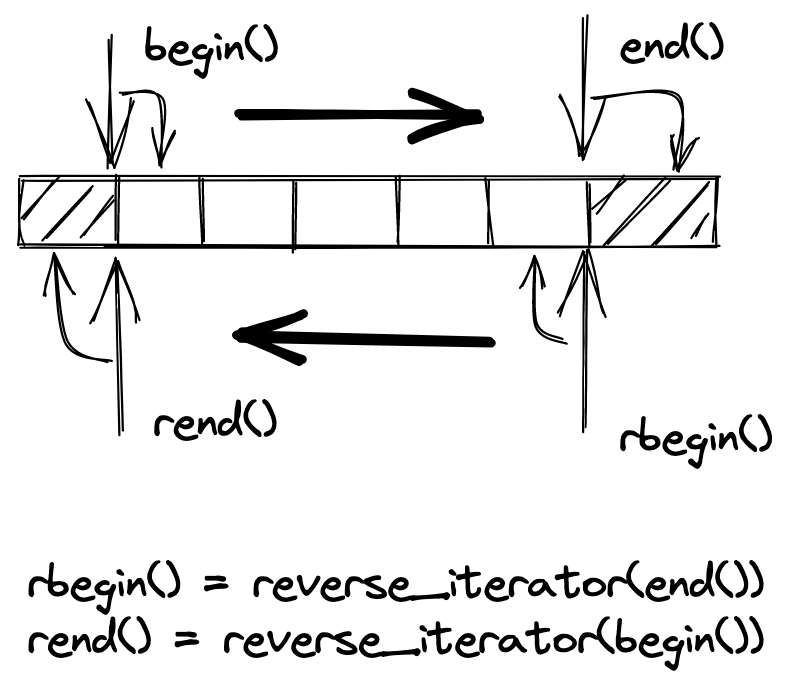
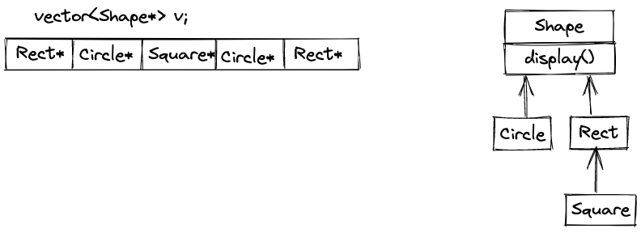

# 配接器
配接器定义：
将一个class的接口转换为另一个class的接口，使原本因不兼容而不能合作的classes，可以一起运作
## 一、配接器概观与分类
### 1、应用于容器
第四章 序列式容器中已经介绍过
- queue
- stack

### 2、应用于迭代器
- insert iterators
- reverse iterators
- iostream iterators

### 3、应用于仿函数

## 二、iterator adapters
### insert iterators
内藏了一个`container`，所以也是一个adapter
```cpp
// 将某个迭代器的赋值操作改为尾部插入操作
template <class _Container>
class back_insert_iterator {
protected:
  _Container* container;
public:
  typedef _Container          container_type;
  typedef output_iterator_tag iterator_category;
  typedef void                value_type;
  typedef void                difference_type;
  typedef void                pointer;
  typedef void                reference;

  explicit back_insert_iterator(_Container& __x) : container(&__x) {}
  back_insert_iterator<_Container>&
  operator=(const typename _Container::value_type& __value) { 
    container->push_back(__value);
    return *this;
  }
  // operator* operator++ operator++(int)都不起作用
  back_insert_iterator<_Container>& operator*() { return *this; }
  back_insert_iterator<_Container>& operator++() { return *this; }
  back_insert_iterator<_Container>& operator++(int) { return *this; }
};


// 将某个迭代器的赋值操作改为头部插入操作，不适用于vector，因为vector没有提供push_front函数
template <class _Container>
class front_insert_iterator {
protected:
  _Container* container;
public:
  typedef _Container          container_type;
  typedef output_iterator_tag iterator_category;
  typedef void                value_type;
  typedef void                difference_type;
  typedef void                pointer;
  typedef void                reference;

  explicit front_insert_iterator(_Container& __x) : container(&__x) {}
  front_insert_iterator<_Container>&
  operator=(const typename _Container::value_type& __value) { 
    container->push_front(__value);
    return *this;
  }
  front_insert_iterator<_Container>& operator*() { return *this; }
  front_insert_iterator<_Container>& operator++() { return *this; }
  front_insert_iterator<_Container>& operator++(int) { return *this; }
};

// 将某个迭代器的赋值操作修改为插入操作，在指定位置进行，操作完成后将迭代器右移一个位置
template <class _Container>
class insert_iterator {
protected:
  _Container* container;
  typename _Container::iterator iter;
public:
  typedef _Container          container_type;
  typedef output_iterator_tag iterator_category;
  typedef void                value_type;
  typedef void                difference_type;
  typedef void                pointer;
  typedef void                reference;

  insert_iterator(_Container& __x, typename _Container::iterator __i) 
    : container(&__x), iter(__i) {}
  insert_iterator<_Container>&
  operator=(const typename _Container::value_type& __value) { 
    iter = container->insert(iter, __value);
    ++iter;
    return *this;
  }
  insert_iterator<_Container>& operator*() { return *this; }
  insert_iterator<_Container>& operator++() { return *this; }
  insert_iterator<_Container>& operator++(int) { return *this; }
};


```

### reverse iterators
内藏了一个`iterator`，所以也是一种adapter
当迭代器被逆转方向时，其实体位置（真正的地址）不变，但其逻辑位置（迭代器所代表的元素）改变了



实现时，主要就是靠重载各类运算符实现的
```cpp
template <class _Iterator>
class reverse_iterator 
{
protected:
  _Iterator current;
public:
  typedef typename iterator_traits<_Iterator>::iterator_category
          iterator_category;
  typedef typename iterator_traits<_Iterator>::value_type
          value_type;
  typedef typename iterator_traits<_Iterator>::difference_type
          difference_type;
  typedef typename iterator_traits<_Iterator>::pointer
          pointer;
  typedef typename iterator_traits<_Iterator>::reference
          reference;

  typedef _Iterator iterator_type;
  typedef reverse_iterator<_Iterator> _Self;

public:
  reverse_iterator() {}
  explicit reverse_iterator(iterator_type __x) : current(__x) {}

  reverse_iterator(const _Self& __x) : current(__x.current) {}
#ifdef __STL_MEMBER_TEMPLATES
  template <class _Iter>
  reverse_iterator(const reverse_iterator<_Iter>& __x)
    : current(__x.base()) {}
#endif /* __STL_MEMBER_TEMPLATES */
    
  iterator_type base() const { return current; }
  reference operator*() const {
    _Iterator __tmp = current;
    // 对逆向迭代器取值，就是将“对应之正向迭代器”后退一格后取值
    return *--__tmp;
  }
#ifndef __SGI_STL_NO_ARROW_OPERATOR
  pointer operator->() const { return &(operator*()); }
#endif /* __SGI_STL_NO_ARROW_OPERATOR */

  _Self& operator++() {
    --current;
    return *this;
  }
  _Self operator++(int) {
    _Self __tmp = *this;
    --current;
    return __tmp;
  }
  _Self& operator--() {
    ++current;
    return *this;
  }
  _Self operator--(int) {
    _Self __tmp = *this;
    ++current;
    return __tmp;
  }

  _Self operator+(difference_type __n) const {
    return _Self(current - __n);
  }
  _Self& operator+=(difference_type __n) {
    current -= __n;
    return *this;
  }
  _Self operator-(difference_type __n) const {
    return _Self(current + __n);
  }
  _Self& operator-=(difference_type __n) {
    current += __n;
    return *this;
  }
  reference operator[](difference_type __n) const { return *(*this + __n); }  
}; 
```

### stream iterators
**istream_iterator**
内藏了一个`cin`，所以也是一种adapter
主要是重载了`operator++(int)`和`operator++()`操作符
```cpp
template <class _Tp, class _Dist>
class istream_iterator {
#ifdef __STL_TEMPLATE_FRIENDS
  template <class _T1, class _D1>
  friend bool operator==(const istream_iterator<_T1, _D1>&,
                         const istream_iterator<_T1, _D1>&);
#else /* __STL_TEMPLATE_FRIENDS */
  friend bool __STD_QUALIFIER
  operator== __STL_NULL_TMPL_ARGS (const istream_iterator&,
                                   const istream_iterator&);
#endif /* __STL_TEMPLATE_FRIENDS */

protected:
  istream* _M_stream;
  _Tp _M_value;
  bool _M_end_marker;
  void _M_read() {
    _M_end_marker = (*_M_stream) ? true : false;
    if (_M_end_marker) *_M_stream >> _M_value;
    _M_end_marker = (*_M_stream) ? true : false;
  }
public:
  typedef input_iterator_tag  iterator_category;
  typedef _Tp                 value_type;
  typedef _Dist               difference_type;
  typedef const _Tp*          pointer;
  typedef const _Tp&          reference;

  istream_iterator() : _M_stream(&cin), _M_end_marker(false) {}
  istream_iterator(istream& __s) : _M_stream(&__s) { _M_read(); }
  reference operator*() const { return _M_value; }
#ifndef __SGI_STL_NO_ARROW_OPERATOR
  pointer operator->() const { return &(operator*()); }
#endif /* __SGI_STL_NO_ARROW_OPERATOR */
  istream_iterator<_Tp, _Dist>& operator++() { 
    _M_read(); 
    return *this;
  }
  istream_iterator<_Tp, _Dist> operator++(int)  {
    istream_iterator<_Tp, _Dist> __tmp = *this;
    _M_read();
    return __tmp;
  }
};

```

**ostream_iterator**
内藏了一个`cout`，所以也是一种adapter
主要是重载了`operator=()`操作符
```cpp
template <class _Tp>
class ostream_iterator {
protected:
  ostream* _M_stream;
  const char* _M_string;
public:
  typedef output_iterator_tag iterator_category;
  typedef void                value_type;
  typedef void                difference_type;
  typedef void                pointer;
  typedef void                reference;

  ostream_iterator(ostream& __s) : _M_stream(&__s), _M_string(0) {}
  ostream_iterator(ostream& __s, const char* __c) 
    : _M_stream(&__s), _M_string(__c)  {}
  ostream_iterator<_Tp>& operator=(const _Tp& __value) { 
    *_M_stream << __value;
    if (_M_string) *_M_stream << _M_string;
    return *this;
  }
  ostream_iterator<_Tp>& operator*() { return *this; }
  ostream_iterator<_Tp>& operator++() { return *this; } 
  ostream_iterator<_Tp>& operator++(int) { return *this; } 

};
```

## 三、function adapters
内藏一个仿函数
```cpp
template <class _Operation> 
class binder2nd
  : public unary_function<typename _Operation::first_argument_type,
                          typename _Operation::result_type> {
protected:
  _Operation op;
  typename _Operation::second_argument_type value;
public:
  binder2nd(const _Operation& __x,
            const typename _Operation::second_argument_type& __y) 
      : op(__x), value(__y) {}
  typename _Operation::result_type
  operator()(const typename _Operation::first_argument_type& __x) const {
    return op(__x, value); 
  }
};

```

function adapters用于函数合成
```cpp
template <class _Operation1, class _Operation2>
class unary_compose
  : public unary_function<typename _Operation2::argument_type,
                          typename _Operation1::result_type> 
{
protected:
  _Operation1 _M_fn1;
  _Operation2 _M_fn2;
public:
  unary_compose(const _Operation1& __x, const _Operation2& __y) 
    : _M_fn1(__x), _M_fn2(__y) {}
  typename _Operation1::result_type
  operator()(const typename _Operation2::argument_type& __x) const {
    return _M_fn1(_M_fn2(__x));
  }
};

// 辅助函数，使用户方便运用unary_compose<Op1, Op2>
template <class _Operation1, class _Operation2>
inline unary_compose<_Operation1,_Operation2> 
compose1(const _Operation1& __fn1, const _Operation2& __fn2)
{
  return unary_compose<_Operation1,_Operation2>(__fn1, __fn2);
}

```

function adapters用于函数指针
```cpp
template <class _Arg, class _Result>
class pointer_to_unary_function : public unary_function<_Arg, _Result> {
protected:
  _Result (*_M_ptr)(_Arg);
public:
  pointer_to_unary_function() {}
  explicit pointer_to_unary_function(_Result (*__x)(_Arg)) : _M_ptr(__x) {}
  _Result operator()(_Arg __x) const { return _M_ptr(__x); }
};

// _Arg: 输入参数型别
// _Result: 输出参数型别
// __x: ptr_fun
template <class _Arg, class _Result>
inline pointer_to_unary_function<_Arg, _Result> ptr_fun(_Result (*__x)(_Arg))
{
  return pointer_to_unary_function<_Arg, _Result>(__x);
}
```

function adapters用于成员函数指针
```cpp
template <class _Ret, class _Tp>
class mem_fun_t : public unary_function<_Tp*,_Ret> {
public:
  // _Tp::*__pf   pf是指向Tp类中成员的指针
  explicit mem_fun_t(_Ret (_Tp::*__pf)()) : _M_f(__pf) {}
  _Ret operator()(_Tp* __p) const { return (__p->*_M_f)(); }
private:
  _Ret (_Tp::*_M_f)();
};

template <class _Ret, class _Tp>
inline mem_fun_t<_Ret,_Tp> mem_fun(_Ret (_Tp::*__f)())
  { return mem_fun_t<_Ret,_Tp>(__f); }

```

调用时
```cpp
vector<Shape*> v;
for_each(v.begin(), v.end(), mem_fun(&Shape::display));  // 正确

for_each(v.begin(), v.end(), &Shape::display);   // 错误

for_each(v.begin(), v.end(), Shape::display);    // 错误
```



