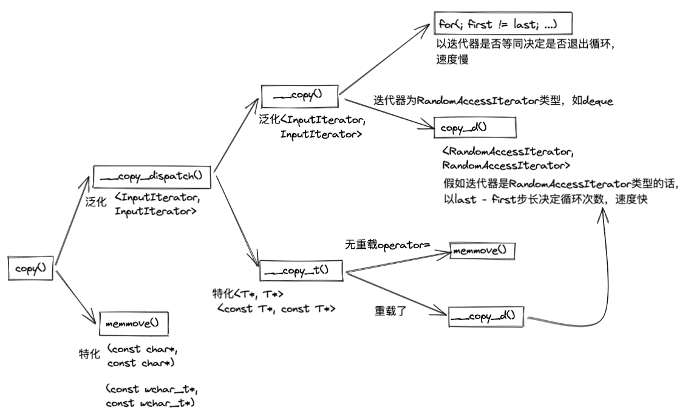

# 算法
## 一、算法概观
主要涉及文件
- stl_numeric.h
- std_algo.h
- stl_algobase.h
- stl_heap.h

质变算法：运算过程会改变迭代器所指元素内容，例如sort
非质变算法：例如min、max等

## 二、基本算法
### copy——强化效率无所不用其极


下面摘抄自stl_algobase.h，与上图中略有不同
```cpp
// 泛化版copy(), 调用__copy_dispatch()
template <class _InputIter, class _OutputIter>
inline _OutputIter copy(_InputIter __first, _InputIter __last,
                        _OutputIter __result) {
  __STL_REQUIRES(_InputIter, _InputIterator);
  __STL_REQUIRES(_OutputIter, _OutputIterator);
  typedef typename iterator_traits<_InputIter>::value_type _Tp;
  typedef typename __type_traits<_Tp>::has_trivial_assignment_operator
          _Trivial;
  return __copy_dispatch<_InputIter, _OutputIter, _Trivial>
    ::copy(__first, __last, __result);
}

// 特化版copy()
inline _Tp* copy(const _Tp* __first, const _Tp* __last, _Tp* __result) 
{ 
    memmove(__result, __first, sizeof(_Tp) * (__last - __first));          
    return __result + (__last - __first);                                  
}


// __copy_dispatch()做了什么
template <class _InputIter, class _OutputIter, class _BoolType>
struct __copy_dispatch {
  static _OutputIter copy(_InputIter __first, _InputIter __last,
                          _OutputIter __result) {
    typedef typename iterator_traits<_InputIter>::iterator_category _Category;
    typedef typename iterator_traits<_InputIter>::difference_type _Distance;
    return __copy(__first, __last, __result, _Category(), (_Distance*) 0);
  }
};

template <class _Tp>
struct __copy_dispatch<_Tp*, _Tp*, __true_type>
{
  static _Tp* copy(const _Tp* __first, const _Tp* __last, _Tp* __result) {
    return __copy_trivial(__first, __last, __result);
  }
};

template <class _Tp>
struct __copy_dispatch<const _Tp*, _Tp*, __true_type>
{
  static _Tp* copy(const _Tp* __first, const _Tp* __last, _Tp* __result) {
    return __copy_trivial(__first, __last, __result);
  }
};

// __copy_trival做了什么？其实就是图上的，因为无重载operator=，所以直接调用memmove()
template <class _Tp>
inline _Tp*
__copy_trivial(const _Tp* __first, const _Tp* __last, _Tp* __result) {
  memmove(__result, __first, sizeof(_Tp) * (__last - __first));
  return __result + (__last - __first);
}

// __copy做了什么？根据_Category决定是按照步长迭代还是通过判断迭代器是否等同结束迭代
// 若_Categroy为RandomAccessIterator,调用如下：
template <class _RandomAccessIter, class _OutputIter, class _Distance>
inline _OutputIter
__copy(_RandomAccessIter __first, _RandomAccessIter __last,
       _OutputIter __result, random_access_iterator_tag, _Distance*)
{
  for (_Distance __n = __last - __first; __n > 0; --__n) {
    *__result = *__first;
    ++__first;
    ++__result;
  }
  return __result;
}

// 若为其他类型迭代器，调用如下：
template <class _InputIter, class _OutputIter, class _Distance>
inline _OutputIter __copy(_InputIter __first, _InputIter __last,
                          _OutputIter __result,
                          input_iterator_tag, _Distance*)
{
  for ( ; __first != __last; ++__result, ++__first)
    *__result = *__first;
  return __result;
}

```

### reverse算法
`__first`, `__last`可以看作原生指针或智能指针
`iter_swap(__first++, __last)`方法，先调用`_BidirectionalIter`的copy construction，再`++`，最后会调用`iter_swap()`方法，所以可以起到头尾互换后，头部累进一个位置的效果。
```cpp
template <class _BidirectionalIter>
void __reverse(_BidirectionalIter __first, _BidirectionalIter __last, 
               bidirectional_iterator_tag) {
  while (true)
    if (__first == __last || __first == --__last)
      return;
    else
      iter_swap(__first++, __last);
}

template <class _RandomAccessIter>
void __reverse(_RandomAccessIter __first, _RandomAccessIter __last,
               random_access_iterator_tag) {
  while (__first < __last)
    iter_swap(__first++, --__last);
}

template <class _BidirectionalIter>
inline void reverse(_BidirectionalIter __first, _BidirectionalIter __last) {
  __STL_REQUIRES(_BidirectionalIter, _Mutable_BidirectionalIterator);
  __reverse(__first, __last, __ITERATOR_CATEGORY(__first));
}

```


### random_shuffle算法
洗牌算法
从第二个位置开始，每个位置都与随机一个位置进行交换
```cpp
template <class _Distance>
inline _Distance __random_number(_Distance __n) {
#ifdef __STL_NO_DRAND48
  return rand() % __n;
#else
  return lrand48() % __n;
#endif
}

// random_shuffle

template <class _RandomAccessIter>
inline void random_shuffle(_RandomAccessIter __first,
                           _RandomAccessIter __last) {
  __STL_REQUIRES(_RandomAccessIter, _Mutable_RandomAccessIterator);
  if (__first == __last) return;
  for (_RandomAccessIter __i = __first + 1; __i != __last; ++__i)
    iter_swap(__i, __first + __random_number((__i - __first) + 1));
}

template <class _RandomAccessIter, class _RandomNumberGenerator>
void random_shuffle(_RandomAccessIter __first, _RandomAccessIter __last,
                    _RandomNumberGenerator& __rand) {
  __STL_REQUIRES(_RandomAccessIter, _Mutable_RandomAccessIterator);
  if (__first == __last) return;
  for (_RandomAccessIter __i = __first + 1; __i != __last; ++__i)
    iter_swap(__i, __first + __rand((__i - __first) + 1));
}

```

### sort排序算法
1、普通QuickSort算法平均时间复杂度为O(å$NlogN$)，最坏情况可以到O($N^2$)，如何优化可以使最坏情况的时间复杂度也降低到O($NlogN$)？
使用三点中值法，即选用pivot时，使用头、尾、中央三个位置元素的中值
IntroSort是David R.Musser在1996年提出的一种混合式排序算法，在大部分情况下几乎与三点中值法相同，但是当分割行为有恶化为二次行为的倾向时，能够自我侦测，转而改用Heap Sort


## 附录
### 模板自动推导
下面这个例子中，Iterator自动被推导为int*，T自动被推导为int
模板参数能自动推导需要满足下面三个条件：
1. 模板的形参必须与模板函数的形参在位置上存在一一对应的关系
2. 与模板函数返回值相关的模板参数无法进行自动推导
3. 需要推导的模板参数必须是连续位于模板参数列表的尾部，中间不能有不可推导的模板参数。
```cpp
#include <iostream>

using std::cout;
using std::endl;

template<class Iterator, class T>
Iterator find(Iterator begin, Iterator end, const T& value)
{
  while (begin != end && *begin != value)
    ++begin;
  return begin;
}

int main() {
  int ia[5] = {0, 1, 2, 3, 4};
  int* ip = find(ia, ia + 5, 1);
  if (ip == ia + 5)
    cout << "1 not found" << endl;
  else
    cout << "1 found. " << *ip << endl;
}
```