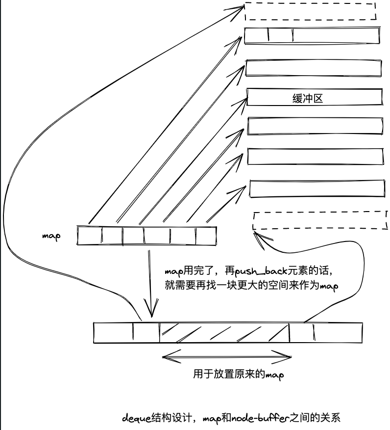

# 序列式容器
## 一、vector


备用空间用完后，会扩充空间，是怎么扩充的呢？

```cpp
void push_back(const T& x)
{
  if (finish != end_of_storage) {
    construct(finish, x);
    ++finish;
  } else {
    insert_aux(end(), x);
  }
}

template <class T, class Alloc>
void vector<T, Alloc>::insert_aux(iterator position, const T& x) {
if (finish != end_of_storage) {     // 考虑到这个函数还会被insert(p, x)调用
  construct(finish, *(finish - 1));
  ++finiish;
  T x_copy = x;
  copy_backward(position, finish - 2, finish - 1);
  *position = x_copy;
} else { // 真的没有备用空间了
  // size_type类型即size_t, typedef size_t size_type
  const size_type old_size = size(); 
  const size_type len = old_size != 0 ? 2 * old_size : 1;

  iterator new_start = data_allocator:allocate(len);
  iterator new_finish = new_start;
  try {
    // 先copy start -> position的对象
    // 再插入x，这里还是考虑到insert(p, x)会调用这个方法
    // 最后copy position -> finish之间的对象
    new_finish = uninitialized_copy(start, position, new_start);
    construct(new_finish, x);
    ++new_finish;
    new_finish = uninitialized_copy(position, finish, new_finish);
  } catch (...) {
    // commit or rollback semantics
    destroy(new_start, new_finish);
    data_allocator::deallocate(new_start, len);
    throw;
  }

  // 析构并释放原vector
  destroy(begin(), end());
  deallocate;

  start = new_start;
  finish = new_finish;
  end_of_storage = new_start + len;
}

}
```

copy_backward()工作方式与uninitialized_copy()工作方式相反，
copy_backward()是从后往前复制


uninitialized_copy()则是从前往后复制，如下图：


## 二、list
c++中的list是双向链表


### STL中list迭代器设计
对于list迭代器，需要支持以下功能：
- operator*
- operator->
- operator++
- operator--
- operator++(int)
- operator--(int)
- operator==
- operator!=

```cpp
template <class T>
struct __list_node {
  typedef void* void_pointer;
  void_pointer prev;
  void_pointer next;
  T data;
};

template<class T, class Ref, class Ptr>
struct __list_iterator {
  typedef __list_iterator<T, T&, T*>    iterator;
  typedef __list_iterator<T, Ref, Ptr>  self;

  typedef bidirectional_iterator_tag iterator_categroy;
  typedef T     value_type;
  typedef Ptr   pointer;
  typedef Ref   reference;
  typedef __list_node<T>* link_type;
  typedef size_t size_type;
  typedef ptrdiff_t difference_type;

  link_type node;

  // constructor
  __list_iterator(link_type x) : node(x) {}
  __list_iterator() {}
  __list_iterator(const interator& x) : node(x.node) {}

  bool operator==(const self& x) const { return node == x.node; }
  bool operator!=(const self& x) const { return node != x.node; }

  reference operator*() const { return (*node).data; }
  // 取的是迭代器成员node.data的地址
  pointer operator->() const { return &(operator*()); } 

  // ++iterator
  self& operator++() {
    node = (link_type)((*node).next);
    return *this;
  }

  // iterator++
  self operator++(int) {
    self tmp = *this;
    ++*this;
    return tmp;
  }

  // --iterator
  self& operator--() {
    node = (link_type)((*node).prev);
    return *this;
  }

  // iterator--
  self operator--(int) {
    self tmp = *this;
    --*this;
    return tmp;
  }
};
```

### list的元素操作

| 操作                                                            | 说明                                             |
| --------------------------------------------------------------- | ------------------------------------------------ |
| void push_front(const T& x)                                     | 插入一个节点，作为头节点                         |
| void push_back(const T& x)                                      | 插入一个节点，作为尾节点                         |
| iterator erase(iterator position)                               | 移除迭代器position所指节点，并返回下一节点迭代器 |
| void pop_front()                                                | 移除头节点                                       |
| void pop_back()                                                 | 移除尾节点                                       |
| void clear()                                                    | 清除所有节点（整个链表）                         |
| void remove(const T& value)                                     | 将值为value的所有元素移除                        |
| void unique()                                                   | 移除所有数值相同的**连续**元素                   |
| void transfer(iterator position, iterator first, iterator last) | 将\[first, last\)内的所有元素移动到position之前  |
|                                                                 |                                                  |


。。。

## 三、deque
相比vector这种单向开口的连续线性空间，deque是一种双向开口的连续线性空间

### deque 和 vector的区别
1. deque允许在O(1)时间内对起头端进行元素的插入或移除操作
2. deque没有所谓容量（capacity）观念，它是动态地以分段连续空间组合而成的

deque复杂度相比vector高很多，若要去deque进行排序操作，一般是将整个deque复制到vector中，再将vector进行排序后再复制回deque

### deque结构设计
map是由一个个node组成的，node则会继续指向buffer




## 四、stack
stack允许新增元素、移除元素、取得最顶端元素，但不允许有遍历行为
stack是以底部容器完成所有工作的，这种通过“修改某物接口，形成另一种风貌”的特性，称为adapter（配接器）
所以SGI stack往往不被归类为container，而被归类为container adapter
stack没有迭代器

## 五、queue
queue允许新增元素、移除元素、从最底端加入元素、获取顶端元素
没有任何其它方法可以存取queue的其它元素，queue不允许有遍历行为
同stack，queue实际上也是一个adapter（配接器），也不提供迭代器

## 六、heap
heap不归属于STL容器组件，它是个幕后英雄，扮演priority queue的助手
heap没有迭代器
C++中的priority queue是最大堆
可以利用最大堆实现堆排序
建堆（将列表隐式表述为完全二叉树）关键：
若父节点下标为i，则其左节点下标为`2 * i + 1`，右节点下标为`2 * i + 2`
建堆时，起点的`holeIndex=(len - 2) / 2`，其中`len`是列表中节点的个数，如下图，应从5这个节点开始调整，调整完后调整4节点，3节点......一直到1这个根节点


主要提供的接口（需要`#include <algorithm>`）：
```cpp
int ia[9] = {0, 1, 2, 3, 4, 8, 9, 3, 5};
vector<int> ivec(ia, ia+9);
```
- make_heap(ivec.begin(), ivec.end())     建堆
- push_heap(ivec.begin(), ivec.end())      将队尾元素push到其所应该在位置
- pop_heap(ivec.begin(), ivec.end())        将最大元素放到列表队尾，可以通过`ivec.back()`获取
- sort_heap(ivec.begin(), ivec.end())        堆排序，排序后ivec为`{0, 1, 2, 3, 3, 4, 5, 8, 9}`

## 七、priority_queue
priority_queue完全以底部容器为根据，加上heap处理规则，所以其实现非常简单。
缺省情况下是以vector为底部容器。
也是一个adapter，往往不被归类为container，而被归类为container adapter
不提供遍历功能，不提供迭代器
主要接口
- empty()
- size()
- top()
- push(const value_type& x)     就是组合了container.push_back() + push_heap()
- pop()                                          就是组合了pop_heap() + container.pop_back()

## 八、slist
单向链表
与list的主要差别在于，slit的迭代器属于单向的`Forward Iterator`，后者的迭代器属于双向的`Bidirectional Iterator`


