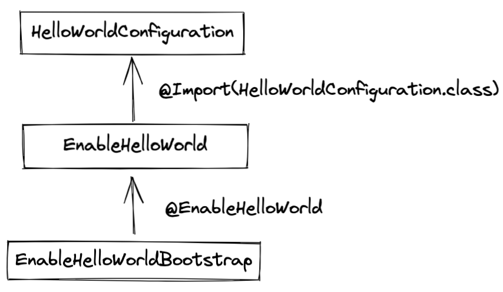
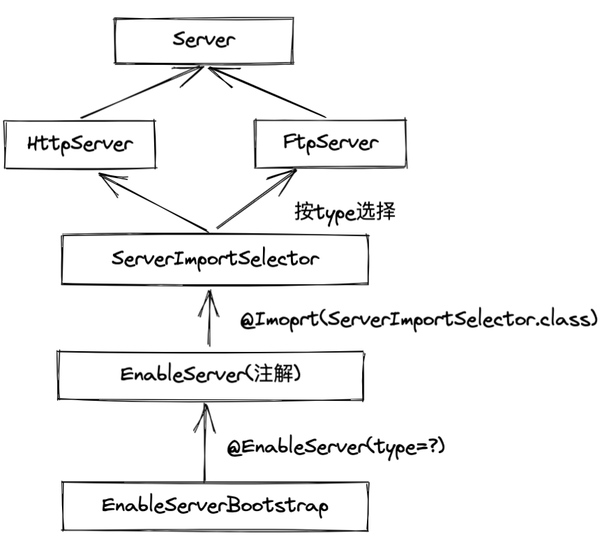

# 八、Spring注解驱动设计模式
## Spring @Enable模块驱动
就是通过注解注入某个Bean，并由Spring Boot进行管理。
Spring Framework大致可分为两类实现，分为“注解驱动”和“接口编程”


### 基于“注解驱动”实现@Enable模块

{width=50%}

```java
// HelloWorldConfiguration.java
package thinking.in.spring.boot.firstappbygui;  
  
import org.springframework.context.annotation.Bean;  
import org.springframework.context.annotation.Configuration;  
  
@Configuration  
public class HelloWorldConfiguration {  
  
    @Bean  
    public String helloWorld() {  
        return "Hello,World";  
    }  
}
```

```java
// EnableHelloWorld.java
package thinking.in.spring.boot.firstappbygui;  
  
import org.springframework.context.annotation.Import;  
  
import java.lang.annotation.*;  
  
@Target(ElementType.TYPE)  
@Retention(RetentionPolicy.RUNTIME)  
@Documented  
@Import(HelloWorldConfiguration.class)  
public @interface EnableHelloWorld {  
  
}
```

```java
// EnableHelloWorldBootstrap
package thinking.in.spring.boot.firstappbygui;  
  
import org.springframework.context.annotation.AnnotationConfigApplicationContext;  
  
@EnableHelloWorld  
public class EnableHelloWorldBootstrap {  
  
    public static void main(String[] args) {  
        AnnotationConfigApplicationContext context = new AnnotationConfigApplicationContext();  
  
        context.register(EnableHelloWorldBootstrap.class);  
  
        context.refresh();  
  
        String helloWorld = context.getBean("helloWorld", String.class);  
  
        System.out.printf("helloWorld = %s \n", helloWorld);  
        context.close();  
    }  
}
```

output:
```java
helloWorld = Hello,World
```


### 基于”接口编程“实现@Enable模块

{width=50%}

```java
// Server.java
package thinking.in.spring.boot.firstappbygui;  
  
public interface Server {  
  
    void start();  
  
    void stop();  
  
    enum Type {  
        HTTP,  
        FTP  
    }  
}
```


```java
// HttpServer
package thinking.in.spring.boot.firstappbygui;  
  
import org.springframework.stereotype.Component;  
  
@Component  
public class HttpServer implements Server {  
  
    @Override  
    public void start() {  
        System.out.println(("HTTP 服务器启动中..."));  
    }  
  
    @Override  
    public void stop() {  
        System.out.println("HTTP 服务器关闭中...");  
    }  
}
```

```java
// FtpServer
package thinking.in.spring.boot.firstappbygui;  
  
import org.springframework.stereotype.Component;  
  
@Component  
public class FtpServer implements Server {  
  
    @Override  
    public void start() {  
        System.out.println("FTP服务器启动中...");  
    }  
  
    @Override  
    public void stop() {  
        System.out.println("FTP 服务器关闭中...");  
    }  
}
```

```java
// ServerImportSelector
package thinking.in.spring.boot.firstappbygui;  
  
import org.springframework.context.annotation.ImportSelector;  
import org.springframework.core.type.AnnotationMetadata;  
  
import java.util.Map;  
  
public class ServerImportSelector implements ImportSelector {  
  
    @Override  
    public String[] selectImports(AnnotationMetadata importingClassMetadata) {  
        Map<String, Object> annotationAttributes = importingClassMetadata.getAnnotationAttributes(EnableServer.class.getName());  
  
        Server.Type type = (Server.Type) annotationAttributes.get("type");  
  
        String[] importClassNames = new String[0];  
  
        switch (type) {  
            case HTTP:  
                importClassNames = new String[] {HttpServer.class.getName()};  
                break;            case FTP:  
                importClassNames = new String[] {FtpServer.class.getName()};  
                break;        }  
        return importClassNames;  
    }  
}
```

```java
// EnableServer

package thinking.in.spring.boot.firstappbygui;  
  
import org.springframework.context.annotation.Import;  
  
import java.lang.annotation.*;  
  
@Target(ElementType.TYPE)  
@Retention(RetentionPolicy.RUNTIME)  
@Documented  
@Import(ServerImportSelector.class)  
public @interface EnableServer {  
  
    Server.Type type();  
}
```

```java
// main, EnableServerBootstrap
package thinking.in.spring.boot.firstappbygui;  
  
import org.springframework.context.annotation.AnnotationConfigApplicationContext;  
import org.springframework.context.annotation.Configuration;  
  
@Configuration  
@EnableServer(type = Server.Type.FTP)  
public class EnableServerBootstrap {  
  
    public static void main(String[] args) {  
        AnnotationConfigApplicationContext context = new AnnotationConfigApplicationContext();  
  
        context.register(EnableServerBootstrap.class);  
  
        context.refresh();  
        Server server = context.getBean(Server.class);  
  
        server.start();  
        server.stop();  
    }  
}
```

## Spring Web自动装配
Spring Boot三大特性：
1.  组件自动装配：Web MVC、Web Flux、JDBC等 ；
2.  嵌入式Web容器：TomCat、Jetty以及Undertow；
3. 生产准备特性。

Spring Boot如何自动加载各类配置：
{width=50%}

## Spring条件装配
Java从IoC容器中获得创建好的对象，getBean方法的三种方式：
1. 根据bean元素的id属性获得对象，需要强转类型，bean的id写错会抛出NoSuchBeanDefinitionException问题
   User user1 = (User) content.getBean("user");
2. 根据bean元素的class属性获得对象，需要确保同一种类型的bean只能配置一个
   User user2 = context.getBean(User.class);
3. 根据bean元素的id + class属性获取对象，要求id和类型一定要匹配正确（推荐）
   User user2 = context.getBean("User", User.class);

### @Profile条件装配
当Profile不匹配时，当前Class不会被注册为Spring Bean

### @Conditional条件装配
相比`@Profile`条件装配，`@Conditional`条件装配更关注运行时动态选择
如何自定义一个`@Conditional`条件装配？
1. 定义一个条件注解
```Java
@...
@Conditional(OnSystemPropertyConditional.class)
public @interface ConditionalSystemProperty {
	String name();

	String value();
}
```

2. 实现一个系统属性名称与值匹配条件 —— OnSystemPropertyConditional
```java
public class OnSystemPropertyConditional implements Condition {

	@Override
	public boolean matches(ConditionContext context, AnnotatedTypeMetadata metadata) {
		....
	}
}
```

3. 实现条件消息配置 —— conditionalMessageConfiguration
```Java
@Configuration
public class ConditionalMessageConfiguration {

	@ConditionalOnSystemProperty(name = "language", value = "Chinese")
	@Bean("message")
	public String chineseMessage() {
		return "你好，世界";
	}

	@ConditionalOnSystemProperty(name = "language", value = "English")
	@Bean("message")
	public String englishMessage() {
		return "Hello, World";
	}
}
```

4. 编写OnSystemPropertyCondition引导程序
```Java
public class ConditionalOnSystemPropertyBootstrap {

	public static void main(String[] args) {
		System.setProperty("language", "Chinese");
		AnnotationConfigApplicationContext context = new AnnotationConfigApplicationContext();
		// 注册Bean到Spring上下文
		context.register(ConditionalMessageConfiguration.class);
		context.refresh;
		String message = context.getBean("message", String.class);
		System.out.printf(....)
	}
}
```

### ConditionEvaluator
其评估存在两个阶段：
1. Bean注册阶段；
2. Configuration Class解析阶段


