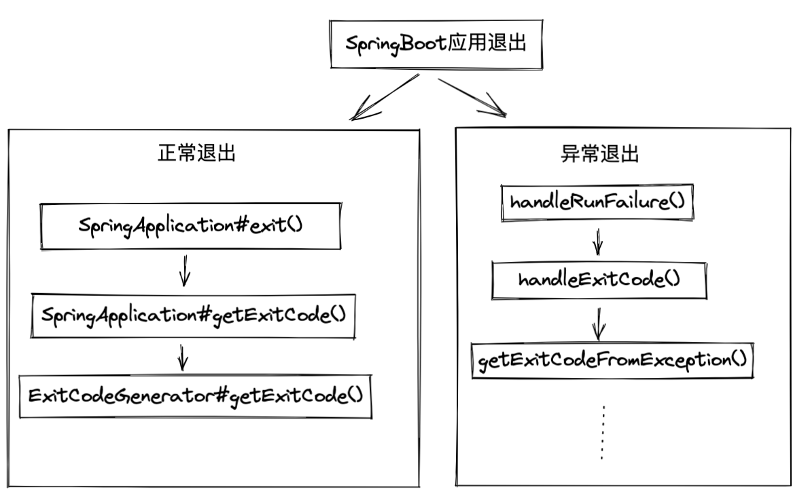

# 十三、SpringBoot应用退出

{width=50%}


## 异常退出
可以基于ExitCodeGenerator，也可以基于ExitCodeExceptionMapper Bean

### 基于ExitCodeGenerator获取异常退出码
```Java
static class ExitCodeGeneratorThrowable extends RuntimeException implements ExitCodeGenerator {
	public ExitCodeGeneratorThrowable(String message) {
		super(message);
	}

	@Override
	public int getExitCode() {
		return 95;
	}
}
```

### 基于ExitCodeExceptionMapper Bean映射异常和退出码

```Java
public interface ExitCodeExceptionMapper {
	int getExitCode(Throwable exception);
}

public class ExitCodeExceptionMapperBootstrap {

	@Bean
	public ExitCodeExceptionMapper exitCodeExceptionMapper() {
		return (throwable) -> 128;
	}
	
	public static void main(String[] args) {
		new SpringApplicationBuilder(ExitCodeExceptionMapperBootstrap.class)
		.listeners((ApplicationListener<ApplicationReadyEvent>) event -> {
			throw new RuntimeException();
		})
		.web(false)
		.run(args)
		.close();
	}
}
```

