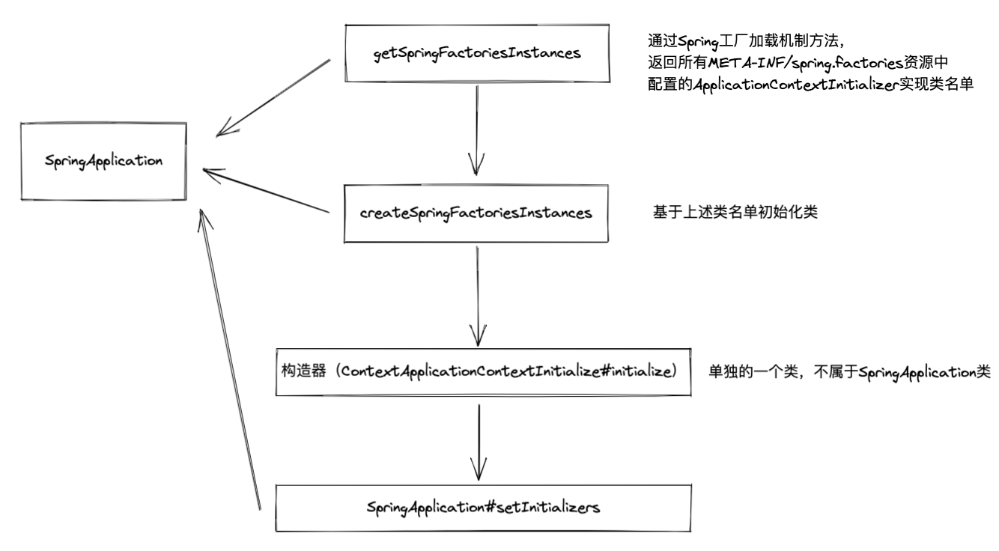

# 十、SpringApplication初始化阶段
SpringApplication的准备阶段由两阶段完成：
1. 构造阶段；
2. 配置阶段

## SpringApplication构造阶段
1. 推断Web应用类型（在SpringApplication类实例初始化阶段运行`deduceMainApplicationClass()`)；
2. 加载Spring应用上下文初始化器；
如何加载Spring应用上下文初始化器？

{width=50%}

用跟上述类似的方式加载Spring应用事件监听器(ApplicationListener)
最后进行推断应用引导类，即推断main方法所在的类

## SpringApplication配置阶段
### 调整SpringApplication设置
调用`app.setXXXXX()`方法调整设置，如
```Java
public static void main(String[] args) {
  SpringApplication app = new SpringApplication(MySpringConfiguration.class);
  app.setBannerMode(Banner.Mode.OFF);
  app.run(args);
}
```

### 增加SpringApplication配置源
SpringApplication配置源：
1. 主配置类名称；
2. @Configuration Class名称;
3. XML配置文件和package名称;
通过SpringApplication#setSources接口来完成
```Java
public class SpringApplication {
  public void setSources(Set<String> sources) {
    Assert.notNull(sources, "Sources must not be null");
    this.sources = new LinkedHashSet<>(sources);
  }
}
```

###  调整Spring Boot外部化配置
如application.properties文件，就是外部化配置

## 附录
Java异常层次结构

{width=50%}