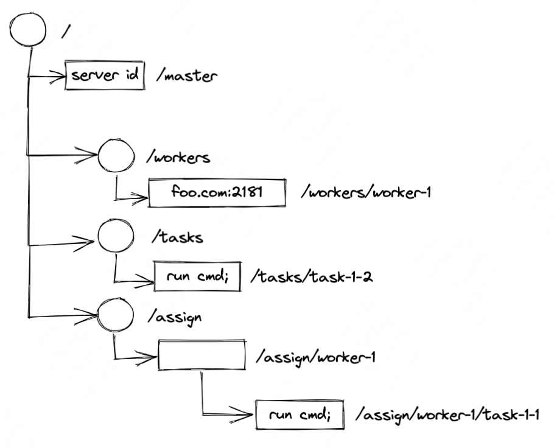
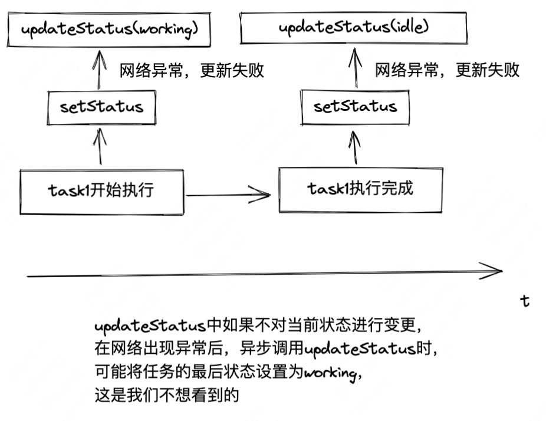
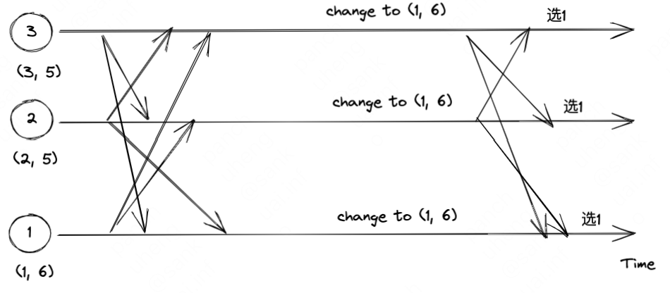
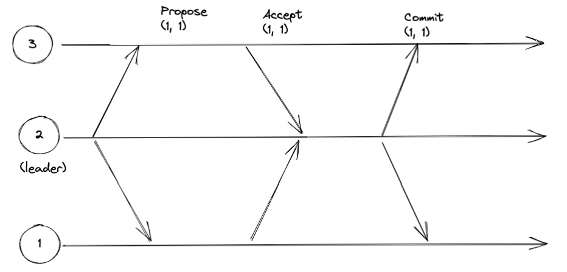

# ZooKeeper分布式过程协同技术

## 2、ZooKeeper技术
一种znode树结构，如下图所示，根节点包含4个子节点，其中三个子节点拥有下一级节点，叶子节点存储了数据信息
{width=50%}

### ZooKeeper API

| API                | 作用                                         |
| ------------------ | -------------------------------------------- |
| create /path data  | 创建一个名为/path的znode节点，并包含数据data |
| delete /path       | 删除名为/path的znode                         |
| exists /path       | 检查是否存在名为/path的节点                  |
| setDate /path data | 设置名为/path的znode的数据会data             |
| getDate /path      | 返回名为/path节点的数据信息                  |
| getChildren /path  | 返回所有/path节点的所有子节点列表                                             |

### znode的不同类型
1. 持久的；
2. 临时的；
3. 持久有序的；
4. 临时有序的。

ZooKeeper客户端尝试连接到不同的服务器时，这个服务器的ZooKeeper状态要与最后连接的服务器的ZooKeeper状态保持最新。
客户端不能连接到这样的服务器：它未发现更新而客户端却已经发现更新了。

### ZooKeeper实现锁
一般使用ZooKeeper的接口来管理znode，以此来实现锁
为了获得一个锁，每个进程p尝试创建znode，名为/lock，如果进程p成功创建了znode，就表示它获得了锁并可以继续执行临界区域的代码，存在的问题：进程p崩溃可能会导致这个锁永远无法释放。
为避免这种情况，可以在创建节点时，指定`/lock`为临时节点，就代表占用了锁，一个临时节点会在会话过期或关闭时自动被删除。

## 3、开始使用ZooKeeper的API

### 注册从节点
通过异步方式设置状态，需要考虑网络不好时的情况
```java
StatCallback statusUpdateCallback = new StatCallback() {
	switch(Code.get(rc)) {
		case CONNECTIONLOSS:
			updateStatus((String) ctx);
			return;
	}
};

// updateStatus需要考虑网络不好时的情况
synchronized private void updateStatus(String status) {
	if (status == this.status) {
		zk.setDate("/workers/" + name, status.getBytes(), -1, statusUpdateCallback, status);
	}
}

public void setStatus(String status) {
	this.status = status;
	updateStatus(status);
}
```


{width=50%}

## 4、处理状态变化
### 单次触发器
事件：指一个znode节点执行了更新操作
监视点：表示一个与之关联的znode节点和事件类型组成的单次触发器
当一个监视点被一个事件触发时，会产生一个通知

会丢事件，但问题不大

### 如何设置监视点
监视点有两种类型：
1. 数据监视点；
2. 子节点监视点。

exists和getData这两个操作可以设置数据监视点
getChildren操作可以设置子节点监视点

getData可调用两种方式设置监视点：

```java
public byte[] getData(final String path, Watcher watcher, Stat stat);

public byte[] getData(final String path, boolean watch, Stat stat);
```

第一种可传递一个用户自定义的Watcher对象
第二种设置为true，告诉客户端使用默认的监视点

ZK监视点的典型特征：
1.  单次触发：状态变更一次，就触发监视点，发送通知；
2.  通知优先：先向 Client 发送通知，再变更 ZNode 状态；
3.  与会话关联：会话过期，则等待的监视点会被删除；
4.  跨服务器生效：Client 跟服务节点断开后，连接其他服务节点时，Client 会重新发送未触发的监视点列表，在新的服务器上注册；
5.  无法移除：监视点一旦设置，就无法手动移除；只有 2 种方式：
    -   触发监视点
    -   会话过期、或关闭


### 如何解决在同个节点创建多个监视点的问题


监视点的生命周期：
1.  跟 Session 生命周期绑定：Session 关闭或超时，监视点会自动清除
2.  监视点只保存在内存中，不会持久化到磁盘
3.  Client 重连有效：Client 侧保存一份监视点信息，Client 重连到另一个 Server 后，会向 Server 发送监视点列表，重新设置监视点

### ZK使用注意点
1. 避免在一个特定节点设置大量的监控点，最好是每次在特定的znode节点上，只有少量的客户端设置监视点，理想情况下最多只设置一个。


## 5、故障处理

### 可恢复的故障
Disconnected事件和ConnectionLossException异常产生时的两种场景：
1. 客户端没有进行中的请求（直接与新的服务器重新建立会话即可）；
2. 客户端中有正在进行中的请求，需要开发者主动关闭会话，再与新的服务器建立连接

**已存在的监视点与Disconnected事件**
客户端与新的服务器建立连接后，会发送监视点列表和最后已知的zxid（最终状态的时间戳），如果任何已经监视的znode节点的修改时间戳晚于最后已知的zxid，服务器就会触发这个监视点。

上述方式无法监控exists操作，因为exists操作可以监控一个不存在的节点。
因此，需要尽量避免监视一个znode节点的创建事件，如果一定要监视创建事件，应尽量监视存活期更长的znode节点。

### 不可恢复的故障
出现这种情况的常见原因：
1. 会话过期；
2. 已认证的会话无法再次与ZooKeeper完成认证。

处理不可恢复故障的最简单的方法是中止进程并重启，清除与旧会话关联的应用内部的进程状态信息，然后重新初始化新的状态。

## 6、ZooKeeper注意事项
ACL：访问控制表(ACL)，用来控制访问权限
SASL：简单认证与安全层

主从实现中，如果主要主节点崩溃并恢复，在主节点恢复后，不能再认为自己是主节点，并认为待分配任务列表已经发生变化。
在会话过期的情况下（崩溃或网络问题或其他问题如Java中的垃圾回收中断），在会话过期的情况下，客户端需要考虑ZK状态也许已经发生了变化，或者客户端对ZK的请求也许并未完成。

sync方法可以让客户端连接的服务端获取到leader服务器上的信息，在遇到更换leader时的情况时会出现一些问题，解决问题的方案：
ZK的仲裁组成员在放弃一个群首时会通知该群首，通过群首与群组成员之间的tickTime来控制超时时间，当它们之间的TCP连接丢失时，群组成员在收到socket的异常后会确定群首是否已经消失。tickTime 通常小于TCP连接超时的时间

## 9、ZooKeeper内部原理
### 请求、事物和标识符
在过去很长一段时间，ZK所采用的设计为：在每个服务器中启动一个单独的线程来处理事务，保障事务之间的顺序执行互不干扰。最近，ZK增加了多线程的支持，以提高事务处理的速度。

### 群首选举
选举过程示例

{width=50%}

### Zab：状态更新的广播协议
Leader提交提案的常规消息模式
分为Propose、Accept、Commit三个阶段

{width=50%}

### 观察者
观察者提交来自群首的提议
观察者不参与选举过程
增加观察者服务器并不会增加整个系统的高可用

引入观察者的原因：
1. 提高读请求的可扩展性，可以在不牺牲写操作的吞吐率的前提下服务更多的读操作；
2. 进行跨多个数据中心的部署，转发更新请求给群首并处理INFORM消息。

### 服务器的构成
快照：
服务器在进行快照时还会继续处理请求，所以当快照完成时，数据树可能又发生了变化，这样的快照是模糊（fuzzy）的
基于以上认知，快照恢复时，可能会出现一些问题，解决方案：
记录快照开始时最后一个被提交的事物作为标记（tag），将这个时间戳记为TS，如果服务器最后加载快照，它会重播在TS之后的所有事务日志中的事物。
由于事物执行是幂等的，所以按照相同的顺序再次执行相同的事物，会得到相同的结果。

### 服务器和监视点
监视点只会保存在内存，而不会持久化到硬盘。当客户端与服务端的连接断开时，它的所有监视点会从内存中清除。因为客户端库也会维护一份监视点的数据，在重连后监视点数据会再次被同步到服务端。

## 10、运行ZooKeeper

运行ZK一般出现最多的问题是配置错误或不一致
### ZK基本配置

| 参数                                   | 解释                                                                                                                              |
| --------------------------------------------------------- | --------------------------------------------------------------------------------------- |
| clientPort                             | 客户端所连接的服务器所监听的TCP端口                                                                                               |
| dataDir                                | 用于配置内存数据库保存的模糊快照的目录                                                                                            |
| dataLogDir                             | 用于写入事务日志的目录                                                                                                            |
| tickTime                               | 单位为毫秒，ZK的基本时间度量单位，tick值越高，网络流量越高，CPU使用率越高                                                         |
| preAllocSize                           | 单位为KB，用于设置预分配的事务日志文件                                                                                            |
| sanpCount                              | 指定每次快照之间的事务数                                                                                                          |
| autopurge.snapRetainCount              | 指定垃圾回收时需要保留的快照数目                                                                                                  |
| autopurge.purgeInterval                | 对快照和日志进行垃圾回收操作的时间间隔的小时数                                                                                    |
| fsync.warningthresholdms               | 单位为毫秒，触发警告的存储同步时间阈值                                                                                            |
| weight.x=n                             | 指定组成一个仲裁机构的某个服务器的权重为n                                                                                         |
| globalOutstandingLimit                 | ZK中待处理请求的最大值                                                                                                            |
| maxClientCnxns                         | 允许每个IP地址的并发socket连接的最大数量                                                                                          |
| clientPortAddress                      | 限制客户端连接到指定的接收信息的地址上，比如将该配置配置为内网接口地址，公网就无法进行访问了                                      |
| minSessionTimeout                      | 单位为毫秒，最小会话超时时间，默认为tickTIme的两倍                                                                                |
| maxSessionTimeout                      | 单位为毫秒，会话的最大超时时间值                                                                                                  |
| initLimit                              | 追随者最初连接到群首时的超时值                                                                                                    |
| syncLimit                              | 追随者与群首进行sync操作时的超时值                                                                                                |
| leaderService                          | 指示群首服务器是否为客户端提供服务                                                                                                |
| server.x=\[hostname\]:n:n\[:observer\] | 指定了服务器x的配置信息，第一个端口用于事务的发送，第二个端口用于群首选举，最后一个字段标记了observer属性，服务器会进入观察者模式 |
| cnxTimeout                             | 在群首选举打开一个新的连接的超时值                                                                                                |
| electionAlg                            | 选举算法配置选项                                                                                                                  |
| jute.maxbuffer                         | 单位为B，一个请求或响应的最大值                                                                                                   |

### 文件系统布局和格式
事务日志：
ZK为文件预分配大的数据块（用null/ \\0填充），服务器运行一段事件后，其中的null字符逐渐被日志数据替代，来避免每次写入所带来的文件增长的元数据管理开销。

快照：
不会预分配空间

