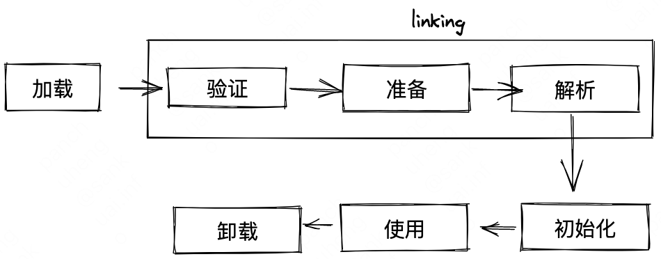
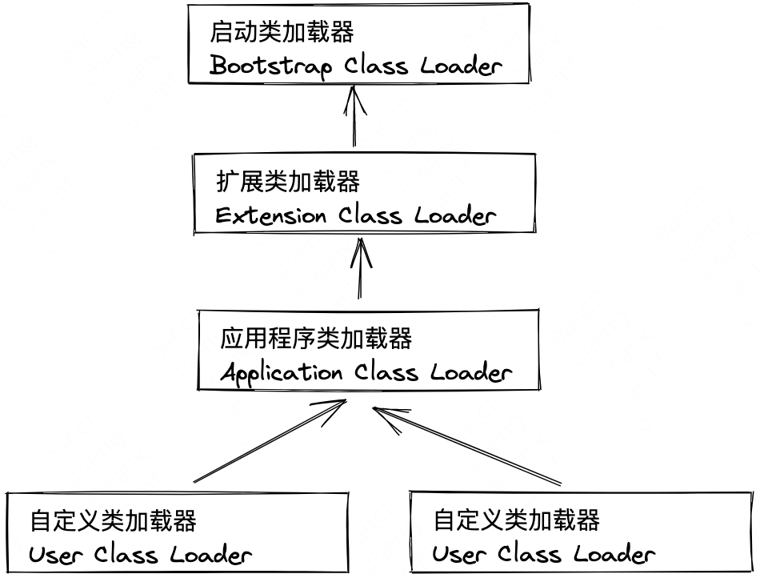

<!-- START doctoc generated TOC please keep comment here to allow auto update -->
<!-- DON'T EDIT THIS SECTION, INSTEAD RE-RUN doctoc TO UPDATE -->

- [七 虚拟机类加载机制](#%E4%B8%83-%E8%99%9A%E6%8B%9F%E6%9C%BA%E7%B1%BB%E5%8A%A0%E8%BD%BD%E6%9C%BA%E5%88%B6)
  - [7.1 类加载时机](#71-%E7%B1%BB%E5%8A%A0%E8%BD%BD%E6%97%B6%E6%9C%BA)
  - [7.2 类加载过程](#72-%E7%B1%BB%E5%8A%A0%E8%BD%BD%E8%BF%87%E7%A8%8B)
    - [加载](#%E5%8A%A0%E8%BD%BD)
    - [验证](#%E9%AA%8C%E8%AF%81)
    - [准备](#%E5%87%86%E5%A4%87)
    - [解析](#%E8%A7%A3%E6%9E%90)
    - [初始化](#%E5%88%9D%E5%A7%8B%E5%8C%96)
  - [7.3 类加载器](#73-%E7%B1%BB%E5%8A%A0%E8%BD%BD%E5%99%A8)
    - [双亲委派模型](#%E5%8F%8C%E4%BA%B2%E5%A7%94%E6%B4%BE%E6%A8%A1%E5%9E%8B)
  - [7.4 Java模块化系统](#74-java%E6%A8%A1%E5%9D%97%E5%8C%96%E7%B3%BB%E7%BB%9F)

<!-- END doctoc generated TOC please keep comment here to allow auto update -->

# 七 虚拟机类加载机制

## 7.1 类加载时机

**类在虚拟机内存中的生命周期如下：**

{width=50%}


顺序不是一定的，比如【解析】可以在【初始化】之后，这是为了支持Java语言的运行时绑定特性。

对于静态字段，只有直接定义这个字段的类会被初始化。

接口的加载过程与类加载过程稍有不同，相比类，接口不能使用`“static {}”`语句块当一个类在初始化时，要求其父类全部都已经初始化过了，但是一个接口在初始化时，并不要求其父类接口全部都完成了初始化，只有在真正使用到父接口的时候（如引用接口中定义的常量）才会初始化。

## 7.2 类加载过程
类加载过程主要指 加载、验证、准备、解析、初始化 五个阶段

### 加载
将Class文件的二进制流加载到内存的方法区中过的过程
非数组类型和数组类型的加载有所不同
非数组类型通过类加载器创建，数组类本身不是通过类加载器创建的，而是==Java虚拟机直接在内存中动态构造==出来的，但是数组类中的元素类型最终还要靠类加载器完成加载。

### 验证
验证过程在类加载过程中占据了相当大的比重，验证阶段大致上会完成下面四个阶段的检验动作：
1. 文件格式验证（验证字节流是否符合Class文件格式规范）
2. 元数据验证（对字节码描述的信息进行语义分析，以保证其描述信息符合《Java语言规范》
3. 字节码验证（最复杂，通过对数据流和控制流的分析，确定程序语义是合法且符合逻辑的）
4. 符号引用验证（可以看作是对类自身以外(常量池中的各种符号引用)的各类信息进行匹配行校验）

### 准备
准备阶段是正式为类中定义的变量（即静态变量，被static修饰的变量）分配内存并设置类变量初始值的阶段，这些变量所使用的内存在方法区进行分配。
准备阶段进行内存分配的仅包括类变量，而不包括实例变量，实例变量会在对象实例化时随着对象一起分配在Java堆中。
对于
```java
public static int value = 123;
```
变量value在准备阶段过后的初始值为0，再初始化阶段初始化为123

对于
```java
public static final int value = 123;
```
变量在准备阶段过后被赋值为123

### 解析
解析阶段是Java虚拟机将常量池内的符号引用替换为直接引用的过程。

### 初始化
在初始化阶段，Java虚拟机才真正开始执行类中编写的Java程序代码，将主导权交给应用程序。
初始化就是执行类构造器`<clinit>()`方法的过程。
- `<clinit>()`方法是由编译器自动收集类中的所有类变量的赋值动作和静态语句块`static {}块`中的语句合并产生的，编译器收集的顺序是由语句在源文件中出现的顺序决定的，静态语句块中只能访问到定义在静态语句块之前的变量。
- Java虚拟机保证在子类的`<clinit>()`方法执行钱，父类的`<clinit>()`方法已经执行完毕。
- 父类定义的静态语句块要优先于子类的变量赋值操作执行
- `<clinit>()`方法对于类或接口来说并不是必需的，如果一个类中没有静态语句块，也没有对变量的赋值操作，那么编译器可以不为这个类生成`<clinit>()`方法
- 接口和类一样会生成`<clinit>()`方法，但接口和类不同的是，执行接口的`<clinit>()`方法不需要先执行父接口的`<clinit>()`方法，此外，接口的实现类在初始化时也一样不会执行接口的`<clinit>()`方法
- Java虚拟机必须保证一个类的`<clinit>()`方法在多线程环境中被正确地加锁同步。

## 7.3 类加载器
两个类加载器加载`.Class`文件，用instanceof判断对象所属关系时为不相等
### 双亲委派模型

Java有三层类加载器
1. 启动类加载器，负责加载存放在`<JAVA_HOME>\lib`目录，或者被-Xbootclasspath参数所指定的路径中存放的，Java虚拟机能够识别rt.jar、tools.jar等类库。
2. 扩展类加载器，负责加载`<JAVA_HOME>\lib\ext`目录中，或者被java.ext.dirs系统变量所指定的路径中所有的类库。由于扩展类加载器是由Java代码实现的，开发者可以直接在程序中使用扩展类加载器来加载Class文件
3. 应用程序类加载器，这个类加载器由`sun.misc.Launcher$AppClassLoader`实现，它负责加载用户类路径（ClassPath）中所有的类库，开发者也可以直接在代码中使用这个类加载器。如果应有程序中没有自定义过类加载器，一般情况下这个就是程序中默认的类加载器。

  {width=50%}

双亲委派模型工作过程：
如果一个类加载器收到了类加载的请求，它首先不会自己去尝试加载这个类，而是把这个请求委派给父类加载器去完成，每一个层次的类加载器都是如此。
基于这个工作过程，Object类在程序的各种类加载器环境中都能保证是同一个类。反之，如果没有双亲委派模型，都由各个类加载器自行去加载的话，如果用户自己也编写了一个名为java.lang.Object的类，并放在程序的ClassPath中，那系统中就会出现多个不同的Object类。

## 7.4 Java模块化系统
JDK 9之前如果类路径中缺失了运行时依赖的类型，那就只能等程序运行到发生该类型的加载、链接时才会报出运行的异常。
在JDK 9以后，如果启用了模块化急性封装，模块就可以声明对其他模块的显式依赖，这样Java虚拟机就能够在启动时验证应用程序开发阶段设定好的依赖关系在运行期是否完备，如有缺失那就直接启动失败，从而避免了很大一部分由于类型依赖而印发的运行时异常。

