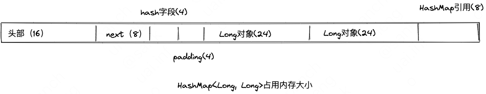

<!-- START doctoc generated TOC please keep comment here to allow auto update -->
<!-- DON'T EDIT THIS SECTION, INSTEAD RE-RUN doctoc TO UPDATE -->

- [五 调优案例分析与实战](#%E4%BA%94-%E8%B0%83%E4%BC%98%E6%A1%88%E4%BE%8B%E5%88%86%E6%9E%90%E4%B8%8E%E5%AE%9E%E6%88%98)
  - [附录](#%E9%99%84%E5%BD%95)
    - [1、一个HashMap<Long, Long>占用多少内存](#1%E4%B8%80%E4%B8%AAhashmaplong-long%E5%8D%A0%E7%94%A8%E5%A4%9A%E5%B0%91%E5%86%85%E5%AD%98)
    - [2、即时编译](#2%E5%8D%B3%E6%97%B6%E7%BC%96%E8%AF%91)
    - [3、本地代码、字节码和虚拟机](#3%E6%9C%AC%E5%9C%B0%E4%BB%A3%E7%A0%81%E5%AD%97%E8%8A%82%E7%A0%81%E5%92%8C%E8%99%9A%E6%8B%9F%E6%9C%BA)

<!-- END doctoc generated TOC please keep comment here to allow auto update -->

# 五 调优案例分析与实战

## 附录
### 1、一个HashMap<Long, Long>占用多少内存
对象 = 对象头+成员变量+对齐填充
**对象头：**
java对象在Heap里面的结构是这样的：对象头跟对象体，对象体跟C里面的结构体是一样的，对象头由两个域组成：用于存放hashcode、同步、GC的\_mask域，和指向方法区该对象Class对象的指针——\_klass域，对于64位系统，头部长度理论上讲应该是8+8=16字节。但是从java6u23以后开始，64位的机器会自动开启指针压缩的功能，此时引用指针的长度为4字节。所以，对象头长度应该为8+4=12。

**成员变量**
成员变量：分两类，包括一些基本类型，如int,long.byte,short,boolean等，以及引用类型，如String,Date引用。如果是引用类型，也应该把引用类型指向的对象纳入当前对象。

**对齐补充**
JVM规定，对象的大小必须是8字节的整数倍，如果不足，则会补齐。

因此一个Long对象大小如下图，

{width=50%}

HashMap<Long, Long>对象占用内存大小如下图：
Entry：头部 + next + hash + padding = 32字节
两个Long对象：48字节
一个HashMap Ref：8字节
共计88字节

{width=50%}

### 2、即时编译
编译时间是指虚拟机的即时编译器编译热点代码的耗时。
Java代码编译出来的Class文件中存储的是字节码，虚拟机通过解释方式执行字节码命令，比起C/C++编译成本地二进制代码来说，速度要慢不少。为了解决程序解释执行的速度问题，HotSpot虚拟机内置了两个即时编译器，如果一段Java方法被调用次数达到一定程度，就会被判定为热代码交给即时编译器编译为本地代码，提高运行速度。而且完全有可能在运行期动态编译比C/C++的编译器静态编译出来的结果更好，因为运行期的编译器可以收集很多静态编译器无法得知的信息，也可以采用一些激进的优化手段。

缺点：它进行编译需要消耗机器的计算资源，影响程序正常的运行时间，也就是上面所说的“编译时间”

### 3、本地代码、字节码和虚拟机
本地代码（Native Code）：是计算机编程（代码），编译用来运行一个特殊的处理器（如英特尔x86级的处理器）和它的特殊[指令集](https://baike.baidu.com/item/%E6%8C%87%E4%BB%A4%E9%9B%86)。如果同一个程序在不同的处理器上执行的话[软件](https://baike.baidu.com/item/%E8%BD%AF%E4%BB%B6)就必须能够模拟出旧的处理器的指令。
字节码（Byte Code）：叫作编译代码，需要转化为本地代码后才能被计算机执行
虚拟机：一个把通用字节码转换成用于特定处理器的本地代码的程序