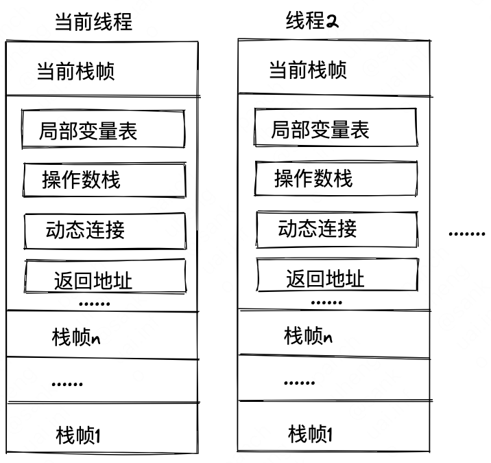
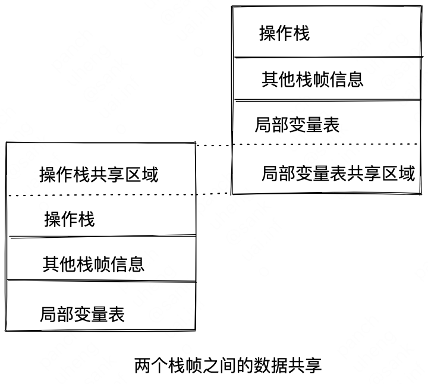
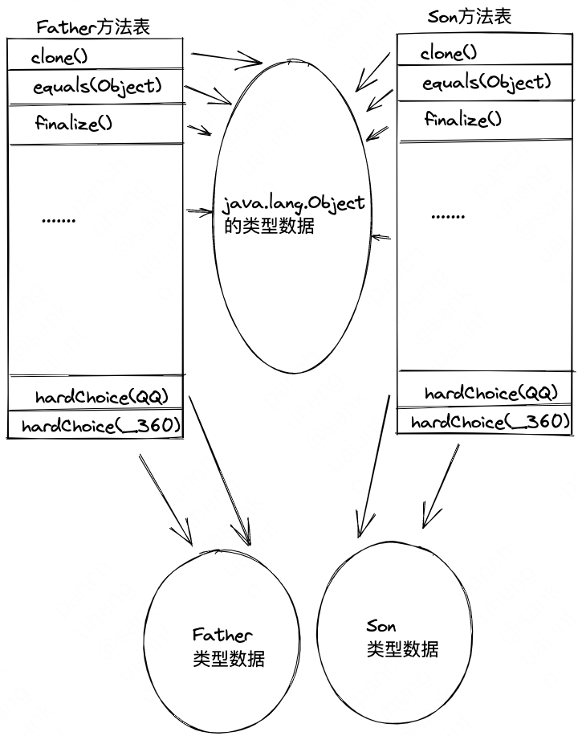

<!-- START doctoc generated TOC please keep comment here to allow auto update -->
<!-- DON'T EDIT THIS SECTION, INSTEAD RE-RUN doctoc TO UPDATE -->

- [八、虚拟机字节码执行引擎](#%E5%85%AB%E8%99%9A%E6%8B%9F%E6%9C%BA%E5%AD%97%E8%8A%82%E7%A0%81%E6%89%A7%E8%A1%8C%E5%BC%95%E6%93%8E)
  - [8.1 运行时栈帧结构](#81-%E8%BF%90%E8%A1%8C%E6%97%B6%E6%A0%88%E5%B8%A7%E7%BB%93%E6%9E%84)
    - [局部变量表](#%E5%B1%80%E9%83%A8%E5%8F%98%E9%87%8F%E8%A1%A8)
    - [操作数栈](#%E6%93%8D%E4%BD%9C%E6%95%B0%E6%A0%88)
    - [动态连接](#%E5%8A%A8%E6%80%81%E8%BF%9E%E6%8E%A5)
    - [方法返回地址](#%E6%96%B9%E6%B3%95%E8%BF%94%E5%9B%9E%E5%9C%B0%E5%9D%80)
    - [附加信息](#%E9%99%84%E5%8A%A0%E4%BF%A1%E6%81%AF)
  - [8.2 方法调用](#82-%E6%96%B9%E6%B3%95%E8%B0%83%E7%94%A8)
    - [解析](#%E8%A7%A3%E6%9E%90)
    - [分派](#%E5%88%86%E6%B4%BE)
    - [虚拟机动态分派实现](#%E8%99%9A%E6%8B%9F%E6%9C%BA%E5%8A%A8%E6%80%81%E5%88%86%E6%B4%BE%E5%AE%9E%E7%8E%B0)
  - [8.3 动态类型语言支持](#83-%E5%8A%A8%E6%80%81%E7%B1%BB%E5%9E%8B%E8%AF%AD%E8%A8%80%E6%94%AF%E6%8C%81)

<!-- END doctoc generated TOC please keep comment here to allow auto update -->

# 八、虚拟机字节码执行引擎

## 8.1 运行时栈帧结构
{width=50%}

### 局部变量表
局部变量表的变量可以重复使用，看下面这个例子：
```java
public static void main(String[] args) {
	{
		byte[] placeholder = new byte[64 * 1024 * 1024];
	}
	System.gc();
}
```
执行`System.gc()`后，placeholder占用的64MB没有被回收
```java
public static void main(String[] args) {
	{
		byte[] placeholder = new byte[64 * 1024 * 1024];
	}
	int a = 0;
	System.gc();
}
```
此时，placeholder占用的内存被回收了，这是因为第一段代码中，执行`System.gc()`时，虽然已经离开了placeholder的作用域，但在此之后没有发生过任何对局部变量表的读写操作，placeholder原本所占用的变量槽还没有被其他变量所复用，所以作为GC Roots一部分的局部变量表仍然保持着对它的关联。

局部变量不像类变量那样存在“准备阶段”，类的字段变量有两次赋值机会，一次是在准备阶段，赋予系统初始值；另一次是在初始化阶段，赋予程序员定义的初始值。
即Java中不是任何情况都存在如整型变量默认为0，布尔型变量默认为false这样的规则，所以下面这个代码在编译阶段就会报错，但在C/C++中可运行：
```java
public static void main(String[] args) {
	int a;
	System.out.println(a);
}
```

### 操作数栈
在概念模型中，两个不同的栈帧作为不同方法的虚拟机栈的元素，是完全相互独立的。但是在大多虚拟机的实现里都会进行一些优化，令两个栈帧出现一部分重叠。
{width=50%}

### 动态连接
Class文件的常量池中存有大量的符号引用，字节码的方法调用指令以常量池里指向方法的符号引用作为参数。这些符号引用一部分会在类加载阶段或者第一次使用的时候就被转化为直接引用，这种转化称为静态解析；
另一部分回在每一次运行期间都转化为直接引用，这部分被称为动态连接

### 方法返回地址
方法退出的过程等同于把当前栈帧出栈，退出时可能执行的操作有：
1. 恢复上层方法的局部变量表和操作数栈
2. 把返回值（如有）压入调用者栈帧的操作数栈中
3. 调整PC计数器的值以指向方法调用指令后面的一条指令

### 附加信息
这部分信息完全取决于具体的虚拟机实现

## 8.2 方法调用
一切方法调用在Class文件里面存储的都只是符号引用，而不是方法在实际运行时内存布局中的入口地址。这个特性给Java带来了更强大的动态扩展能力，也使得Java方法调用过程变得相对复杂，某些调用需要在类加载期间，甚至到运行期间才能确定目标方法的直接引用

### 解析
在Java语言中符合“编译期可知，运行期不可变”这个要求的方法，主要有静态方法和私有方法两大类，前者与类型直接关联，后者在外部不可被访问，这两种方法各自的特点决定了它们都不可能通过继承或别的方式重写出其他版本，因此它们都适合在类加载阶段进行解析。
Java虚拟机支持以下五条方法调用字节码指令：
- invokestatic，调用静态方法
- invokespecial，用于调用实例构造器`<init>()`方法、私有方法和父类中的方法
- invokevirtual，用于调用所有的虚方法
- invokeinterface，用于调用接口方法，会在运行时再确定一个实现该接口的对象
- invokedynamic，先在运行时动态解析出调用点限定符所引用的方法，然后再执行该方法，前四条调用指令，分派逻辑都固化在Java虚拟机内部，而invokedynamic指令的分派逻辑是由用户设定的引导方法来决定的
五条方法中的前面两条，都可以在解析阶段中确定唯一的调用版本，Java语言里符合这个条件的方法有：
1. 静态方法
2. 私有方法
3. 实例构造起
4. 父类方法
5. 被final修饰的方法（由于历史设计原因，使用Invokevirtual指令调用）
这些方法被称为“非虚方法”，其他方法被称为“虚方法”

### 分派
分派分为静态分派和动态分派
静态分派：在编译器即可决定分派给哪个类，编译期间选择静态分派目标的过程也是Java语言实现方法重载（Overload）的本质

动态分派：它与Java语言中的重写（Override）有密切联系。
动态分派是通过invokevirtual指令来完成的，invokevirtual指令的运行时解析过程可以分为以下几步：
1. 找到操作数栈顶的第一个元素所指向的对象的实际类型，记作C
2. 如果在类型C中找到与常量中的描述符和简单名称都相符的方法，则进行访问权限校验，如果通过则返回这个方法的直接引用，查找过程结束；不通过则返回java.lang.IllegalAccessError
3. 否则，按照继承关系从下往上依次对C的各个父类进行第二部的搜索和验证过程
4. 如果始终没有找到合适的方法，则抛出java.lang.AbstractMethodError异常
java中只存在虚方法，不存在虚字段

### 虚拟机动态分派实现
动态分派是执行非常频繁的动作，而且动态分派的方法版本选择过程需要运行时在接收者类型的方法元数据中搜索合适的目标方法，因此，Java虚拟机实现基于执行性能的考虑，真正运行时一般不会如此频繁地去反复搜索类型元数据。
面对这种情况，一种基础而且常见的优化手段是为类型在方法区建立一个虚方法表（vtable），与此对应的，在invokeinterface执行时也会用到接口方法表——Interface Method Table，使用虚方法表索引来代替元数据查找以提高性能。

{width=50%}
虚方法表中存放着各个方法的实际入口地址。
因为Son类重写了Father的全部方法，所以Son的方法表没有指向Father类型数据的箭头，但没有重写Object的方法，所以所有从Object继承来的方法都指向了Object的类型数据

虚方法表一般在类加载的连续阶段进行初始化，准备了类的变量初始值后，虚拟机会把该类的虚方法表也一同初始化完毕。

Java对象中的方法默认（即不使用final修饰）就是虚方法

## 8.3 动态类型语言支持
动态类型语言的关键特征是它的类型检查的主体过程是在运行期而不是编译期进行的。如JS、Lisp、Lua、PHP、Python等
相对地，在编译期就进行类型检查过程的语言，如C++就是最常用的静态类型语言。
下面这段代码能够正常编译但不能运行，运行时会出现NegativeArraySizeException
```java
public static void main(String[] args) {
	int[][][] array = new int[1][0][-1];
}
```
但在C语言中，下面这段代码在编译期就会报错
```c
int main(void) {
	int i[1][0][-1];
	return 0;
}
```
一门语言的哪一种检查行为要在运行期进行，哪一种要在编译期进行并没有必然的因果逻辑关系，关键在语言规范中人为设定的约定。

