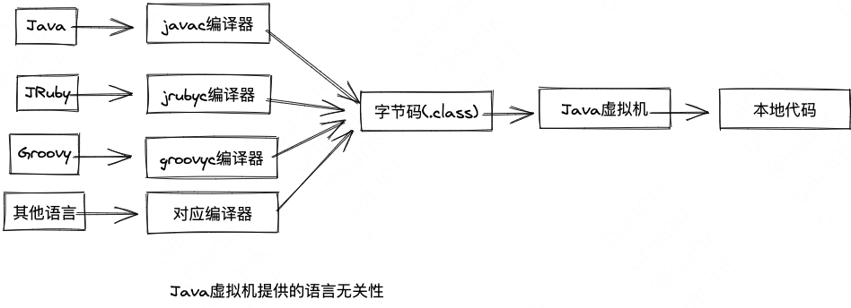

<!-- START doctoc generated TOC please keep comment here to allow auto update -->
<!-- DON'T EDIT THIS SECTION, INSTEAD RE-RUN doctoc TO UPDATE -->

- [六 类文件结构](#%E5%85%AD-%E7%B1%BB%E6%96%87%E4%BB%B6%E7%BB%93%E6%9E%84)
  - [一、无关性基石](#%E4%B8%80%E6%97%A0%E5%85%B3%E6%80%A7%E5%9F%BA%E7%9F%B3)
  - [二、Class类文件结构](#%E4%BA%8Cclass%E7%B1%BB%E6%96%87%E4%BB%B6%E7%BB%93%E6%9E%84)
    - [2.1 魔数与Class文件版本](#21-%E9%AD%94%E6%95%B0%E4%B8%8Eclass%E6%96%87%E4%BB%B6%E7%89%88%E6%9C%AC)
    - [2.2 常量池](#22-%E5%B8%B8%E9%87%8F%E6%B1%A0)
    - [2.3 访问标志](#23-%E8%AE%BF%E9%97%AE%E6%A0%87%E5%BF%97)
    - [2.4 类索引、父类索引与接口索引集合](#24-%E7%B1%BB%E7%B4%A2%E5%BC%95%E7%88%B6%E7%B1%BB%E7%B4%A2%E5%BC%95%E4%B8%8E%E6%8E%A5%E5%8F%A3%E7%B4%A2%E5%BC%95%E9%9B%86%E5%90%88)
    - [2.5 字段表集合](#25-%E5%AD%97%E6%AE%B5%E8%A1%A8%E9%9B%86%E5%90%88)
    - [2.6 方法表集合](#26-%E6%96%B9%E6%B3%95%E8%A1%A8%E9%9B%86%E5%90%88)
    - [2.7 属性表(attribute_info)集合](#27-%E5%B1%9E%E6%80%A7%E8%A1%A8attribute_info%E9%9B%86%E5%90%88)
  - [三、字节码指令简介](#%E4%B8%89%E5%AD%97%E8%8A%82%E7%A0%81%E6%8C%87%E4%BB%A4%E7%AE%80%E4%BB%8B)
    - [3.1 加载和存储指令](#31-%E5%8A%A0%E8%BD%BD%E5%92%8C%E5%AD%98%E5%82%A8%E6%8C%87%E4%BB%A4)
    - [3.2 运算指令](#32-%E8%BF%90%E7%AE%97%E6%8C%87%E4%BB%A4)
    - [3.3 类型转换指令](#33-%E7%B1%BB%E5%9E%8B%E8%BD%AC%E6%8D%A2%E6%8C%87%E4%BB%A4)
    - [3.4 对象创建与访问指令](#34-%E5%AF%B9%E8%B1%A1%E5%88%9B%E5%BB%BA%E4%B8%8E%E8%AE%BF%E9%97%AE%E6%8C%87%E4%BB%A4)
    - [3.5 操作数栈管理指令](#35-%E6%93%8D%E4%BD%9C%E6%95%B0%E6%A0%88%E7%AE%A1%E7%90%86%E6%8C%87%E4%BB%A4)
    - [3.6 控制转移指令](#36-%E6%8E%A7%E5%88%B6%E8%BD%AC%E7%A7%BB%E6%8C%87%E4%BB%A4)
    - [3.7 方法调用和返回指令](#37-%E6%96%B9%E6%B3%95%E8%B0%83%E7%94%A8%E5%92%8C%E8%BF%94%E5%9B%9E%E6%8C%87%E4%BB%A4)
    - [3.8 异常处理指令](#38-%E5%BC%82%E5%B8%B8%E5%A4%84%E7%90%86%E6%8C%87%E4%BB%A4)
    - [3.9 同步指令](#39-%E5%90%8C%E6%AD%A5%E6%8C%87%E4%BB%A4)
  - [四、公有设计，私有实现](#%E5%9B%9B%E5%85%AC%E6%9C%89%E8%AE%BE%E8%AE%A1%E7%A7%81%E6%9C%89%E5%AE%9E%E7%8E%B0)

<!-- END doctoc generated TOC please keep comment here to allow auto update -->

# 六 类文件结构

## 一、无关性基石

{width=50%}

## 二、Class类文件结构
Class文件格式采用了一种类似于C语言结构体的伪结构来存储数据，这种伪结构中只有两种数据类型：无符号数和表
1. 无符号数属于基本数据类型，以u1、u2、u4、u8分别代表1个字节、2个字节、4个字节和8个字节的无符号数，无符号数可以用来描述数字、索引引用、数量值或按照UTF-8编码构成字符串值
2. 表是由多个无符号数或者其他表作为数据项构成的复合数据类型，为了便于区分，所有表的命名都习惯以"\_info"结尾。表用于表述有层次关系的复合结构的数据，整个Class文件本质上也可以视作一张表，如下

| 类型           | 名称                | 数量                  |
| -------------- | ------------------- | --------------------- |
| u4             | magic               | 1                     |
| u2             | minor_version       | 1                     |
| u2             | major_version       | 1                     |
| u2             | constant_pool_count | 1                     |
| cp_info        | constant_pool       | constant_pool_count-1 |
| u2             | access_flags        | 1                     |
| u2             | this_class          | 1                     |
| u2             | super_class         | 1                     |
| u2             | interfaces_count    | 1                     |
| u2             | interfaces          | interfaces_count      |
| u2             | fields_count        | 1                     |
| field_info     | fields              | 1                     |
| method_info    | methods             | methods_count         |
| u2             | attributes_count    | 1                     |
| attribute_info | attributes          | attributes_count      |

### 2.1 魔数与Class文件版本
每个Class文件的头4个字节被称为魔数（Magic Number），它的唯一作用是确定这个文件是否为一个能被虚拟机接受的文件。不仅是Class文件，很多文件格式标准中都有使用魔数来进行身份识别的习惯，譬如GIF或者JPEG等在文件头中都存在魔数。**使用魔数而不是扩展名来进行识别是基于安全考虑，因为文件扩展名可以随意改动。**

紧接着魔数的4个字节存储的是Class文件的版本号：第5和第6个字节存储的是次版本号，第7和第8个字节存储的是主版本号。

### 2.2 常量池
它是Class文件结构中与其他项目关联最多的数据，通常也是占用Class文件空间最大的数据项目之一，另外，它还是在Class文件中第一个出现的表类型数据项目。
常量池中常量的数量是不固定的，所以在常量池的入口需要放置一项u2类型的数据，代表常量池容量计数值。从1开始计数，`0x0016`表示常量池中有21项常量，index为 0 - 21

常量池中主要存放两大类常量：字面量和符号引用。
字面量比较接近于Java语言层面的常量概念，如文本字符串、被声明为final的常量值等。
而符号引用则属于编译原理方面的概念，包括：
- 被模块导出或开放的包（Package）
- 类和接口的全限定名（Fully Qualified Name）
- 字段的名称和描述符（Descriptor）
- 方法的名称和描述符
- 方法句柄和方法类型（Method Handle、Method Type、Invoke Dynamic）
- 动态调用点和动态常量（Dynamically-Computed Call Site、Dynamically-Computed Constant）

### 2.3 访问标志
在常量池结束之后，紧接着的2个字节代表访问标志（access_flags），这个标志用于识别一些类或者接口层次的访问信息，包括：这个Class是类还是接口；是否定义为public类型；是否定义为abstract类型；如果是类的话，是否被声明为final等等。

### 2.4 类索引、父类索引与接口索引集合
类索引（this_class）和父类索引（super_class）都是一个u2类型的数据，而接口索引集合（interfaces）是一组u2类型的数据的集合，Class文件中由这三项数据来确定该类型的继承关系。
类索引用于确定这个类的全限定名，父类索引用于确定这个类的父类的全限定名。由于Java语言不允许多重继承，所以父类索引只有一个，除了java.lang.Object外，所有Java类的父类索引都不为0。接口索引集合用来描述这个类实现了哪些接口，这些被实现的接口将按implements关键字（如果这个Class文件表示的是一个接口，则应当是extends关键字）后的接口顺序从左到右排列在接口索引集合中。

### 2.5 字段表集合
字段表（field_info）用于描述接口或者类中声明的变量。Java语言中的字段包括类级变量以及实例级变量，但不包括在方法内部声明的局部变量。
字段可以包括的修饰符由字段的作用域（public、private、protected修饰符）、是实例变量还是类变量（static修饰符）、可变性（final）、并发可见性（volatile）、可否被序列化（transient修饰符）、字段数据类型（基本类型、对象、数组）、字段名称。包括：
- access_flags
- name_index（简单名称）对于`private int m;` 而言就是m
- descriptor_index（描述符）对于`private int m;`而言就是I (int)
- attributes_count
- attributes
attributes_count和attributes用于描述0至多项的额外信息，如描述`final static int m = 123`中的final、static等字段

### 2.6 方法表集合
方法表和字段表类似，也是由下列几个字段构成的：
- access_flags
- name_index
- descriptor_index
- attributes_count
- attribute_info

### 2.7 属性表(attribute_info)集合
Class文件、字段表、方法表都可以携带自己的属性表集合，用以描述某些场景专用的信息。
与Class文件中其他的数据项目要求严格的顺序、长度和内容不同，属性表集合的限制稍微宽松一点，不再要求各个属性表具有严格顺序，并且《Java虚拟机规范》允许只要不与已有属性名重复，任何人实现的编译器都可以向属性表中写入自己的属性信息，**Java虚拟机运行时会忽略它不认识的属性。**
属性表集合包含：

| 属性                                                                                                                                                 | 备注                                                                                                                         |
| ---------------------------------------------------------------------------------------------------------------------------------------------------- | ---------------------------------------------------------------------------------------------------------------------------- |
| Code                                                                                                                                                 | 包含了方法中的try...catch...                                                                                                 |
| Exceptions                                                                                                                                           | 描述方法中throws关键字后面列举的异常                                                                                         |
| LineNumberTable                                                                                                                                      | 用于描述Java源码行号与字节码行号之间的对应关系                                                                               |
| LocalVariableTable及LocalVariableTypeTable属性                                                                                                       | LocalVariableTable属性用于描述栈帧中局部变量表的变量与Java源码中定义的变量之间的关系                                         |
| SourceFile                                                                                                                                           | 用于记录生成这个Class文件的源码文件名称                                                                                      |
| SourceDebugExtension                                                                                                                                 | 用于存储额外的代码调试信息                                                                                                   |
| ConstantValue                                                                                                                                        | 用于通知虚拟机自动为静态变量赋值，只有被static修饰的变量才可以使用这项属性                                                   |
| InnerClasses                                                                                                                                         | 用于记录内部类与宿主类之间的关联，用于一个类中定义了内部类的场景                                                             |
| Deprecated                                                                                                                                           | 用于表示某个类、字段或者方法已经不推荐使用                                                                                   |
| Synthetic                                                                                                                                            | 代表此字段或者方法并不是由Java源码直接产生的，而是由编译器自行添加的                                                         |
| StackMapTable                                                                                                                                        | 这个属性会在虚拟机类加载的字节码验证阶段被新类型检查验证器使用，目的在于代替以前比较消耗性能的基于数据流分析的类型推导验证器 |
| Signature属性                                                                                                                                        | 用于记录泛型签名信息                                                                                                         |
| BootstrapMethods                                                                                                                                     | 用于保存invokedynamic指令引用的引导方法限定符                                                                                |
| MethodParameters                                                                                                                                     | 用于记录方法的各个形参名称和信息                                                                                             |
| 模块化相关属性(Module)                                                                                                                               | 变长属性，除了表示该模块的名称、版本、标志信息以为，还存储了这个模块requires、exports、opens、uses和provides定义的全部内容;  |
| 模块化相关属性(ModulePackages)                                                                                                                       | 变长属性，用于描述该模块中所有的包，不论是不是被export或者open的                                                             |
| 模块化相关属性(ModuleMainClass)                                                                                                                      | 定长属性，用于确定该模块的主类                                                                                               |
| 运行时注解相关属性(RuntimeVisibleAnnotations、RuntimeInvisibleAnnotations、RuntimeVisibleParameterAnnotations、RuntimeInvisibleParameterAnnotations) | 用于存储源码中的注解信息                                                                                                     |

## 三、字节码指令简介
Java虚拟机的操作码只有一个字节，所以包含了数据类型的操作码就为指令集的设计带来了很多的压力，比如一个load指令，int类型的需要设计一个iload，float类型的需要设计一个fload，这样下来势必会超过255个指令。
Java虚拟机的指令集对于特定的操作只提供了有限的类型相关指令去支持它，换句话说，指令集被故意设计成非完全独立的，即并非每种数据类型和每一种操作都有对应的指令。有一些单独的指令可以在必要的时候用来将一些不支持的类型转换为可被支持的类型。

### 3.1 加载和存储指令
**Java虚拟机的指令是从操作数栈中而不是从寄存器中取得操作数的，因此它的运行方式是基于栈的而不是基于寄存器的**。虽然指令也可以从其他地方取得操作数，比如从字节码流中跟随在操作码（代表指令的字节）之后的字节中或从常量池中，但是主要还是从操作数栈中获得操作数。

加载和存储指令用于将数据在栈帧中的局部变量表和操作数栈之间来回传输，包括：
1. 将一个局部变量加载到操作栈：iload、iload_\<n\>...
2. 将一个数值从操作数栈存储到局部变量表：istore、istore_\<n\>
3. 将一个常量加载到操作数栈：bipush、sipush...
4. 扩充局部变量表的访问索引的指令：wide

### 3.2 运算指令
算术指令用于对操作数栈上的两个值进行某种特定运算，并把结果重新存入到操作栈顶。
大体可以分为两种：
1. 对整型数据进行运算的指令
2. 对浮点型数据进行运算的指令

不存在直接支持byte、short、char和boolean类型的算术指令

所有的算术指令包括：
1. 加法指令
2. 减法指令
3. 乘法指令
4. 除法指令
5. 求余指令
6. 取反指令
7. 位移指令
8. 按位或指令
9. 按位与指令
10. 按位异或指令
11. 局部变量自增指令
12. 比较指令

### 3.3 类型转换指令
类型转换指令可以将两种不同的数值类型相互转换，Java虚拟机直接支持小范围类型向大范围类型的安全转换：
1. int类型转换到long、float或double
2. long类型到float、double
3. float类型到double

窄化类型转换需要显式地使用转换指令来完成，这些转换指令包括i2b、i2c、l2i、f2i、f2l、d2i、d2l和d2f等等，转换过程中很可能会引起数值精度丢失。
《Java虚拟机规范》明确规定数值类型的窄化指令永远不可能导致虚拟机抛出运行时异常。

### 3.4 对象创建与访问指令
类实例和数组都是对象，但Java虚拟机对类实例和数组的创建与操作使用了不同的字节码指令，包括：
1. 创建类实例的指令：new
2. 创建数组的指令：newarray、anewarray、multianewarray
3. 访问类字段和实例字段：getfield、putfield、getstatic、putstatic
4. 把一个数组元素加载到操作数栈的指令：baload、caload、saload、iaload、laload、faload、daload、aaload
5. 将一个操作数栈的值存储到数组元素中的指令：bastore、castore、sastore、iastore、fastore、dastore、aastore
6. 取数组长度的指令：arraylength
7. 检查类实例类型的指令：instanceof、checkcast

### 3.5 操作数栈管理指令
Java虚拟机提供了一些用于直接操作操作数栈的指令，包括：
1. 将操作数栈的栈顶一个或两个元素出栈：pop、pop2
2. 复制栈顶一个或两个数值并将复制值或双份的复制值重新压入栈顶：dup、dup2、dup_x1、dup2_x1、dup_x2、dup2_x2
3. 将栈最顶端的两个数值互换：swap

### 3.6 控制转移指令
1. 条件分支：ifeq、iflt、ifle等等
2. 复合条件分支：tableswitch、lookupswitch
3. 无条件分枝：goto、goto_w、jsr、jsr_w、ret

### 3.7 方法调用和返回指令
1. invokevirtual指令：用于调用对象的实例方法，根据对象的实际类型进行分派（虚方法分派）
2. invokeinterface指令，用于调用接口方法，它会在运行时搜索一个实现了这个接口方法的对象，找出适合的方法进行调用
3. invokespecial指令：用于调用一些需要特殊处理的实例方法，包括实例初始化方法、私有方法和父类方法
4. invokestatic指令：用于调用类静态方法
5. invokedynamic指令：用于在运行时动态解析出调用点限定符所引用的方法，并执行该方法，该指令的分派逻辑是由用户所设定的引导方法决定的。
方法调用指令与数据类型无关，但方法返回指令是根据返回值的类型进行区分的。

### 3.8 异常处理指令
Java程序中显式抛出异常的操作都是由`athrow`指令来实现的。
Java虚拟机中，处理异常不是由字节码指令来实现的，而是采用异常表来完成的

### 3.9 同步指令
Java虚拟机支持方法级的同步和方法内部一段指令序列的同步，这两种同步结构都是使用管程（Monitor，或称为锁）来实现的
同步一段指令集序列通常是由Java语言中的synchronized语句块表示的，Java虚拟机的指令集中有成对出现的`monitorenter`和`monitorexit`两条指令来支持synchronized关键字的语义。

## 四、公有设计，私有实现
《Java虚拟机规范》描绘的是Java虚拟机应有的共同程序存储格式：Class文件格式以及字节码指令集。这些内容与硬件、操作系统和具体的Java虚拟机实现之间是完全独立的。虚拟机实现者更愿意把它们看作程序在各种Java平台实现之间互相安全地交互的手段。

