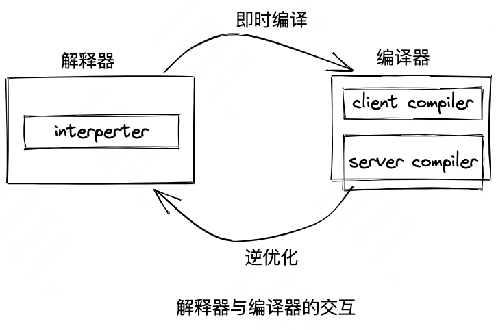
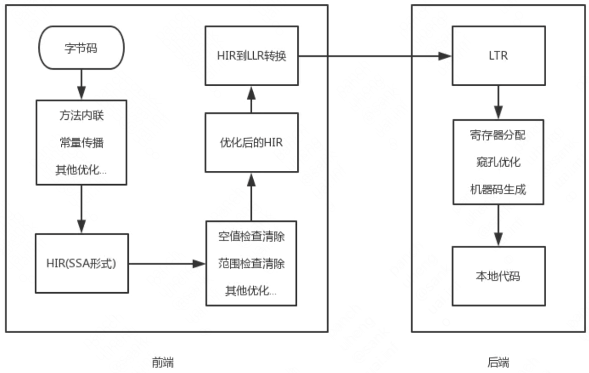

<!-- START doctoc generated TOC please keep comment here to allow auto update -->
<!-- DON'T EDIT THIS SECTION, INSTEAD RE-RUN doctoc TO UPDATE -->

- [十一、后端编译与优化](#%E5%8D%81%E4%B8%80%E5%90%8E%E7%AB%AF%E7%BC%96%E8%AF%91%E4%B8%8E%E4%BC%98%E5%8C%96)
  - [11.1 即时编译器](#111-%E5%8D%B3%E6%97%B6%E7%BC%96%E8%AF%91%E5%99%A8)
    - [解释器与编译器](#%E8%A7%A3%E9%87%8A%E5%99%A8%E4%B8%8E%E7%BC%96%E8%AF%91%E5%99%A8)
    - [编译对象与触发条件](#%E7%BC%96%E8%AF%91%E5%AF%B9%E8%B1%A1%E4%B8%8E%E8%A7%A6%E5%8F%91%E6%9D%A1%E4%BB%B6)
    - [编译过程](#%E7%BC%96%E8%AF%91%E8%BF%87%E7%A8%8B)
  - [11.2 提前编译器](#112-%E6%8F%90%E5%89%8D%E7%BC%96%E8%AF%91%E5%99%A8)
    - [提前编译的优劣得失](#%E6%8F%90%E5%89%8D%E7%BC%96%E8%AF%91%E7%9A%84%E4%BC%98%E5%8A%A3%E5%BE%97%E5%A4%B1)
  - [11.3 编译器优化技术](#113-%E7%BC%96%E8%AF%91%E5%99%A8%E4%BC%98%E5%8C%96%E6%8A%80%E6%9C%AF)
    - [优化技术概览](#%E4%BC%98%E5%8C%96%E6%8A%80%E6%9C%AF%E6%A6%82%E8%A7%88)
    - [方法内联](#%E6%96%B9%E6%B3%95%E5%86%85%E8%81%94)
    - [逃逸分析](#%E9%80%83%E9%80%B8%E5%88%86%E6%9E%90)
    - [公共子表达式消除](#%E5%85%AC%E5%85%B1%E5%AD%90%E8%A1%A8%E8%BE%BE%E5%BC%8F%E6%B6%88%E9%99%A4)
    - [数组边界检查消除](#%E6%95%B0%E7%BB%84%E8%BE%B9%E7%95%8C%E6%A3%80%E6%9F%A5%E6%B6%88%E9%99%A4)

<!-- END doctoc generated TOC please keep comment here to allow auto update -->

# 十一、后端编译与优化
## 11.1 即时编译器
Java程序最初都是通过解释器进行解释执行的，当虚拟机发现某个方法或代码块运行特别频繁，就会把这些代码认定为“热点代码”，为了提高热点代码的执行效率，在运行时，虚拟机会把这些代码编译成本地机器码，并以各种手段尽可能地进行代码优化，运行时完成这个任务的后端编译器被称为即时编译器。

### 解释器与编译器
{width=50%}
无论采用客户端编译器还是服务端编译器，解释器与编译器搭配使用的方式在虚拟机中被称为“混合模式”（Mixed Mode)，使用`-Xint`参数可以强制虚拟机运行在“解释模式”，使用`-Xcomp`参数可以强制虚拟机运行在“编译模式”。
解释模式更加节约内存，但是对长期而言，运行效率更低。

### 编译对象与触发条件
热点代码包括：
1. 被多次调用的方法
2. 被多次执行的循环体
如何确定某个方法或某段代码被执行过多次呢？
1. 基于采样的热点探测。采用这种方法的虚拟机会周期性地检查各个线程的调用栈顶，如果发现某个方法经常出现在栈顶，那这个方法就是“热点方法”。
   优点：可以比较容易地获取方法调用关系；
   缺点：很难精确地确认一个方法的热度，容易受到线程阻塞或别的外界因素的影响而扰乱热点探测。
2. 基于计数器的热点探测。采用这种方法的虚拟机会为每个方法建立计数器，统计方法的执行次数，如果执行次数超过一定的阈值就认定它是“热点方法”。
   优点：统计结果更加精确严谨；
   缺点：不能直接获取到方法的调用关系。

### 编译过程
{width=50%}

## 11.2 提前编译器
提前编译的两条分支：
1. 做与传统C、C++编译器类似的，做在程序运行之前把程序代码编译成机器码的静态翻译工作；
2. 把原本即时编译器在运行时要做的编译工作提前做好并保存下来，下次运行到这些代码时直接把它加载进来使用。
### 提前编译的优劣得失
上面说的第二条分支，本质是给即时编译器做缓存加速。缺点是这种提前编译方式不仅要和目标机器相关，甚至还必须与HotSpot虚拟机的运行时参数绑定。
即时编译器相对于提前编译器的几个优势：
1. 性能分析制导优化（可以在运行过程中不断收集性能监控信息并不断进行优化）
2. 激进预测性优化（可以在性能监控信息支持即时编译器做出一些正确的可能性很大但无法保证绝对正确的预测判断时，可以大胆地按照高概率的假设进行优化，万一真的走到罕见分支上，可退回到低级编译器甚至解释器上去执行）
3. 链接时优化（Java语言天生就是动态链接的，一个个Class文件在运行期被加载到虚拟机内存当中，然后在即时编译器里产生优化后的本地代码。然而当涉及到动态链接时，用提前编译器就很难做一些优化了，因为主程序与动态连接库的代码在它们编译时是完全独立的，两者各自编译、优化自己的代码）

## 11.3 编译器优化技术
### 优化技术概览
即时编译器优化技术一览表

| 类型                   | 优化技术                                                                                                                                                                                                     |
| ---------------------- | ------------------------------------------------------------------------------------------------------------------------------------------------------------------------------------------------------------ |
| 编译器策略             | 延迟编译 <br> 分层编译 <br> 栈上替换 <br> 延迟优化 <br> 程序依赖图表示 <br> 静态单赋值表示                                                                                                                   |
| 基于性能监控的优化技术 | 乐观空值断言 <br> 乐观类型断言 <br> 乐观类型增强 <br> 乐观数组长度增强 <br> 裁剪未被选择的分支 <br> 乐观的多态内联 <br> 分支频率预测 <br> 调用频率预测                                                       |
| 基于证据的优化技术     | 精确类型推断 <br> 内存值推断 <br> 内存值跟踪 <br> 常量折叠 <br> 重组 <br> 操作符退化 <br> 空值检查消除 <br> 类型检测消除 <br> 代数化简 <br> 公共子表达式消除                                                 |
| 数据流敏感重写         | 条件常量传播 <br> 基于流承载的类型缩减转换 <br> 无用代码消除                                                                                                                                                 |
| 语言相关的优化技术     | 类型继承关系分析 <br> 去虚拟机化 <br> 符号常量传播 <br> 自动装箱消除 <br> 逃逸分析 <br> 锁消除                                                                                                               |
| 语言相关的优化技术     | 锁膨胀 <br> 消除反射                                                                                                                                                                                         |
| 内存及代码位置变换     | 表达式下沉 <br> 冗余存储消除 <br> 相邻存储合并 <br> 交汇点分离                                                                                                                                               |
| 循环变换               | 循环展开 <br> 循环剥离 <br> 安全点消除 <br> 迭代范围分离 <br> 范围检查消除 <br> 循环向量化                                                                                                                   |
| 全局代码调整           | 内联 <br> 全局代码外提 <br> 基于热度的代码布局 <br> Switch调整                                                                                                                                               |
| 控制流图变换           | 本地代码编排 <br> 本地代码封包 <br> 延迟槽填充 <br> 着色图寄存器分配 <br> 线性扫描寄存器分配 <br> 复写聚合 <br> 常量分裂 <br> 复写移除 <br> 地址模式匹配 <br> 指令窥孔优化 <br> 基于确定有限状态机的代码生成 |

优化前的代码：
```java
static class B {
	int value;
	final int get() {
		return value;
	}
}

public void foo() {
	y = b.get();
	z = b.get();
	sum = y + z;
}
```

经过内联优化：
```java
public void foo() {
	y = b.value;
	z = b.value;
	sum = y + z;
}
```

经过冗余存储消除后的代码：
```java
public void foo() {
	y = b.value;
	z = y;
	sum = y + z;
}
```

经过复写传播优化后的代码：
```java
public void foo() {
	y = b.value;
	y = y;
	sum = y + y;
}
```

经过无用代码消除后的代码：
```java
public void foo() {
	y = b.value;
	sum = y + y;
}
```

### 方法内联
类型继承分析 / Class Hierarchy Analysis(CHA)
下面灰色部分引用 HotSpot 术语表对 CHA 的解释

解决虚方法无法轻易在静态编译阶段寻找到到具体的调用函数

通过整个应用程序范围查找的类型分析技术，实现判断目前已经加载类中的方法，接口是否包含多种实现；某个子类是否覆盖父类的函数

**激进优化**
如果不是虚方法，那么可以直接内联就好了，不用有任何担心。如果是虚方法那么向 CHA 查询有多少实现，如果只有一个，那么可以直接内联该实现函数，我们称之为守护内联(Guarded Inlining)

**退路 / 去优化**
当 CHA 发现虚方法只有一种实现时，直接关联实现函数，是过于激进的。我们需要解决 JAVA 程序在运行时，加载了新类型时，虚方法实现由一到多的问题

退路就是，假设程序加载了导致继承关系发生变化的新类，那么就必须抛弃已经变异的守护内联，退回到解释执行，或者重新进行即时编译。

### 逃逸分析
逃逸指一个对象在方法里面被定义后，被外部方法引用或做被外部线程访问到
逃逸可以分为：
1. 从不逃逸；
2. 方法逃逸；
3. 线程逃逸。

如果能证明一个对象不会逃逸到方法或线程之外，或者逃逸程度比较低，则可以为这个对象实例采取不同程度的优化，如：
1. 栈上分配；
   如果确定一个对象不会逃逸出线程之外，那让这个对象在栈上分配内存会是一个不错的主意，对象所占用的内存空间可以随栈帧出栈而销毁，这样可以降低垃圾回收的压力。
2. 标量替换；
   如果能够证明一个对象不会被方法外部访问，并且这个对象可以被拆散，那么程序真正执行的时候可以不去创建这个对象，而改为直接创建它的若干个被这个方法使用的成员变量来代替。
3. 同步消除。
   线程同步是一个相对耗时的过程，如果能够确定一个变量不会逃逸出线程，无法被其他线程访问，那么对这个变量实施的同步措施就可以安全地消除掉。

举个例子，优化下面这段代码
```java
public int test(int x) {
	int xx = x + 2;
	Point p = new Point(xx, 42);
	return p.getX();
}
```

构造函数内联后的样子
```java
public int test(int x) {
	int xx = x + 2;
	Point p = point_memory_alloc();
	p.x = xx;
	p.y = 42;
	return p.x;
}
```

经过逃逸分析优化后的样子
```java
public int test(int x) {
	int xx = x + 2;
	int px = xx;
	int py = 42;
	return px;
}
```

消除无效代码后的样子
```java
public int test(int x) {
	return x + 2;
}
```

### 公共子表达式消除
举个例子，优化下面这段代码
```java
int d = (c * b) * 12 + a + (a + b * c);
```
通过优化，编译器检测到`c * b`与`b * c`是一样的表达式，因此可以优化如下：

```java
int d = E * 12 + a + (a + E);
```
有些编译器还会进行代数化简，化简如下：
```java
int d = E * 13 + a + a;
```

### 数组边界检查消除
数组边界检查不一定必须在运行期间一次不漏地进行，对于`foo[3]`，只要在编译器根据数据流分析确定foo.length的值，并判断下标`3`没有越界，执行时就无须判断了；
另外，如果数组访问发生在循环之中，并且使用循环变量来进行数组访问，如果编译器只通过数据流分析就可以判定循环变量的取值范围永远在\[0, foo.length\]之间，在循环中就可以把整个数组的上下界检查消除掉。


