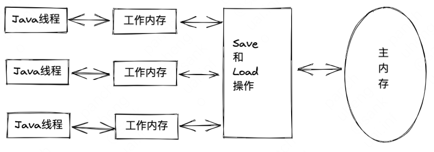

# 十二、Java内存模型与线程

## 12.1 Java内存模型
### 主内存与工作内存
Java内存模型规定了所有的变量都存储在主内存中，每条线程还有自己的工作内存，线程的工作内存中保存了被该线程使用到的变量的主内存副本拷贝，线程对变量的所有操作（读取、赋值等）都必须在【工作内存】中进行，而不能直接读写主内存中的变量。

线程、主内存、工作内存三者交互关系

{width=50%}

### volatile型变量的特殊规则
1. volatile变量可以用来控制并发
   这里当shutdown()方法被调用时，能保证所有线程中执行doWork()方法都立即停下来。
```java
volatile boolean shutdownReqeusted;

public void shutdown() {
	shutdownRequested = true;
}

public void doWork() {
	while (!shutdownRequested) {
		// do something
	}
}
```
2. volatile可以用来禁止指令重新排序优化
   下面代码中，如果没有使用volatile修饰，就可能会由于指令重排序的优化，导致位于线程A中最后一句的代码“initialized  = true“被提前执行，这样线程B中使用配置信息的代码就可能出现错误，而volatile关键字可以避免此类情况的发生。
```java
// thread A
Map configOptions;
char[] configText;
volatile boolean initialized = false;
configOptions = new HashMap();
configText = readConfigFile(fileName);
processConfigOptions(configText, configOptions);
initialized = true;


// thread B
while (!initialized) {
	sleep();
}
doSomethingWithConfig();
```

### 原子性、可见性和有序性
1. 原子性
   由Java内存模型直接保证原子性变量操作的是：read、load、assign、use、store和write，另外，Java内存模型还提供了lock和unlock操作来满足这种需求，虚拟机提供了更高层次的monitorenter和monitorexit来隐式地使用这两个操作，这两个字节码指令反映到Java代码中就是同步块——synchronized关键字
2. 可见性
   指当一个线程修改了共享变量的值，其他线程能够立刻得知这个修改。普通变量和volatile变量的区别是volatile的特殊规则保证了新值能立即同步到主内存，以及每次使用前立即从主内存刷新。
   除了volatile之外，Java还有两个关键字能实现可见性，它们是synchronized和final
3. 有序性
   Java程序中天然的有序性可以总结为：如果在本线程内观察，所有的操作都是有序的；如果在一个线程中观察另一个线程，所有的操作都是无序的，前半句指“线程内表现为串行的语义”，后半句指“指令重排序”现象和“工作内存与主内存同步延迟”现象。

### 先行发生原则
先行发生是Java内存模型中定义的两项操作之间的偏序关系，比如说操作A先行发生于操作B，其实就是说在操作B之前，操作A产生的影响能被操作B观察到，“影响”包括修改了内存中共享变量的值、发送了消息、调用了方法等。
另外，时间先后顺序与先行发生原则之间基本没有因果关系。

## 12.2 Java与线程
### 线程的实现
实现线程有三种方式：
1. 使用内核线程实现；
2. 使用用户线程实现；
3. 使用用户线程加轻量级进程混合实现。

**内核线程实现**
优点：
由于内核线程的支持，每个轻量级进程都成为一个独立的调度单元，即使其中某一个轻量级进程在系统调用中被阻塞了，也不会影响整个进程继续工作。
缺点：
1. 由于其是基于内核线程实现的，所以各种线程操作，如创建、析构及同步，都需要进行系统调用，但系统调用的代价相对较高，需要在用户态和内核态来回切换
2. 因为每个轻量级进程都需要一个内核线程的支持，因此轻量级进程要消耗一定的内核资源（如内核线程的栈空间），因此一个系统支持轻量级进程的数量是有限的

**用户线程实现**
优点：
不需要系统内核支援，其建立、同步、销毁和调度完全在用户态中完成，不需要内核的帮助，操作非常快且是低消耗的，能够支持规模更大的线程数量。
缺点：
难以实现将线程映射到其他处理器上的操作

**混合实现**
既存在用户线程，也存在轻量级进程。
1. 可以支持大规模的用户线程并发；
2. 同时降低了整个进程被完全阻塞的风险。

Java线程的实现不受Java虚拟机规范约束，是一个与具体虚拟机相关的话题。

### Java线程调度
线程调度主要有两种：
1. 协同式线程调度；
2. 抢占式线程调度。

**协同式线程调度**
优点：
一般不存在线程同步问题
缺点：
会出现多个其他线程阻塞的现象，导致整个系统崩溃

**抢占式线程调度**
优点：
每个线程由系统分配执行时间，线程的切换不由线程本身决定，不会出现一个线程导致整个系统阻塞的问题。

缺点：
可以通过`Thread::yield()`方法主动让出执行时间，但无法主动获取执行时间。

### 状态转换
Java语言定义了6种线程状态
1. 新建：创建后尚未启动的线程状态；
2. 运行：包括操作系统线程状态中的Running和Ready；
3. 无限期等待：处于这种状态的线程不会被分配处理器执行时间，它们要等待其他线程显式唤醒；
4. 限期等待：相比无限期等待，无须等待被其他线程显式唤醒，在一定时间之后由系统自动唤醒（sleep）；
5. 阻塞：等待获取到一个排它锁；
6. 结束：已终止线程的线程状态。


