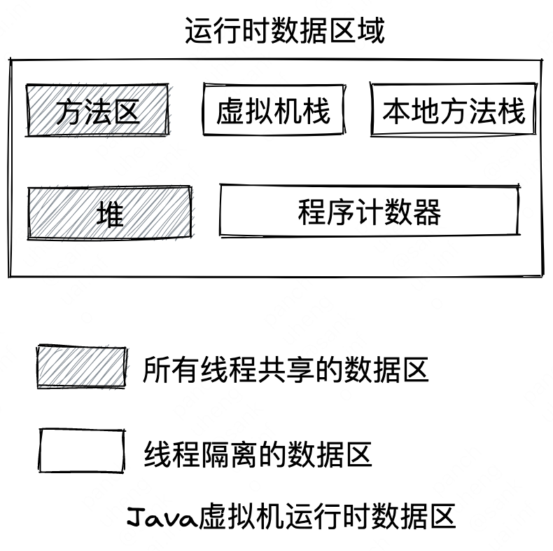

# 四 虚拟机性能监控、故障处理工具

## 一、性能监控和故障处理工具

| 工具名称  | 主要作用                                                                                                                                                                                                            |
| --------- | --------------------------------------------------------- |
| jps       | JVM Process Status Tool,显示指定系统内所有的HotSpot虚拟机进程                                                                                                                                                       |
| jstat     | JVM Statistics Monitoring Tool, 用于收集Hotspot虚拟机各方面的运行数据                                                                                                                                               |
| jstatd    | JVM Statistics Monitoring Tool Daemon, jstat的守护程序，启动一个RMI服务器应用程序，用于监视测试的HotSpot虚拟机的创建和终止，并提供一个界面，允许远程监控工具附加到在本地系统上运行的虚拟机。在JDK9中集成到了JHSDB中 |
| jinfo     | Configuration Info for Java, 显示虚拟机配置信息。在JDK9中集成到了JHSDB中                                                                                                                                            |
| jmap      | Memory Map For Java, 生成虚拟机的内存转储快照(heapdump) 文件。在JDK9中集成到了JHSDB中                                                                                                                               |
| jhat      | JVM Heap Analysis Tool, 用于分析堆转储快照，它会建立一个HTTP/Web服务器，让用户可以在浏览器上查看分析结果。在JDK9中被JHSDB替代                                                                                       |
| jstack    | Stack Trace For Java, 显示虚拟机的线程快照，JDK9集成到JHSDB                                                                                                                                                         |
| jhsdb     | Java HotSpot Debugger, 一个基于Serviceability Agent的HotSpot进程调试器，JDK9开始提供                                                                                                                                |
| jsadebugd | Java Serviceability Agent Debug Daemon, 适用于Java的可维护性代理调试守护程序，主要用于附加到指定的Java进程、核心文件，或充当一个调试服务器                                                                          |
| jcmd      | JVM Command, 虚拟机诊断命令工具，将诊断命令请求发送到正在运行的Java虚拟机。                                                                                                                                         |
| jconsole  | 用于监控Java虚拟机的使用JMX规范的图形工具，可监控本地和远程Java虚拟机                                                                                                                                               |
| jmc       | 包含用于监控和管理Java应用程序的工具，而不会引入与这些工具相关联的性能开销                                                                                                                                          |
| jvisualvm | Java VisualVM, 一种图形化工具，提供内存、CPU分析，堆转储分析、内存泄漏检测、MBean访问和垃圾收集                                                                                                                     |
| schemagen | 用于XML绑定的Schema生成器，用于生成XML Schema文件                                                                                                                                                                   |
|          |                                                                                                                                                                                                                     |

## 二、Java运行时数据区域
{width=50%}

### 程序计数器
是一块较小的内存空间，可以看作是当前线程所执行的字节码的行号指示器。
为了线程切换后能恢复到正确的执行位置，每条线程都需要有一个独立的程序计数器，各条线程之间计数器互不影响，独立存储，我们称这类内存区域为“线程私有”内存。
该内存区域是《Java虚拟机规范》中唯一一个没有规定任何`OutOfMemoryError`情况的区域。

### Java虚拟机栈
Java虚拟机栈也是线程私有的，其生命周期与线程相同。每个方法被执行时，Java虚拟机都会同步创建一个栈帧用于存储局部变量表、操作数栈、动态连接、方法出口等信息。每一个方法被调用直至执行完毕，对应着一个栈帧（每一个方法对应一个栈帧）在虚拟机栈中从入栈到出栈的过程。
虚拟机栈中有一个**局部变量表**，用于存放在编译器可知的各种Java虚拟机基本数据类型（boolean、byte、char、short、int、float、long、double）、对象引用以及returnAddress类型（指向了一条字节码指令的地址）


《Java虚拟机规范》中，对这个内存区域规定了两类异常状况：如果线程请求的栈深度大于虚拟机所允许的深度，就会抛出`StackOverflowError`异常；如果Java虚拟机栈容量可以动态扩展，当栈扩展时无法申请到足够的内存时就会抛出`OutOfMemoryError`异常。

### 本地方法栈
本地方法栈和虚拟机栈所发挥的作用是非常相似的，有的Java虚拟机直接将本地方法栈和虚拟机栈合二为一。
其与虚拟机栈的区别只是虚拟机栈为虚拟机执行Java方法（也就是字节码）服务，而本地方法栈则是为虚拟机使用到的本地方法服务。

### Java堆
Java堆时虚拟机所管理的内存中最大的一块，是被所有线程共享的一块内存区域。该区域唯一的目的是存放对象实例。
Java堆是垃圾回收器管理的内存区域，因此一些资料中也称其为“GC堆“。
从分配内存的角度看，所有线程共享的Java堆中可以划分出多个线程私有的分配缓冲区，以提升对象分配时的效率。不过无论从什么角度，无论如何划分，都不会改变Java堆中存储内容的共性，无论是哪个区域，存储的都只能是对象的实例，将Java堆细分的目的只是更好地回收内存或更快地分配内存。
Java堆只会抛出`OutofMemoryError`异常

### 方法区
方法区和Java堆一样，是各个线程共享的内存区域，它用于存储已被虚拟机加载的类型信息、常量、静态变量、即时编译器编译后的代码缓存等数据。
方法区内存不需要是连续的，可以选择固定大小，也可以进行扩展，也可以选择不要垃圾收集。相对而言，垃圾收集行为在这个区域是比较少出现的，但并非数据进入了方法区就如同永久代的名字一样“永久”存在了。该区域的内存回收目标主要是针对常量池的回收和对类型的卸载，一般来说这个区域的回收效果比较难令人满意，尤其是类型的卸载，条件相当苛刻，但是这部分区域的回收有时又确实是必要的。

如果方法区无法满足新的内存分配需求，会抛出`OutOfMemoryError`异常

### 运行时常量池
运行时常量池是方法区的一部分，Class文件中除了有类的版本、字段、方法、接口等描述信息外，还有一项信息是常量池表，用于存放编译器生成的各种字面量和符号引用，这部分内容将在类加载后存放到方法区的运行时常量池中。
`OutOfMemoryError`

### 直接内存
直接内存不是虚拟机运行时数据区的一部分，也不是《Java虚拟机规范》中定义的内存区域。但是这部分内存会被频繁使用，而且也可以导致`OutOfMemoryError`异常。
在JDK1.4中新加入了NIO（New Input/Output）类，引入了一种基于通道与缓冲区的I/O方式，它可以使用Native函数库直接分配堆外内存，然后通过一个存储在Java堆里面的DirectByteBuffer对象作为这块内存的引用进行操作。这样就能在一些场景中显著提高性能，避免了在Java堆和Native堆中来回复制数据。

直接内存的分配不会受到Java堆大小的限制，但会受到本机总内存（包括物理内存、SWAP分区或者分页文件）大小以及处理器寻址空间的限制。

```java
public class JHSDB_TestCase {  
  
    static class Test {
	    // staticObj存放在方法区
        static ObjectHolder staticObj = new ObjectHolder();  
        // instanceObj存放在Java堆
        ObjectHolder instanceObj = new ObjectHolder();  
  
        void foo() {  
	        // localObj的引用存放在方法帧栈的局部变量表中，实际对象建立在堆中
            ObjectHolder localObj = new ObjectHolder();  
            System.out.println("done");  
        }  
    }  
  
    private static class ObjectHolder {}  
  
    public static void main(String[] args) {  
        Test test = new JHSDB_TestCase.Test();  
        test.foo();  
    }  
}
```


```java
/* BTrace Script Template */
import org.openjdk.btrace.core.annotations.*;
import static org.openjdk.btrace.core.BTraceUtils.*;

@BTrace
public class TracingScript {
	/* put your code here */
    @OnMethod(
        clazz="thinking.in.spring.boot.firstappbygui.BTraceTest",
        method="add",
        location=@Location(Kind.RETURN)
    )
    
    public static void func(@Self thinking.in.spring.boot.firstappbygui.BTraceTest instance,
    int a, int b, @Return int result) {
        println("调用堆栈: ");
        jstack();
        println(strcat("方法参数A: ", str(a)));
        println(strcat("方法参数B: ", str(b)));
        println(strcat("方法结果: ", str(result)));    
    }
}
```