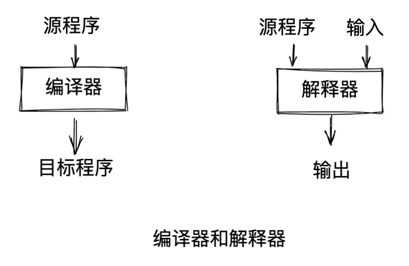
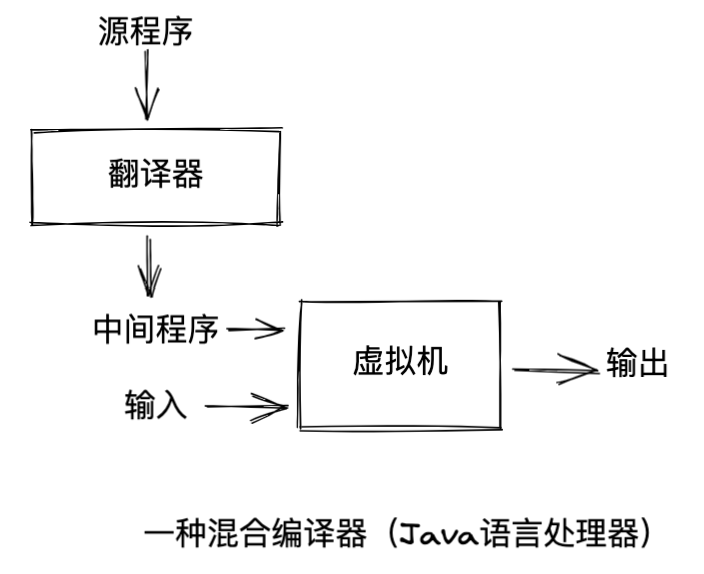
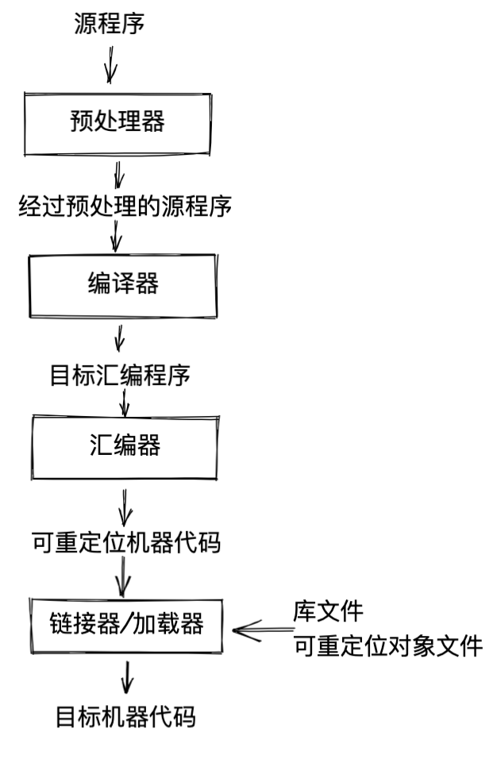
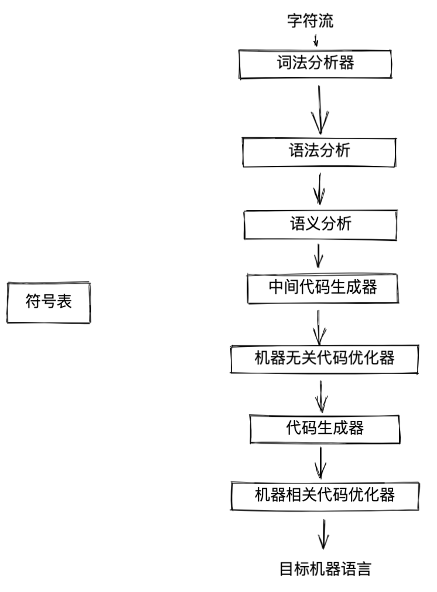

<!-- START doctoc generated TOC please keep comment here to allow auto update -->
<!-- DON'T EDIT THIS SECTION, INSTEAD RE-RUN doctoc TO UPDATE -->

- [1 引论](#1-%E5%BC%95%E8%AE%BA)
  - [1.1 语言处理器](#11-%E8%AF%AD%E8%A8%80%E5%A4%84%E7%90%86%E5%99%A8)
  - [1.2 一个编译器的结构](#12-%E4%B8%80%E4%B8%AA%E7%BC%96%E8%AF%91%E5%99%A8%E7%9A%84%E7%BB%93%E6%9E%84)

<!-- END doctoc generated TOC please keep comment here to allow auto update -->

# 1 引论
## 1.1 语言处理器

编译器和解释器

{width=50%}

Java语言处理器
{width=50%}

一个语言处理系统
{width=50%}

## 1.2 一个编译器的结构
{width=50%}

