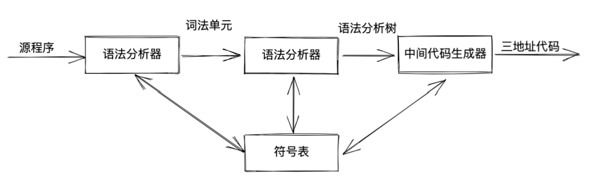
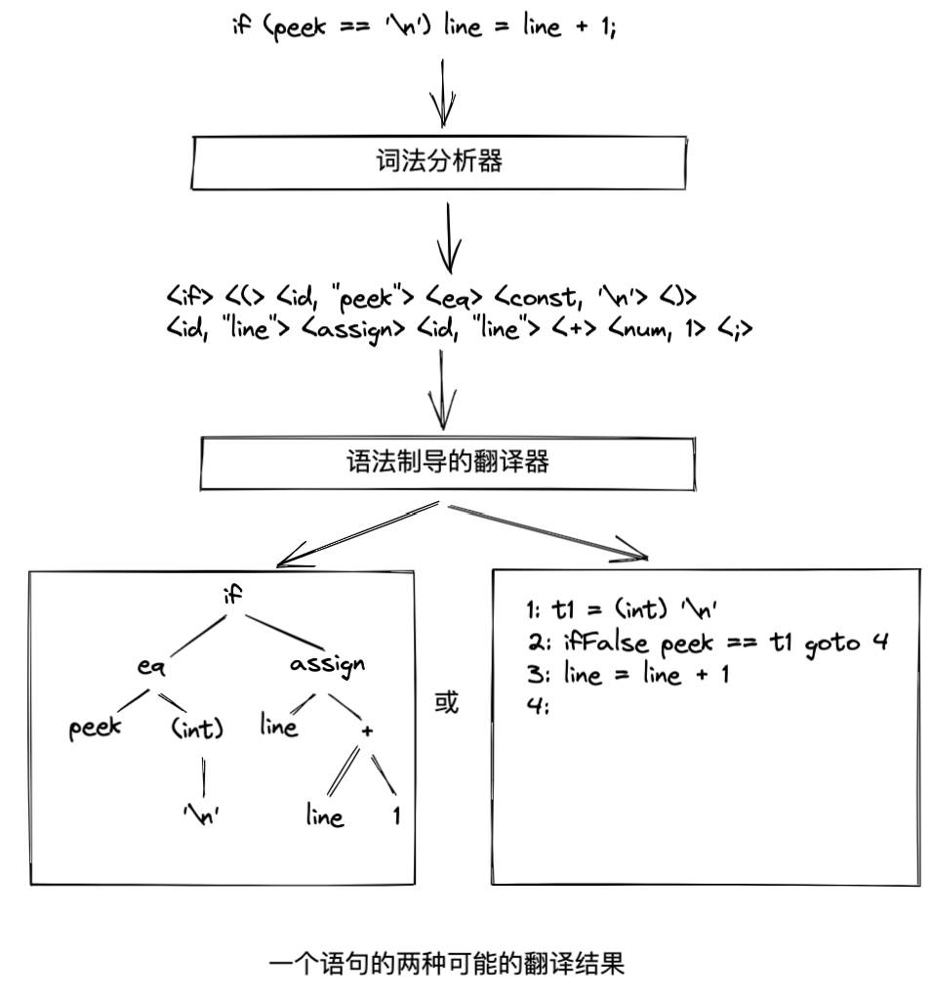

# 2 一个简单的语法制导翻译器

**编译原理中的前后端划分：**
划分依据：与机器的相关性。
前端工作与源语言有关而与机器无关。后端工作与机器有关。
可以理解为：前端工作把（不同类型的）源语言转换为中间代码，后端工作是将中间代码适用于（不同类型的）机器上。实际应用中通常是某一源语言适用于不同类型的机器上。而不同源语言适用于某一机器的做法对前端要求非常高，还有较大的发展潜力。
==**前端**==包括词法分析、语法分析、语义分析、中间代码生成、符号表的建立，以及与机器无关的中间代码优化。
==**后端**==包括与机器相关的代码优化、目标代码的生成、相关错误的处理、符号表的访问等。

## 2.1 引言

一个编译器前端模型
{width=50%}

三地址指令最多只执行一个运算，通常指计算、比较或分支跳转运算

## 2.2 语法定义

一个上下文无关文法由四个元素组成：
1. 一个终结符号集合；
2. 一个非终结符号集合；
3. 一个产生式集合；
4. 指定一个非终结符号为开始符号。

1、非终结符号和终结符号

非终结符号：一个可拆分元素
终结符号：不可拆分的最小元素

2、词法单元和终结符号

词法单元由两个部分组成：名字和属性值，通常将词法单元名字称为终结符号，如果词法单元具有属性值，这个值就是一个指向符号表的指针，符号表中包含了该词法单元的附加信息。这些附加信息不是文法的组成部分，因此在讨论语法分析时，通常将【词法单元】和【终结符号】当做同义词。

## 2.3 语法制导翻译
关于树的遍历，这里有个说法说得挺好的：
前序遍历：如果动作在我们第一次访问这个结点时被执行，这种遍历就是前序遍历；
后序遍历：如果动作在我们最后离开一个结点前被执行，这种遍历就是后序遍历。

## 2.7 符号表
符号表时一种供编译器用于保存有关源程序构造的各种信息的数据结构。

1、谁创建符号表条目
符号表条目是在分析阶段由词法分析器、语法分析器、语义分析器创建并使用的

## 2.8 生成中间代码
两种中间表示形式：
1. 树型结构，包括语法分析树和抽象语法树；
2. 线性表示形式，特别是“三地址代码”

## 总结

{width=50%}

